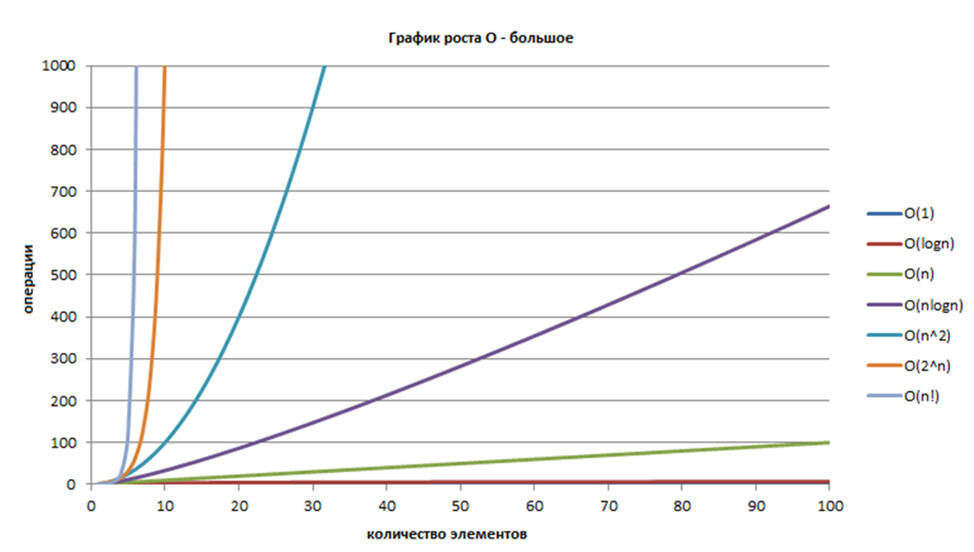

## Оценка эффективности алгоритмов. Принципы выбора различных по эффективности алгоритмов для решения конкретных задач.

Эффективность алгоритма — это свойство алгоритма, которое связано с вычислительными ресурсами, используемыми алгоритмом. 
Алгоритм должен быть проанализирован с целью определения необходимых алгоритму ресурсов. 
Эффективность алгоритма можно рассматривать как аналог производственной производительности повторяющихся или непрерывных процессов.

Для достижения максимальной эффективности мы желаем уменьшить использование ресурсов. 
Однако различные ресурсы (такие как время и память) нельзя сравнить напрямую, так что какой из двух алгоритмов считать более эффективным часто зависит от того, 
какой фактор более важен, например, требование высокой скорости, минимального использования памяти или другой меры эффективности.

|    Обозначение   	|                  Граница                  	|        Рост       	|
|:----------------:	|:-----------------------------------------:	|:-----------------:	|
|      (Тета) Θ     	|  Нижняя и верхняя границы, точная оценка  	|       Равно       	|
|   (О большое) О  	| Верхняя граница, точная оценка неизвестна 	| Меньше либо равно 	|
|    (о малое) о   	|      Верхняя граница, неточная оценка     	|       Меньше      	|
| (Омега большое) Ω  	|  Нижняя граница, точная оценка неизвестна 	| Больше либо равно 	|
|  (Омега малое)  ω 	|      Нижняя граница, неточная оценка      	|       Больше      	|

1.	(О — большое) — верхняя граница, в то время как (Омега — большое) — нижняя граница. Тета требует как (О — большое), так и (Омега — большое), поэтому она является точной оценкой (она должна быть ограничена как сверху, так и снизу). К примеру, алгоритм требующий Ω (n logn) требует не менее n logn времени, но верхняя граница не известна. Алгоритм требующий Θ (n*log(n)) предпочтительнее потому, что он требует не менее n log(n) (Ω (n*logn)) и не более чем n*log(n) (O(n*logn)).
2.	f(x) = Θ(g(n)) означает, что f растет так же как и g когда n стремится к бесконечности. Другими словами, скорость роста f(x) асимптотически пропорциональна скорости роста g(n).
3.	f(x) = O(g(n)). Здесь темпы роста не быстрее, чем g (n). O большое является наиболее полезной, поскольку представляет наихудший случай.

| Алгоритм 	| Эффективность 	|
|:--------:	|:-------------:	|
|   o(n)   	|      < n      	|
|   O(n)   	|       ≤ n        	|
|   Θ(n)       	|      n         	|
|   Ω(n)     	|         ≥ n      	|
|   ω(n)    	|         > n      	|

