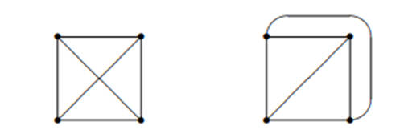
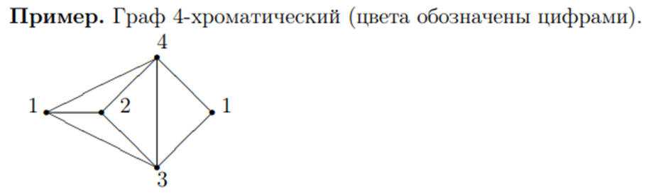

## Базовые понятия теории графов. Поиск в графах. Алгоритмы поиска в ширину и глубину, построение каркасов графа. Пути в графах. Алгоритмы поиска Эйлерова и Гамильтонова пути. Алгоритмы поиска минимальных путей. Раскраска графов. Планарность графов.

Граф – это конечное множество вершин и ребер, соединяющих их, т. е.:

> G = < V, E >

где
- V – конечное непустое множество вершин; 
- Е – множество ребер (пар вершин).

Если пары Е (ребра) имеют направление, то граф называется ориентированным (орграф), если иначе - неориентированный (неорграф). 

Если в пары Е входят только различные вершины, то в графе нет петель. 

Если ребро графа имеет вес, то граф называется взвешенным. 

Степень вершины графа равна числу ребер, входящих и выходящих из нее (инцидентных ей). 

Неорграф называется связным, если существует путь из каждой вершины в любую другую.

---

Способы представления:
- Матрица смежности
-	Матрица инцидентности
-	Список смежности
-	Список дуг

---

Основные операции по работе с графовыми структурами:
-	поиск кратчайшего пути от одной вершины к другой (если он есть);
-	поиск кратчайшего пути от одной вершины ко всем другим;
-	поиск кратчайших путей между всеми вершинами;
-	поиск эйлерова пути (если он есть);
-	поиск гамильтонова пути (если он есть).

---

Поиск (или обход графа) в глубину (depth first search, DFS), при котором, начиная с произвольной вершины v0, ищется ближайшая смежная вершина v, 
для которой в свою очередь осуществляется поиск в глубину (т.е. снова ищется ближайшая, смежная с ней вершина) до тех пор, 
пока не встретится ранее просмотренная вершина, или не закончится список смежности вершины v (то есть вершина полностью обработана). 

Если нет новых вершин, смежных с v, то вершина v считается использованной, идет возврат в вершину, из которой попали в вершину v, и процесс продолжается до тех пор, 
пока не получим v = v0. Иными словами, поиск в глубину из вершины v основан на поиске в глубину из всех новых вершин, смежных с вершиной v.

Путь, полученный методом поиска в глубину, в общем случае не является кратчайшим путем из вершины v в вершину u. Это общий недостаток поиска в глубину.

Указанного недостатка лишен другой метод обхода графа – поиск в ширину (breadth first search, BFS). 
Обработка вершины v осуществляется путем просмотра сразу всех новых соседей этой вершины. 
При этом полученный путь является кратчайшим путем из одной вершины в другую.

При использовании алгоритмов DFS и BFS графы обходят разными способами, получая при этом некоторые подграфы, 
которые имеют специфические названия: каркасы, остовы или стягивающие деревья. 

Все вершины исходного графа входят в полученное стягивающее дерево, а все ветви дерева – это множество ребер из все множеств ребер графа

---

Произвольный путь в графе, проходящий через каждое ребро графа точно один раз, называется эйлеровым путем. 

При этом, если по некоторым вершинам путь проходит неоднократно, то он является непростым. 

Если путь замкнут, то имеем эйлеров цикл. Для существования эйлерова пути в связном графе необходимо и достаточно, 
чтобы граф содержал не более двух вершин нечетной степени.

Путь в графе, проходящий в точности один раз через каждую вершину графа (а не каждое ребро) и соответствующий цикл называются гамильтоновыми и 
существуют не для каждого графа, как и эйлеров путь. 

В отличие от эйлеровых путей неизвестно ни одного простого необходимого и достаточного условия для существования гамильтоновых путей. 

Неизвестен даже алгоритм полиномиальной сложности, проверяющий существование гамильтонова пути в произвольном графе. 

Проблема существования гамильтонова пути принадлежит к классу так называемых NP-полных задач

---

Поиск кратчайших путей до всех вершин из одной указанной вершины для взвешенного орграфа (имеющего значение, т.е. вес или стоимость, ребра) 
с неотрицательными ребрами осуществляется с использованием алгоритма Дейкстры. 

Алгоритм Дейкстры основан на выборе для включения в путь всякий раз той вершины, которая имеет наименьшую оценку кратчайшего пути (по весам ребер), 
то есть наименьший путь до этой вершины из всех возможных путей, которые были рассмотрены ранее.

Алгоритм Беллмана-Форда позволяет решить задачу о поиске кратчайших путях из одной выбранной вершины ко всем остальным вершинам при любых весах ребер, 
в том числе и отрицательных. 
Сначала ищется путь от выбранной вершины ко всем вершинам, связными с ней (аналогично поиску в ширину), 
а затем – кратчайший путь ко всем остальным вершинам, с попыткой последовательно пройти к ним, т.е. сначала через первую вершину, 
затем через вторую, через третью и так далее до последней вершины. Кроме того алгоритм возвращает TRUE, если в графе нет цикла отрицательного веса, 
достижимого из данной вершины.

Для поиска кратчайших путей между всеми вершинами используется алгоритм Флойда-Уоршалла. 
По алгоритму Флойда-Уоршалла сначала ищется кратчайший путь от одной вершины ко всем вершинам, доступным из нее, 
затем проводятся те же действия, но пытаясь пройти от этой вершины ко всем доступным из нее, 
проходя каждый раз через новую вершину (сначала через первую, затем – через вторую и т.д.). 
Таким образом обрабатываются все вершины.

Остовым деревом графа является дерево, содержащие все вершины графа. Стоимостью этого дерева является сумма стоимостей всех ребер 

---

Граф укладывается на некоторой поверхности, если его диаграмму можно нарисовать на этой поверхности без пересечения ребер.

Граф называется планарным, если его можно уложить на плоскости
 

 
Граф G называется k-раскрашиваемым, если каждой его вершине можно приписать один из k цветов таким образом, 
чтобы никакие две смежные вершины не были одного цвета. 

Если граф G является k-раскрашиваемым, но не является k − 1- раскрашиваемым, то граф называется k-хроматическим, а k – его хроматическим числом χ(G).
 

 
---
 
Теорема о шести красках. Любой планарный граф 6-раскрашиваем.

Теорема о пяти красках. Любой планарный граф 5-раскрашиваем.

Гипотеза четырех красок. Любой планарный граф 4-раскрашиваем. 

Возникновение гипотезы четырех красок исторически связано с раскрашиванием географических карт. 
Если имеется карта с изображением нескольких стран, то граничащие страны необходимо раскрасить в разные цвета. 
Если каждой стране сопоставить вершину графа, и соединить вершины ребром в случае, если страны граничат, то мы получим планарный граф.

---

Алгоритмы раскраски графов
Точный алгоритм раскрашивания.
1. Найти все максимальные независимые подмножества вершин. 
2. Построить булеву матрицу, строкам которой сопоставлены максимальные независимые подмножества вершин, а столбцам – вершины графа. 
3. Найти кратчайшее покрытие этой таблицы. 
4. Раскрасить граф по найденному кратчайшему покрытию: выбрать произвольную строку и окрасить все вершины соответствующего подмножества в один цвет. Затем выбрать следующую строку и окрасить все вершины соответствующего подмножества, кроме уже окрашенных, в следующий цвет и т.д., пока не будут исчерпаны все строки. 

Алгоритм вычислительно сложный – поиск всех максимальных независимых подмножеств и поиск кратчайшего покрытия булевой матрицы являются вычислительно сложными задачами.
Поэтому актуальными являются приближенные алгоритмы последовательной раскраски. 

Алгоритм 1. Последовательно раскрашиваются вершины – берется очередная вершина и раскрашивается в цвет, не совпадающий с цветами смежных окрашенных вершин. 

Алгоритм 2. Цикл по цветам – сначала все, что можно, окрашивается в цвет 1, затем все, что можно, в цвет 2, и т.д. При этом лучше сначала упорядочить вершины по убыванию степеней, так как чем больше степень вершины, тем больше вероятность, что ее придется красить в новый цвет, если она будет окрашиваться последней.

(часть Бомонка, http://wwwcdl.bmstu.ru/iu7/book1/stage9.htm, часть другие лекции
 Планарность графов - https://portal.tpu.ru/SHARED/t/TRACEY/Courses/Graph_Theory/Tab1/graph_lec_09.pdf,
 Раскрашивание графов - https://portal.tpu.ru/SHARED/t/TRACEY/Courses/Graph_Theory/Tab1/graph_lec_10.pdf)
