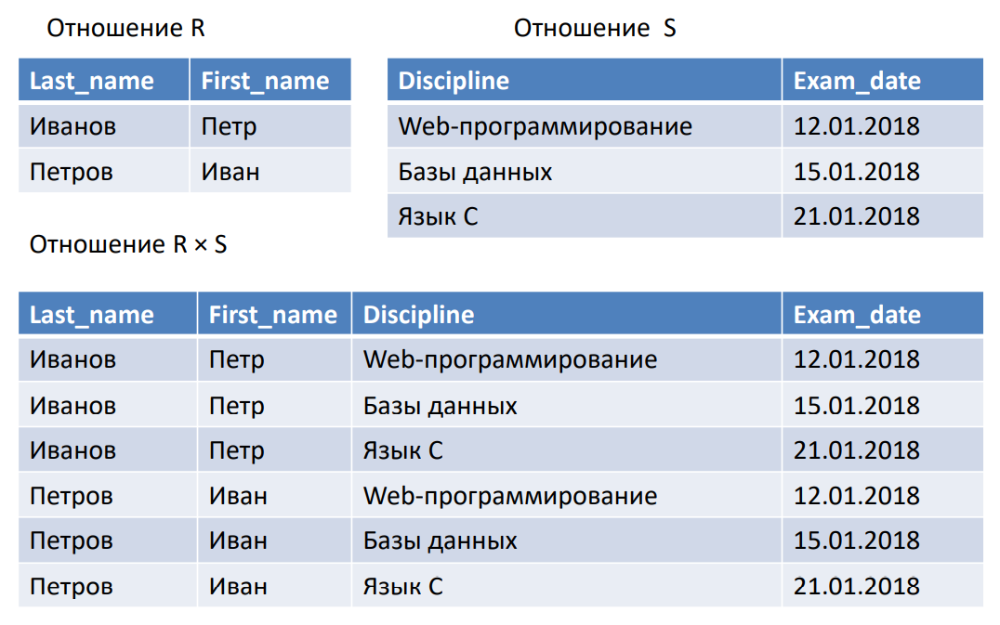

## Реляционная алгебра

Реляционная алгебра — это коллекция операций, которые принимают отношения в качестве операндов и возвращают отношение в качестве результата.

Результат выполнения одной операции может использоваться в качестве входных 
данных (операнда) другой операции. Поэтому возможно использование 
вложенных операций. Это свойство называется замкнутостью (closure).

Алгебра, определенная Э. Коддом, включала две группы по 4 операции:
- Традиционные операции с множествами:
	- объединение (Union)
	- пересечение (Intersection)
	- разность (Set difference) 
	- декартово произведение (Cartesian product)
- Специальные реляционные операции:
	- сокращение (Restriction) или выборка (Selection)
	- проекция (Projection)
	- соединение (Join)
	- деление (Division)

Эти операции можно разделить на базовые (выборка, проекция, декартово 
произведение, объединение и разность) и дополнительные (соединение, 
пересечение и деление).

Операции выборки и проекции являются унарными (работают с одним 
отношением), остальные операции — бинарные (работают с двумя отношениями).

Все эти операции предназначены только для чтения (т. е. они «читают», но не обновляют свои операнды)

---

### Выборка (Selection), или сокращение (Restriction)

Эта операция выполняется на одном отношении R и определяет отношение, которое содержит только те кортежи исходного отношения R, которые 
удовлетворяют заданному условию (предикату).

К. Дейт использует такое обозначение: R WHERE p
Некоторые другие авторы — такое: σpredicate(R)
Выражение р — это предикат, или условие сокращения

Примеры.

>Students WHERE record_book = 55500 
>Students WHERE record_book = 55500 OR record_book = 55800
>Progress WHERE acad_year = '2017/2018' AND term = 1

### Проекция (Projection)

Эта операция выполняется на одном отношении R, которое имеет атрибуты X, Y, . . ., Z (и, возможно, другие атрибуты) и определяет отношение, которое 
содержит вертикальное подмножество исходного отношения R, извлекая 
значения указанных атрибутов и отбрасывая дубликаты полученных 
кортежей. 

В таком случае проекция отношения R по атрибутам X, Y, . . . , Z 
определяется с помощью следующего выражения (К. Дейт): R { X, Y, . . . , Z }. 

Его заголовок формируется из заголовка отношения R путем удаления всех 
атрибутов, не указанных в множестве { X, Y, . . . , Z }.

Некоторые авторы используют обозначение: Пa1...an(R)

Пример.

>Progress { acad_year, term }

### Объединение (Union)

Объединением отношений R и S является отношение того же типа с телом, 
которое состоит из всех кортежей, присутствующих в R или в S, или в обоих 
отношениях. При этом кортежи-дубликаты устраняются.

Отношения R и S должны принадлежать к одному типу. Они должны быть 
совместимыми по объединению (union compatible), т. е. иметь одинаковые 
заголовки.

К. Дейт использует такое обозначение: R UNION S

Некоторые другие авторы — такое: R ∪ S

Пример. 

> Students1 UNION Students2
(предположим, что оба эти отношения имеют 
тот же тип, что и отношение Students)

### Пересечение (Intersection)

Пересечением отношений R и S является отношение того же типа с телом, 
которое состоит из всех кортежей, присутствующих одновременно в R и в S.

Отношения R и S должны принадлежать к одному типу. Они должны быть 
совместимыми по объединению (union compatible), т. е. иметь одинаковые 
заголовки.

К. Дейт использует такое обозначение: R INTERSECT S

Некоторые другие авторы — такое: R ∩ S

Пример. 

>Students1 INTERSECT Students2
(предположим, что оба эти отношения имеют 
тот же тип, что и отношение Students)

### Разность (Set difference)

Разностью отношений R и S (в указанном порядке) является отношение того 
же типа с телом, которое состоит из всех кортежей, присутствующих в R, но 
не присутствующих в S.

Отношения R и S должны принадлежать к одному типу. Они должны быть 
совместимыми по объединению (union compatible), т. е. иметь одинаковые 
заголовки. 

Важно: оператор MINUS характеризуется направленностью 
(некоммутативностью), так же, как вычитание в обычной арифметике.

К. Дейт использует такое обозначение: R MINUS S

Некоторые другие авторы — такое: R − S

Пример. 

> Students1 MINUS Students2
(предположим, что оба эти отношения имеют 
тот же тип, что и отношение Students)

### Декартово произведение (Cartesian product)

Декартово произведение отношений R и S, не имеющих общих атрибутов –
это отношение, заголовок которого представляет собой (теоретико-множественное) объединение заголовков отношений R и S, а тело состоит из 
всех кортежей t, таких, что t является (теоретико-множественным) 
объединением кортежа, принадлежащего к отношению R, и кортежа, 
принадлежащего к отношению S. 

Следует отметить, что кардинальность 
результата равна произведению кардинальностей входных отношений, R и S, 
а степень результата — сумме степеней входных отношений.

Если необходимо сформировать декартово произведение двух отношений, 
имеющих общие имена атрибутов, то следует вначале воспользоваться 
оператором RENAME, чтобы переименовать атрибуты должным образом.

К. Дейт использует такое обозначение: R TIMES S

Некоторые другие авторы — такое: R × S

Пример

### Соединение (Join)

Соединение равносильно выполнению операции выборки (selection) над 
результатом декартова произведения: R JOIN S = ( R TIMES S ) WHERE p

Имеются следующие виды соединений:
- θ-соединение 
- Эквисоединение (частный случай θ-соединения)
- Естественное соединение
- Внешнее соединение
- Полусоединение

θ-соединение определяет отношение, которое содержит кортежи из 
декартова произведения отношений R и S, удовлетворяющие предикату p. 

Предикат p имеет форму R.ai θ S.bi
, где θ может являться одним их 
операторов сравнения (<, ≤, >, ≥, =, ≠), а R.ai и S.bi – атрибуты отношений R и 
S соответственно.

Эквисоединение – это частный случай θ-соединения. Он имеет место, когда 
в качестве оператора сравнения используется только проверка на равенство 
(=).

Естественное соединение – это частный случай эквисоединения. Он имеет 
место, когда отношения R и S соединяются по всем общим атрибутам. Один 
экземпляр каждого из общих атрибутов исключается из результирующего 
отношения.

Пояснение:
> Таблицы «Студенты» (students) и «Успеваемость» (progress)
 Общий атрибут – record_book
 Students JOIN Progress эквивалентно следующему выражению:
 (Students TIMES ( Progress RENAME record_book AS p_record_book )
 WHERE record_book = p_record_book )
 Степень результата естественного соединения равна сумме степеней 
отношений R и S минус число общих атрибутов этих отношений.

Внешнее соединение может быть левым, правым или полным
- Левое внешнее соединение отношений R и S – это соединение, в котором 
кортежи из R, которые не имеют соответствующих значений в общих атрибутах 
отношения S, также включаются в результирующее отношение. Отсутствующие 
значения атрибутов отношения S заменяются на NULL.
- Правое внешнее соединение определяется аналогично.
- Полное внешнее соединение сохраняет в результирующем отношении кортежи из обоих исходных 
отношений, заменяя отсутствующие значения на NULL

Полусоединение определяет отношение, которое содержит кортежи из 
отношения R, которые участвуют в соединении R и S, удовлетворяющие 
предикату p. 

Обозначается таким образом: R SEMIJOIN S

Полусоединение выполняет соединение двух отношений, а затем выполняет 
проекцию по атрибутам первого операнда.

### Деление (Division)

Предположим, что отношения R и S, соответственно, имеют следующие 
атрибуты: X1, Х2, ... ,Хm и Y1, Y2, ... ,Yn. 
Здесь ни один из атрибутов Xi (i = 1, 2, ... , m) не имеет одинакового имени с любым из атрибутов 
Yj (j = 1, 2, ... , n). 

Пусть отношение T имеет следующие атрибуты: X1, Х2, ... ,Хm и Y1, Y2, ... ,Yn. 
Это означает, что T имеет заголовок, представляющий собой (теоретико-множественное) объединение заголовков отношений R и S. Будем 
рассматривать множества {X1, Х2, ... ,Хm} и {Y1, Y2, ... ,Yn}, соответственно, как 
составные атрибуты X и Y. 
В таком случае операция деления R на S по T (где R — делимое, S — делитель, а T — посредник) может быть представлена с 
помощью следующего выражения:

R DIVIDEBY S PER T

Результат представляет собой отношение с заголовком 
{ X } и телом, состоящим из таких кортежей { X х }, 
присутствующих в R, что кортеж { X х, Y у } присутствует 
в T для всех кортежей { Y у }, присутствующих в S. 

Иными словами, данный результат состоит из тех 
значений X, присутствующих в R, для которых 
соответствующие значения Y в T включают все 
значения Y из S

### Дополнительные операции

Назначение операции расширения EXTEND состоит в поддержке 
вычислительных возможностей. Если быть точнее, то операция EXTEND 
принимает одно отношение и возвращает другое, идентичное заданному, 
если не считать того, что оно включает дополнительный атрибут, значения 
которого получены путем вычисления некоторого специального вычислимого 
выражения. Например, можно записать следующее выражение.

EXTEND P ADD ( WEIGHT * 454 ) AS GMWT

Данное выражение (следует подчеркнуть, что это — выражение, а не команда 
или оператор и поэтому может вкладываться в другие выражения) приводит к 
получению отношения с таким же заголовком, как Р, не считая того, что оно 
содержит дополнительный атрибут с именем GMWT.

Каждый кортеж этого отношения совпадает с соответствующим кортежем 
отношения Р, за исключением того, что он дополнительно содержит значение 
веса в граммах GMWT, вычисленного с помощью заданного арифметического 
выражения WEIGHT * 454

Операция агрегирования выполняет аналогичную функцию для так 
называемых вертикальных вычислений, или «вычислений, осуществляемых в 
пределах атрибута». 
Например, в результате вычисления следующего выражения

SUMMARIZE SP PER P { Р# } ADD SUM ( QTY ) AS TOTQTY

формируется отношение с атрибутами Р# и TOTQTY, в котором имеется по 
одному кортежу для каждого значения Р# в проекции отношения Р по 
атрибуту Р#, содержащему это значение Р# и соответствующее общее 
количество. 

Иными словами, отношение SP концептуально подразделяется на 
группы, или множества кортежей (где имеется по одной группе для каждого 
номера детали в отношении Р), после чего каждая такая группа используется 
для выработки одного кортежа в составе общего результата

Вообще говоря, значение следующей операции агрегирования
SUMMARIZE R PER S ADD summary AS Z
представляет собой отношение

