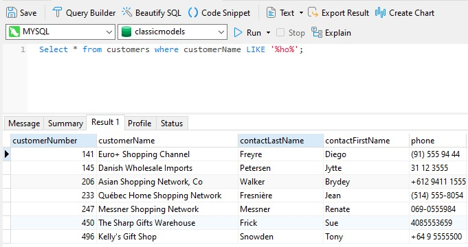
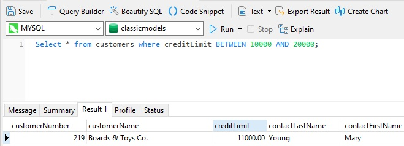
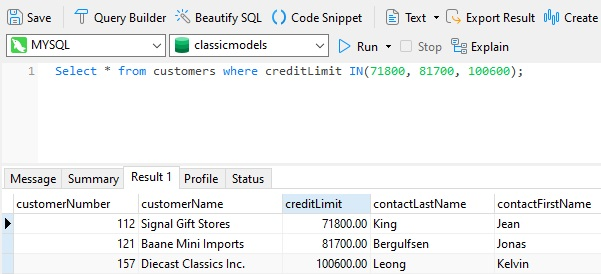
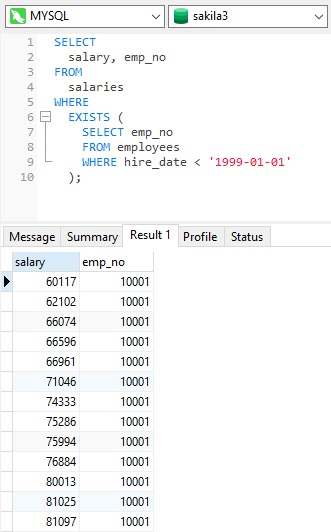
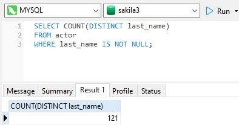

## Условные выражения и предикаты языка SQL.

Выражение CASE – условный оператор языка SQL

Данный оператор позволяет осуществить проверку условий и возвратить в зависимости от выполнения того или иного условия тот или иной результат.

Оператор CASE имеет 2 формы:

| Первая форма  |  Вторая форма |
|---|---|
| CASE   WHEN условие_1   THEN возвращаемое_значение_1  … WHEN условие_N THEN возвращаемое_значение_N  [ELSE возвращаемое_значение]  END  |  CASE проверяемое_значение WHEN сравниваемое_значение_1 THEN возвращаемое_значение_1 … WHEN сравниваемое_значение_N THEN возвращаемое_значение_N [ELSE возвращаемое_значение] END  |

В качестве значений здесь могут выступать и выражения.

### Первая форма

WHEN-условия проверяются последовательно, сверху - вниз. При достижении первого удовлетворяющего условия дальнейшая проверка прерывается и возвращается значение, 
указанное после слова THEN, относящегося к данному блоку WHEN.

Если ни одно из WHEN-условий не выполняется, то возвращается значение, указанное после слова ELSE (что в данном случае означает «ИНАЧЕ ВЕРНИ …»).

Если ELSE-блок не указан и не выполняется ни одно WHEN-условие, то возвращается NULL.

И в первой, и во второй форме ELSE-блок идет в самом конце конструкции CASE, т.е. после всех WHEN-условий.

### Вторая форма

Вторая форма – это всего лишь упрощенная запись для тех случаев, когда нам нужно сделать сравнение на равенство, 
одного и того же проверяемого значения с каждым WHEN-значением/выражением.

>Первая и вторая форма CASE входят в стандарт языка SQL, поэтому скорее всего они должны быть применимы во многих СУБД.

---

Предикат — это выражение, которое вычисляет значение TRUE, FALSE или UNKNOWN. 
Предикаты обычно используются в условиях поиска WHERE и HAVING, условиях соединения FROM, а также в любой другой части запроса, где требуется логическое значение.

Существует множество типов предикатов, в том числе:
- Comparison
- LIKE
- BETWEEN
- IN
- EXISTS
- IS NULL (INTEGER/DECIMAL/FLOAT...)

### Предикаты сравнения
Каждый раз, когда мы используем оператор сравнения в выражении, например:

> WHERE employee_salary > 100000

мы строим предикат, который вычисляет TRUE, FALSE или UNKNOWN. 

Операторы сравнения включают в себя:
- `=` Равно
- `>` Больше, чем
- `<` Меньше
- `>=` Больше или равно
- `<=` Меньше или равно
- `<>` Не равно

Следовательно, предикат сравнения принимает форму:

> expression_1 comparison_operator expression_2

В предикате сравнения выражение2 также может быть подзапросом. 

Если подзапрос не возвращает строки, предикат сравнения вычисляется как FALSE.

### Предикат LIKE 

В SQL предикатом для поиска значений, соответствующих шаблону, является оператор LIKE. LIKE работает с любым символом или типом данных даты. 

### Предикат BETWEEN 

Оператор BETWEEN задает диапазон, определяющий нижнюю и верхнюю границы квалифицируемых значений. 

Например, в предикате выбранные данные представляют собой диапазон больше или равен 5000 и меньше или равен 20000. 

Оператор BETWEEN можно использовать с числовыми, текстовыми и датовыми типами данных. 

### Предикат IN

Оператор IN позволяет использовать спецификацию двух или более выражений для поиска по запросу. 

Результатом условия является TRUE, если значение соответствующего столбца равно одному из выражений, заданных предикатом IN.

### Предикат EXISTS

Предикат EXISTS принимает подзапрос в качестве аргумента. 

Он возвращает значение TRUE, если подзапрос возвращает одну или несколько строк, и возвращает значение FALSE, если возвращает нулевые строки.

### Предикат IS NULL

Используйте значение IS NULL, чтобы определить, является ли выражение null, так как невозможно проверить значение NULL с помощью оператора сравнения `=`. 

Предикат IS NULL принимает следующую форму:

> IS [NOT] NULL

Например, выражение имеет значение TRUE, если x имеет значение null. 

> x IS NULL

IS UNKNOWN является синонимом значения IS NULL, когда выражение относится к типу BOOLEAN.

