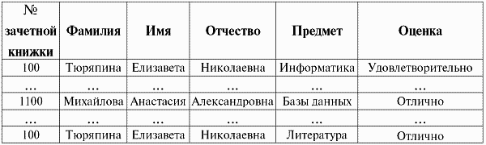

## Функциональные зависимости. Правила вывода Армстронга и Дарвина. Замыкание множества атрибутов.

Ограничения уникальности, накладываемые объявлениями первичного и кандидатных ключей отношения, является частным случаем ограничений, 
связанных с понятием функциональных зависимостей.

Для объяснения понятия функциональной зависимости, рассмотрим следующий пример.

Пусть нам дано отношение, содержащее данные о результатах какой-то одной конкретной сессии. Схема этого отношения выглядит следующим образом:

Сессия (<b>№ зачетной книжки</b>, Фамилия, Имя, Отчество, <b>Предмет</b>, Оценка);

Атрибуты «№ зачетной книжки» и «Предмет» образуют составной (так как ключом объявлены два атрибута) первичный ключ этого отношения. 
Действительно, по двум этим атрибутам можно однозначно определить значения всех остальные атрибутов.

Однако, помимо ограничения уникальности, связанной с этим ключом, на отношение непременно должно быть наложено то условие, 
что одна зачетная книжка выдается обязательно одному конкретному человеку и, следовательно, 
в этом отношении кортежи с одинаковым номером зачетной книжки должны содержать одинаковые значения атрибутов «Фамилия», «Имя» и «Отчество».

Если у нас имеется следующий фрагмент какой-то определенной базы данных студентов учебного заведения после какой-то сессии, 
то в кортежах с номером зачетной книжки 100, атрибуты «Фамилия», «Имя» и «Отчество» совпадают, 
а атрибуты «Предмет» и «Оценка» – не совпадают (что и понятно, ведь в них речь идет о разных предметах и успеваемости по ним). 
Это значит, что атрибуты «Фамилия», «Имя» и «Отчество» <b>функционально зависят</b> от атрибута «№ зачетной книжки», 
а атрибуты «Предмет» и «Оценка» функционально не зависят.

>Таким образом, функциональная зависимость – это однозначная зависимость, затабулированная в системах управления базами данных.

Теперь дадим строгое определение функциональной зависимости.

Определение: пусть X, Y – подсхемы схемы отношения S, определяющие над схемой S схему функциональной зависимости X > Y (читается «X стрелка Y»). 
Определим ограничения функциональной зависимости inv<X > Y> как утверждение о том, что в отношении со схемой S любые два кортежа, 
совпадающие в проекции на подсхему X, должны совпадать и в проекции на подсхему Y.

Запишем это же определение в формулярном виде:

>`Inv<X > Y> r(S) = t1, t2 ? r(t1[X] = t2[X] ? t1[Y] = t2 [Y]), X, Y ? S`

На практике проектирования баз данных на схему функциональной зависимости для краткости обычно ссылаются как на функциональную зависимость.

В частном случае, когда правая часть функциональной зависимости, т. е. подсхема Y, совпадает со всей схемой отношения, 
ограничение функциональной зависимости переходит в ограничение уникальности первичного или кандидатного ключа. 

Действительно:

>`Inv<K > S> r(S) = ? t1, t2 ? r(t1[K] = t2 [K] > t1(S) = t2(S)), K ? S`

Просто в определении функциональной зависимости вместо подсхемы X нужно взять обозначение ключа K, 
а вместо правой части функциональной зависимости, подсхемы Y взять всю схему отношений S, т. е., действительно, 
ограничение уникальности ключей отношений является частным случаем ограничения функциональной зависимости при равенстве правой части схемы 
функциональной зависимости всей схеме отношения.

Приведем примеры изображения функциональной зависимости:

> { № зачетной книжки} > {Фамилия, Имя, Отчество }

> { № зачетной книжки, Предмет} > {Оценка}

---

Прежде чем приступать к анализу самих правил вывода Армстронга, введем в рассмотрение новый металингвистический символ «+», 
который называется символом метаутверждения о выводимости. 

Этот символ при формулировании правил записывается между двумя синтаксическими выражениями и свидетельствует о том, что из формулы, 
стоящей слева от него, выводится формула, стоящая справа от него.

Сформулируем теперь сами правила вывода Армстронга в виде следующей теоремы.

Теорема. Справедливы следующие правила, называемые правилами вывода Армстронга.

- Правило вывода 1. `+ X > X`;
- Правило вывода 2. `X > Y+ X ? Z > Y`;
- Правило вывода 3. `X > Y, Y ? W > Z + X ? W > Z`;

Здесь X, Y, Z, W – произвольные подсхемы схемы отношения S. Символ метаутверждения о выводимости разделяет списки посылок и списки утверждений (заключений).

1. Первое правило вывода называется «<b>рефлексивность</b>» и читается следующим образом: «выводится правило: “X функционально влечет за собой X”». 
Это самое простое из правил вывода Армстронга. Оно выводится буквально из воздуха.
  Функциональная зависимость, обладающая и левой, и правой частями, называется <b>рефлексивной</b>. 
Согласно правилу рефлексивности ограничение рефлексивной зависимости выполняется автоматически.

2. Второе правило вывода называется «<b>пополнение</b>» и читается таким образом: «если X функционально определяет Y, то выводится правило: 
“объединение подсхем X и Z функционально влечет за собой Y”». 
  Правило пополнения позволяет расширять левую часть ограничения функциональных зависимостей.

3. Третье правило вывода называется «<b>псевдотранзитивность</b>» и читается следующим образом: 
“если подсхема X функционально влечет за собой подсхему Y и объединение подсхем Y и W функционально влекут за собой Z, 
то выводится правило: «объединение подсхем X и W функционально определяют подсхему Z»”.

  Правило псевдотранзитивности обобщает правило транзитивности, соответствующее частному случаю W: = 0. Приведем формулярную запись этого правила:

X >Y, Y > Z +X > Z.

Необходимо отметить, что посылки и заключения, приведенные ранее, были представлены в сокращенной форме обозначениями схем функциональной зависимости. 
В расширенной форме им соответствуют следующие ограничения функциональных зависимостей.

- Правило вывода 1. `inv <X > X> r(S)`
- Правило вывода 2. `inv <X > Y> r(S) ? inv <X ? Z > Y> r(S)`
- Правило вывода 3. `inv <X > Y> r(S) & inv <Y ? W > Z> r(S) ? inv<X ? W > Z> r(S)`

Проведем доказательства этих правил вывода.

1. Доказательство правила рефлексивности следует непосредственно из определения ограничения функциональной зависимости при подстановке вместо подсхемы Y – подсхемы X.
  Действительно, возьмем ограничение функциональной зависимости:

&nbsp;&nbsp;&nbsp;&nbsp;&nbsp;&nbsp;&nbsp;`Inv <X > Y> r(S)`

&nbsp;&nbsp;&nbsp;&nbsp;&nbsp;&nbsp;&nbsp;&nbsp;и подставим в него X вместо Y, получим:

&nbsp;&nbsp;&nbsp;&nbsp;&nbsp;&nbsp;&nbsp;`Inv <X > X> r(S)`, 

&nbsp;&nbsp;&nbsp;&nbsp;&nbsp;&nbsp;&nbsp;&nbsp;а это и есть правило рефлексивности

&nbsp;&nbsp;&nbsp;&nbsp;&nbsp;&nbsp;&nbsp;&nbsp;Правило рефлексивности доказано.

2. Доказательство правила пополнения проиллюстрируем на диаграммах функциональной зависимости.
 Первая диаграмма – это диаграмма посылки:
  посылка: X > Y
  
  Вторая диаграмма:
  заключение: X ? Z > Y
  
  Пусть кортежи равны на X ? Z. Тогда они равны на X. Согласно посылке они будут равны и на Y.
  Правило пополнения доказано.

3. Доказательство правила псевдотранзитивности также проиллюстрируем на диаграммах, которых в этом конкретном случае будет три.
 Первая диаграмма – первая посылка:
  посылка 1: X > Y
  
  посылка 2: Y ? W > Z
  
  И, наконец, третья диаграмма – диаграмма заключения:
  
  заключение: X ? W > Z
  Пусть кортежи равны на X ? W. Тогда они равны и на X, и на W. Согласно Посылке 1, они будут равны и на Y. Отсюда, согласно Посылке 2, они будут равны и на Z.
  Правило псевдотранзитивности доказано.

---

Замыкание множества функциональных зависимостей S — множество всех функциональных зависимостей, обозначаемое S+, 
которые следуют из заданного множества функциональных зависимостей S.

>A -> B, B -> C => A -> C

S <b>слабее</b> P (P накрывает S) тогда и только тогда, когда S+ является подмножеством P+:
>S ⊏ P ⇔ S+ ⊂ P+

S эквивалентно P:
>S ≡ P ⇔ S ⊏ P and P ⊏ S ⇔ S+ = P+

### Оценка мощности замыкания

Для начала оценим количество тривиальных ФЗ на n атрибутах.
Количество способов выбрать k атрибутов из n для левой части ФЗ — (nk), количество способов выбрать непустое подмножество из
левой части для правой — 2k − 1. 

Известно, что ∑nk=0(nk)xk = (1+x)n. 

Значит количество тривиальных ФЗ: ∑nk=0(nk)(2k − 1)=O(3n). 

Заметим, что при построении замыкания нельзя не учитывать тривиальные зависимости, так как при применении правил вывода, 
правила композиции, например, к нетривиальной и тривиальной зависимостям можно получить в итоге нетривиальную зависимость. 

Получается, что мощность порядка O(m3n), где m — количество базовых нетривиальных зависимостей.

На практике замыкания ФЗ не применимы, так как мощность в реальных приложениях слишком велика.
