## Реляционная модель. Реляционные объекты данных. Целостность реляционных данных.

### Реляционная модель.

Реляционная модель данных основывается на понятии отношение (relation). Отношение представляет собой множество
элементов, называема кортежами. Наглядней формой представления отношения является привычная для человеческого восприятия
двумерная таблица. Таблица имеет строки (записи) и столбцы (колонки). Каждая строка таблицы имеет одинаковую структуру и
состоит из полей. Строкам таблицы соответствуют кортежи, а столбцам - атрибуты отношения.

Достоинство реляционной модели данных заключается в простоте, понятности и удобстве физической реализации на ЭВМ.
Основными недостатками реляционной модели являются следующие:

- отсутствие стандартных средств идентификации отдельных записей
- сложность описания иерархических и сетевых связей.

### Реляционные объекты данных.

Основными понятиями объектов реляционных баз данных являются:

- отношение
- кортеж
- атрибут
- домен
- первичный ключ

Домен - допустимое потенциальное множество значений данного типа, которые может принимать объект.

Домен представляет набор скалярных значений, из которых разные атрибуты различных отношений берут свои реальные
значения.

Домены ограничивают сравнения, т.е. в общем случае требуется, чтобы сравниваемые значения принадлежали одному домену.
Как следствие, домены ограничивают различные реляционные операции.

Отношение делится на две части: заголовок и тело.

Заголовок — это набор атрибутов (точнее, пар имя атрибута: имя домена), а тело — это набор кортежей.

Количество атрибутов называется степенью (или арностью), а количество кортежей - кардинальным числом.

Первичный ключ — это уникальный идентификатор для таблицы, т.е. столбец или такая комбинация столбцов, что в любой
момент времени не существует двух строк, содержащих одинаковое значение в этом столбце или комбинации столбцов.

### Целостность реляционных данных

Важнейшим вопросом при проектировании систем обработки данных (СОД) является обеспечение целостности данных. Проблема
целостности состоит в обеспечении правильности данных в базе данных в любой момент времени. Целостность данных
обеспечивается набором специальных предложений, называемых ограничениями целостности. Ограничения целостности
представляют собой утверждения о допустимых значениях отдельных информационных единиц и связях между ними. Ограничения
целостности определяются в большинстве случаев особенностями предметной области, хотя могут отражать и чисто
информационные характеристики.

Ограничения целостности могут относиться к разным информационным объектам:

- атрибутам (полям)
- кортежам (строкам» записям)
- отношениям (таблицам, файлам)
- связям между файлами и т. п.

Для полей чаще всего используются следующие виды ограничений.

1. Тип и формат поля.
2. Задание диапазона значений.
3. Признак непустого поля.
4. Задание домена

Для поддерживания целостности по ссылкам существуют три подхода:

1. ОГРАНИЧИТЬ. Запрещается производить удаление кортежа, на который существуют ссылки.

2. При удалении кортежа, на который имеются ссылки, во всех ссылающихся кортежах значение внешнего ключа автоматически
   становится неопределенным.

3. КАСКАДИРОВАТЬ. Каскадное удаление — при удалении кортежа из отношения, на которое ведет ссылка, из ссылающегося
   отношения автоматически удаляются все ссылающиеся кортежи.

Помимо этого возможно использование процедур баз данных (хранимых процедур, триггеров), которые вызываются при
выполнении операций удаления модификации и вставки и выполняют заданные действия.

Выделяют три разновидности связи между таблицами базы данных:

- "один-ко-многим" (1-М)
- "один-к-одному" (1-1)
- "многие-ко-многим" (М-М)

Отношение "один-ко-многим" имеет место, когда одной записи родительской таблицы может соответствовать несколько записей
дочерней.

Связь "один-ко-многим" является самой распространенной для реляционных баз данных. Она позволяет моделировать также
иерархические структуры данных.

Отношение "один-к-одному" имеет место, когда одной записи в родительской таблице соответствует одна запись в дочерней.
Это отношение встречается намного реже, чем отношение "один-ко-многим". Его используют, если не хотят, чтобы таблица
БД "распухала" от второстепенной информации, однако для чтения связанной информации в нескольких таблицах приходится
производить ряд операций чтения вместо одной, когда данные хранятся в одной таблице.

Отношение "многие-ко-многим" применяется в следующих случаях:

- одной записи в родительской таблице соответ­ствует более одной записи в дочерней;
- одной записи в дочерней таблице соответствует более одной записи в родительской.

Всякую связь "многие-ко-многим" в реляционной базе данных необходимо заменить на связь "один-ко-многим" (одну или более)
с помощью введения дополнительных таблиц.

## Реляционная алгебра

Реляционная алгебра — это коллекция операций, которые принимают отношения в качестве операндов и возвращают отношение в
качестве результата.

Результат выполнения одной операции может использоваться в качестве входных данных (операнда) другой операции. Поэтому
возможно использование вложенных операций. Это свойство называется замкнутостью (closure).

Алгебра, определенная Э. Коддом, включала две группы по 4 операции:

- Традиционные операции с множествами:
    - объединение (Union)
    - пересечение (Intersection)
    - разность (Set difference)
    - декартово произведение (Cartesian product)
- Специальные реляционные операции:
    - сокращение (Restriction) или выборка (Selection)
    - проекция (Projection)
    - соединение (Join)
    - деление (Division)

Эти операции можно разделить на базовые (выборка, проекция, декартово произведение, объединение и разность) и
дополнительные (соединение, пересечение и деление).

Операции выборки и проекции являются унарными (работают с одним отношением), остальные операции — бинарные (работают с
двумя отношениями).

Все эти операции предназначены только для чтения (т. е. они «читают», но не обновляют свои операнды)

---

### Выборка (Selection), или сокращение (Restriction)

Эта операция выполняется на одном отношении R и определяет отношение, которое содержит только те кортежи исходного
отношения R, которые удовлетворяют заданному условию (предикату).

К. Дейт использует такое обозначение: R WHERE p Некоторые другие авторы — такое: σ<sub>predicate</sub>(R)
Выражение р — это предикат, или условие сокращения

Примеры.

> Students WHERE record_book = 55500
> Students WHERE record_book = 55500 OR record_book = 55800
> Progress WHERE acad_year = '2017/2018' AND term = 1

### Проекция (Projection)

Эта операция выполняется на одном отношении R, которое имеет атрибуты X, Y, . . ., Z (и, возможно, другие атрибуты) и
определяет отношение, которое содержит вертикальное подмножество исходного отношения R, извлекая значения указанных
атрибутов и отбрасывая дубликаты полученных кортежей.

В таком случае проекция отношения R по атрибутам X, Y, . . . , Z определяется с помощью следующего выражения (К. Дейт):
R { X, Y, . . . , Z }.

Его заголовок формируется из заголовка отношения R путем удаления всех атрибутов, не указанных в множестве { X, Y, . . .
, Z }.

Некоторые авторы используют обозначение: П<sub>a<sub>1</sub>...a<sub>n</sub></sub>(R)

Пример.

> Progress { acad_year, term }

### Объединение (Union)

Объединением отношений R и S является отношение того же типа с телом, которое состоит из всех кортежей, присутствующих в
R или в S, или в обоих отношениях. При этом кортежи-дубликаты устраняются.

Отношения R и S должны принадлежать к одному типу. Они должны быть совместимыми по объединению (union compatible), т. е.
иметь одинаковые заголовки.

К. Дейт использует такое обозначение: R UNION S

Некоторые другие авторы — такое: R ∪ S

Пример.

> Students1 UNION Students2
(предположим, что оба эти отношения имеют тот же тип, что и отношение Students)

### Пересечение (Intersection)

Пересечением отношений R и S является отношение того же типа с телом, которое состоит из всех кортежей, присутствующих
одновременно в R и в S.

Отношения R и S должны принадлежать к одному типу. Они должны быть совместимыми по объединению (union compatible), т. е.
иметь одинаковые заголовки.

К. Дейт использует такое обозначение: R INTERSECT S

Некоторые другие авторы — такое: R ∩ S

Пример.

> Students1 INTERSECT Students2
(предположим, что оба эти отношения имеют тот же тип, что и отношение Students)

### Разность (Set difference)

Разностью отношений R и S (в указанном порядке) является отношение того же типа с телом, которое состоит из всех
кортежей, присутствующих в R, но не присутствующих в S.

Отношения R и S должны принадлежать к одному типу. Они должны быть совместимыми по объединению (union compatible), т. е.
иметь одинаковые заголовки.

Важно: оператор MINUS характеризуется направленностью
(некоммутативностью), так же, как вычитание в обычной арифметике.

К. Дейт использует такое обозначение: R MINUS S

Некоторые другие авторы — такое: R − S

Пример.

> Students1 MINUS Students2
(предположим, что оба эти отношения имеют тот же тип, что и отношение Students)

### Декартово произведение (Cartesian product)

Декартово произведение отношений R и S, не имеющих общих атрибутов – это отношение, заголовок которого представляет
собой (теоретико-множественное) объединение заголовков отношений R и S, а тело состоит из всех кортежей t, таких, что t
является (теоретико-множественным)
объединением кортежа, принадлежащего к отношению R, и кортежа, принадлежащего к отношению S.

Следует отметить, что кардинальность результата равна произведению кардинальностей входных отношений, R и S, а степень
результата — сумме степеней входных отношений.

Если необходимо сформировать декартово произведение двух отношений, имеющих общие имена атрибутов, то следует вначале
воспользоваться оператором RENAME, чтобы переименовать атрибуты должным образом.

К. Дейт использует такое обозначение: R TIMES S

Некоторые другие авторы — такое: R × S

Пример


### Соединение (Join)

Соединение равносильно выполнению операции выборки (selection) над результатом декартова произведения: R JOIN S = ( R
TIMES S ) WHERE p

Имеются следующие виды соединений:

- θ-соединение
- Эквисоединение (частный случай θ-соединения)
- Естественное соединение
- Внешнее соединение
- Полусоединение

θ-соединение определяет отношение, которое содержит кортежи из декартова произведения отношений R и S, удовлетворяющие
предикату p.

Предикат p имеет форму R.ai θ S.bi , где θ может являться одним их операторов сравнения (<, ≤, >, ≥, =, ≠), а R.ai и
S.bi – атрибуты отношений R и S соответственно.

Эквисоединение – это частный случай θ-соединения. Он имеет место, когда в качестве оператора сравнения используется
только проверка на равенство
(=).

Естественное соединение – это частный случай эквисоединения. Он имеет место, когда отношения R и S соединяются по всем
общим атрибутам. Один экземпляр каждого из общих атрибутов исключается из результирующего отношения.

Пояснение:
> Таблицы «Студенты» (students) и «Успеваемость» (progress)
<br>Общий атрибут – record_book
<br>Students JOIN Progress эквивалентно следующему выражению:
<br>(Students TIMES ( Progress RENAME record_book AS p_record_book )
WHERE record_book = p_record_book )
<br>Степень результата естественного соединения равна сумме степеней отношений R и S минус число общих атрибутов этих отношений.

Внешнее соединение может быть левым, правым или полным

- Левое внешнее соединение отношений R и S – это соединение, в котором кортежи из R, которые не имеют соответствующих
  значений в общих атрибутах отношения S, также включаются в результирующее отношение. Отсутствующие значения атрибутов
  отношения S заменяются на NULL.
- Правое внешнее соединение определяется аналогично.
- Полное внешнее соединение сохраняет в результирующем отношении кортежи из обоих исходных отношений, заменяя
  отсутствующие значения на NULL

Полусоединение определяет отношение, которое содержит кортежи из отношения R, которые участвуют в соединении R и S,
удовлетворяющие предикату p.

Обозначается таким образом: R SEMIJOIN S

Полусоединение выполняет соединение двух отношений, а затем выполняет проекцию по атрибутам первого операнда.

### Деление (Division)

Предположим, что отношения R и S, соответственно, имеют следующие атрибуты: X<sub>1</sub>, Х<sub>2</sub>, ... ,Х<sub>
m</sub> и Y<sub>1</sub>, Y<sub>2</sub>, ... ,Y<sub>n</sub>. Здесь ни один из атрибутов X<sub>i</sub> (i = 1, 2, ... , m)
не имеет одинакового имени с любым из атрибутов Yj (j = 1, 2, ... , n).

Пусть отношение T имеет следующие атрибуты: X<sub>1</sub>, Х<sub>2</sub>, ... ,Х<sub>m</sub> и Y<sub>1</sub>, Y<sub>
2</sub>, ... ,Y<sub>n</sub>. Это означает, что T имеет заголовок, представляющий собой (теоретико-множественное)
объединение заголовков отношений R и S. Будем рассматривать множества {X<sub>1</sub>, Х<sub>2</sub>, ... ,Х<sub>m</sub>}
и {Y<sub>1</sub>, Y<sub>2</sub>, ... ,Y<sub>n</sub>}, соответственно, как составные атрибуты X и Y. В таком случае
операция деления R на S по T (где R — делимое, S — делитель, а T — посредник) может быть представлена с помощью
следующего выражения:

R DIVIDEBY S PER T

Результат представляет собой отношение с заголовком { X } и телом, состоящим из таких кортежей { X х }, присутствующих в
R, что кортеж { X х, Y у } присутствует в T для всех кортежей { Y у }, присутствующих в S.

Иными словами, данный результат состоит из тех значений X, присутствующих в R, для которых соответствующие значения Y в
T включают все значения Y из S

### Дополнительные операции

Назначение операции расширения EXTEND состоит в поддержке вычислительных возможностей. Если быть точнее, то операция
EXTEND принимает одно отношение и возвращает другое, идентичное заданному, если не считать того, что оно включает
дополнительный атрибут, значения которого получены путем вычисления некоторого специального вычислимого выражения.
Например, можно записать следующее выражение.

EXTEND P ADD ( WEIGHT * 454 ) AS GMWT

Данное выражение (следует подчеркнуть, что это — выражение, а не команда или оператор и поэтому может вкладываться в
другие выражения) приводит к получению отношения с таким же заголовком, как Р, не считая того, что оно содержит
дополнительный атрибут с именем GMWT.

Каждый кортеж этого отношения совпадает с соответствующим кортежем отношения Р, за исключением того, что он
дополнительно содержит значение веса в граммах GMWT, вычисленного с помощью заданного арифметического выражения WEIGHT *
454


Операция агрегирования выполняет аналогичную функцию для так называемых вертикальных вычислений, или «вычислений,
осуществляемых в пределах атрибута». Например, в результате вычисления следующего выражения

SUMMARIZE SP PER P { Р# } ADD SUM ( QTY ) AS TOTQTY

формируется отношение с атрибутами Р# и TOTQTY, в котором имеется по одному кортежу для каждого значения Р# в проекции
отношения Р по атрибуту Р#, содержащему это значение Р# и соответствующее общее количество.

Иными словами, отношение SP концептуально подразделяется на группы, или множества кортежей (где имеется по одной группе
для каждого номера детали в отношении Р), после чего каждая такая группа используется для выработки одного кортежа в
составе общего результата

Вообще говоря, значение следующей операции агрегирования SUMMARIZE R PER S ADD summary AS Z представляет собой отношение


## Реляционное исчисление (вариант кортежей).

Реляционное исчисление получило название от той части символьной логики, которая называется исчислением предикатов. В
контексте баз данных оно существует в двух формах:

- в форме предложенного Э. Коддом реляционного исчисления кортежей
- в форме предложенного Лакруа и Пиро реляционного исчисления доменов.

В логике первого порядка (или теории исчисления предикатов) под предикатом подразумевается истинностная функция с
параметрами. После подстановки значений вместо параметров функция становится выражением, называемым суждением, которое
может быть истинным или ложным.

Например, предложения «Иван Петров является сотрудником данной организации» и «Иван Петров имеет более высокую зарплату,
чем Петр Иванов» являются суждениями, поскольку можно определить их истинность или ложность. В первом случае функция
«является сотрудником данной организации» имеет один параметр («Иван Петров»), а во втором случае функция «имеет более
высокую зарплату, чем» имеет два параметра («Иван Петров» и «Петр Иванов»).

Если предикат содержит переменную, например в виде «х является сотрудником этой организации», то у этой переменной
должна быть соответствующая область определения. При подстановке вместо переменной х одних значений из ее области
определения данное суждение может оказаться истинным, а при подстановке других — ложным.

Если Р — предикат, то множество всех значений переменной х, при которых Р становится истинным, можно символически
записать следующим образом:
> { х | Р ( х ) }

Предикаты могут соединяться с помощью логических операций ∧ (AND), ∨
(OR) и ~ (NOT) с образованием составных предикатов.

---

В реляционном исчислении кортежей задача состоит в нахождении таких кортежей, для которых предикат является истинным.
Это исчисление основано на переменных кортежа. Переменными кортежа являются такие переменные, областью определения
которых служит указанное отношение.

Например, для указания отношения Staff в качестве области определения переменной кортежа S используется следующая форма
записи: Staff ( S )

Запрос «найти множество всех кортежей S, для которых F(S) является истинным» можно записать следующим образом:
> { S | F ( S ) }

Здесь предикат F называется формулой (в математической логике, правильно построенной формулой — Well-Formed Formula, или
сокращенно WFF).

Например, запрос «Создайте список всех менеджеров, зарплата которых превышает 25000 рублей» можно записать следующим
образом:
> { S.fName, S.Iname | Staff( S ) ∧ S.position = 'Manager' ∧ S.salary > 25000 }

Для указания количества экземпляров, к которым должен быть применен предикат, в формулах могут использоваться два типа
кванторов.

Квантор существования ∃ («существует») используется в формуле, которая должна быть истинной хотя бы для одного
экземпляра, например:
> Staff(S) ∧ (∃ B) ( Branch(B) ∧ (B.branchNo = S.branchNo) ∧ B.city = 'London' )

Это выражение означает, что в отношении Branch существует кортеж, который имеет такое же значение атрибута branchNo, что
и значение атрибута branchNo в текущем кортеже S из отношения Staff, а атрибут city из кортежа В имеет значение '
London'.

Квантор всеобщности ∀, или так называемый символ «для всех», используется в выражениях, которые относятся ко веем
экземплярам, например:
> (∀ B) (В.city ≠ 'Paris')

Это выражение означает, что ни в одном кортеже отношения Branch значение атрибута city не равно 'Paris'.

Переменные кортежа называются свободными переменными, если они не квалифицируются кванторами ∀ или ∃; в противном случае
они называются связанными переменными.

В реляционном исчислении кортежей используются переменные, областью определения которых являются кортежи в отношении. С
другой стороны, в реляционном исчислении доменов также используются переменные, но их значения берутся из области
определения атрибутов, а не из кортежей отношения. Любое выражение в реляционном исчислении доменов имеет следующую
общую форму:
> { d<sub>1</sub>, d<sub>2</sub>, ..., d<sub>n</sub> | F ( d<sub>1</sub>, d<sub>2</sub>, ..., d<sub>m</sub> ) } m ≥ n

Здесь d<sub>1</sub>, d<sub>2</sub>, ..., d<sub>n</sub> — переменные области определения (домена), a F ( d<sub>1</sub>,
d<sub>2</sub>, ..., d<sub>m</sub> ) — формула.

Найдите имена всех менеджеров, зарплата которых превышает 25000 рублей:
> { fN, lN | ( ∃ sN, posn, sex, DOB, sal, bN ) ( Staff(sN, fN, lN, posn, sex, DOB, sal, bN)
∧ posn = 'Manager' ∧ sal = 25000 ) }

## Условные выражения и предикаты языка SQL.

Выражение CASE – условный оператор языка SQL

Данный оператор позволяет осуществить проверку условий и возвратить в зависимости от выполнения того или иного условия
тот или иной результат.

Оператор CASE имеет 2 формы:

| Первая форма  |  Вторая форма |
|---|---|
| CASE <br> WHEN условие_1 <br> THEN возвращаемое_значение_1 <br>…<br>WHEN условие_N<br>THEN возвращаемое_значение_N <br>[ELSE возвращаемое_значение] <br>END  |  CASE проверяемое_значение<br>WHEN сравниваемое_значение_1<br>THEN возвращаемое_значение_1<br>…<br>WHEN сравниваемое_значение_N<br>THEN возвращаемое_значение_N<br>[ELSE возвращаемое_значение]<br>END  |

В качестве значений здесь могут выступать и выражения.

### Первая форма

WHEN-условия проверяются последовательно, сверху - вниз. При достижении первого удовлетворяющего условия дальнейшая
проверка прерывается и возвращается значение, указанное после слова THEN, относящегося к данному блоку WHEN.

Если ни одно из WHEN-условий не выполняется, то возвращается значение, указанное после слова ELSE (что в данном случае
означает «ИНАЧЕ ВЕРНИ …»).

Если ELSE-блок не указан и не выполняется ни одно WHEN-условие, то возвращается NULL.

И в первой, и во второй форме ELSE-блок идет в самом конце конструкции CASE, т.е. после всех WHEN-условий.

### Вторая форма

Вторая форма – это всего лишь упрощенная запись для тех случаев, когда нам нужно сделать сравнение на равенство, одного
и того же проверяемого значения с каждым WHEN-значением/выражением.

> Первая и вторая форма CASE входят в стандарт языка SQL, поэтому скорее всего они должны быть применимы во многих СУБД.

---

Предикат — это выражение, которое вычисляет значение TRUE, FALSE или UNKNOWN. Предикаты обычно используются в условиях
поиска WHERE и HAVING, условиях соединения FROM, а также в любой другой части запроса, где требуется логическое
значение.

Существует множество типов предикатов, в том числе:

- Comparison
- LIKE
- BETWEEN
- IN
- EXISTS
- IS NULL (INTEGER/DECIMAL/FLOAT...)

### Предикаты сравнения

Каждый раз, когда мы используем оператор сравнения в выражении, например:

> WHERE employee_salary > 100000

мы строим предикат, который вычисляет TRUE, FALSE или UNKNOWN.

Операторы сравнения включают в себя:

- `=` Равно
- `>` Больше, чем
- `<` Меньше
- `>=` Больше или равно
- `<=` Меньше или равно
- `<>` Не равно

Следовательно, предикат сравнения принимает форму:

> expression_1 comparison_operator expression_2

В предикате сравнения выражение2 также может быть подзапросом.

Если подзапрос не возвращает строки, предикат сравнения вычисляется как FALSE.

### Предикат LIKE

В SQL предикатом для поиска значений, соответствующих шаблону, является оператор LIKE. LIKE работает с любым символом
или типом данных даты.

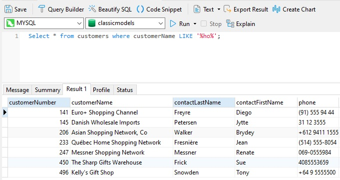

### Предикат BETWEEN

Оператор BETWEEN задает диапазон, определяющий нижнюю и верхнюю границы квалифицируемых значений.

Например, в предикате выбранные данные представляют собой диапазон больше или равен 5000 и меньше или равен 20000.

Оператор BETWEEN можно использовать с числовыми, текстовыми и датовыми типами данных.

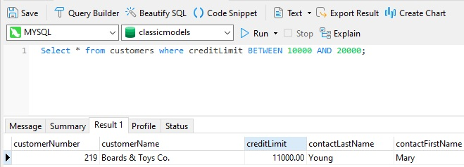

### Предикат IN

Оператор IN позволяет использовать спецификацию двух или более выражений для поиска по запросу.

Результатом условия является TRUE, если значение соответствующего столбца равно одному из выражений, заданных предикатом
IN.

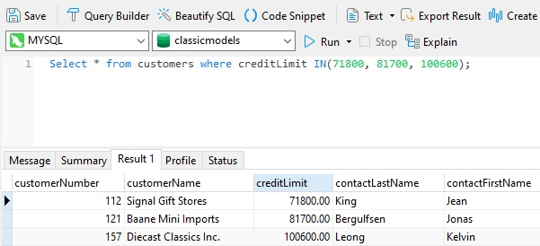

### Предикат EXISTS

Предикат EXISTS принимает подзапрос в качестве аргумента.

Он возвращает значение TRUE, если подзапрос возвращает одну или несколько строк, и возвращает значение FALSE, если
возвращает нулевые строки.

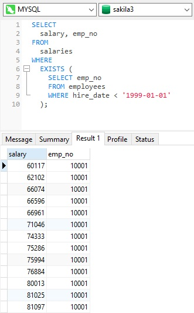

### Предикат IS NULL

Используйте значение IS NULL, чтобы определить, является ли выражение null, так как невозможно проверить значение NULL с
помощью оператора сравнения `=`.

Предикат IS NULL принимает следующую форму:

> IS [NOT] NULL

Например, выражение имеет значение TRUE, если x имеет значение null.

> x IS NULL

IS UNKNOWN является синонимом значения IS NULL, когда выражение относится к типу BOOLEAN.


## Функциональные зависимости. Правила вывода Армстронга и Дарвина. Замыкание множества атрибутов.

Ограничения уникальности, накладываемые объявлениями первичного и кандидатных ключей отношения, является частным случаем
ограничений, связанных с понятием функциональных зависимостей.

Для объяснения понятия функциональной зависимости, рассмотрим следующий пример.

Пусть нам дано отношение, содержащее данные о результатах какой-то одной конкретной сессии. Схема этого отношения
выглядит следующим образом:

Сессия (<b>№ зачетной книжки</b>, Фамилия, Имя, Отчество, <b>Предмет</b>, Оценка);

Атрибуты «№ зачетной книжки» и «Предмет» образуют составной (так как ключом объявлены два атрибута) первичный ключ этого
отношения. Действительно, по двум этим атрибутам можно однозначно определить значения всех остальные атрибутов.

Однако, помимо ограничения уникальности, связанной с этим ключом, на отношение непременно должно быть наложено то
условие, что одна зачетная книжка выдается обязательно одному конкретному человеку и, следовательно, в этом отношении
кортежи с одинаковым номером зачетной книжки должны содержать одинаковые значения атрибутов «Фамилия», «Имя» и
«Отчество».


Если у нас имеется следующий фрагмент какой-то определенной базы данных студентов учебного заведения после какой-то
сессии, то в кортежах с номером зачетной книжки 100, атрибуты «Фамилия», «Имя» и «Отчество» совпадают, а атрибуты
«Предмет» и «Оценка» – не совпадают (что и понятно, ведь в них речь идет о разных предметах и успеваемости по ним). Это
значит, что атрибуты «Фамилия», «Имя» и «Отчество» <b>функционально зависят</b> от атрибута «№ зачетной книжки», а
атрибуты «Предмет» и «Оценка» функционально не зависят.

> Таким образом, функциональная зависимость – это однозначная зависимость, затабулированная в системах управления базами данных.

Теперь дадим строгое определение функциональной зависимости.

Определение: пусть X, Y – подсхемы схемы отношения S, определяющие над схемой S схему функциональной зависимости X > Y (
читается «X стрелка Y»). Определим ограничения функциональной зависимости inv<X > Y> как утверждение о том, что в
отношении со схемой S любые два кортежа, совпадающие в проекции на подсхему X, должны совпадать и в проекции на подсхему
Y.

Запишем это же определение в формулярном виде:

> `Inv<X > Y> r(S) = t<sub>1</sub>, t<sub>2</sub> ? r(t<sub>1</sub>[X] = t<sub>2</sub>[X] ? t<sub>1</sub>[Y] = t<sub>2</sub> [Y]), X, Y ? S`

На практике проектирования баз данных на схему функциональной зависимости для краткости обычно ссылаются как на
функциональную зависимость.

В частном случае, когда правая часть функциональной зависимости, т. е. подсхема Y, совпадает со всей схемой отношения,
ограничение функциональной зависимости переходит в ограничение уникальности первичного или кандидатного ключа.

Действительно:

> `Inv<K > S> r(S) = ? t1, t2 ? r(t1[K] = t2 [K] > t1(S) = t2(S)), K ? S`

Просто в определении функциональной зависимости вместо подсхемы X нужно взять обозначение ключа K, а вместо правой части
функциональной зависимости, подсхемы Y взять всю схему отношений S, т. е., действительно, ограничение уникальности
ключей отношений является частным случаем ограничения функциональной зависимости при равенстве правой части схемы
функциональной зависимости всей схеме отношения.

Приведем примеры изображения функциональной зависимости:

> { № зачетной книжки} > {Фамилия, Имя, Отчество }

> { № зачетной книжки, Предмет} > {Оценка}

---

Прежде чем приступать к анализу самих правил вывода Армстронга, введем в рассмотрение новый металингвистический символ
«+», который называется символом метаутверждения о выводимости.

Этот символ при формулировании правил записывается между двумя синтаксическими выражениями и свидетельствует о том, что
из формулы, стоящей слева от него, выводится формула, стоящая справа от него.

Сформулируем теперь сами правила вывода Армстронга в виде следующей теоремы.

Теорема. Справедливы следующие правила, называемые правилами вывода Армстронга.

- Правило вывода 1. `+ X > X`;
- Правило вывода 2. `X > Y+ X ? Z > Y`;
- Правило вывода 3. `X > Y, Y ? W > Z + X ? W > Z`;

Здесь X, Y, Z, W – произвольные подсхемы схемы отношения S. Символ метаутверждения о выводимости разделяет списки
посылок и списки утверждений (заключений).

1. Первое правило вывода называется «<b>рефлексивность</b>» и читается следующим образом: «выводится правило: “X
   функционально влечет за собой X”». Это самое простое из правил вывода Армстронга. Оно выводится буквально из воздуха.
   <br><br>Функциональная зависимость, обладающая и левой, и правой частями, называется <b>рефлексивной</b>. Согласно
   правилу рефлексивности ограничение рефлексивной зависимости выполняется автоматически.

2. Второе правило вывода называется «<b>пополнение</b>» и читается таким образом: «если X функционально определяет Y, то
   выводится правило:
   “объединение подсхем X и Z функционально влечет за собой Y”».
   <br><br>Правило пополнения позволяет расширять левую часть ограничения функциональных зависимостей.

3. Третье правило вывода называется «<b>псевдотранзитивность</b>» и читается следующим образом:
   “если подсхема X функционально влечет за собой подсхему Y и объединение подсхем Y и W функционально влекут за собой
   Z, то выводится правило: «объединение подсхем X и W функционально определяют подсхему Z»”.

<br><br>Правило псевдотранзитивности обобщает правило транзитивности, соответствующее частному случаю W: = 0. Приведем
формулярную запись этого правила:

X >Y, Y > Z +X > Z.

Необходимо отметить, что посылки и заключения, приведенные ранее, были представлены в сокращенной форме обозначениями
схем функциональной зависимости. В расширенной форме им соответствуют следующие ограничения функциональных зависимостей.

- Правило вывода 1. `inv <X > X> r(S)`
- Правило вывода 2. `inv <X > Y> r(S) ? inv <X ? Z > Y> r(S)`
- Правило вывода 3. `inv <X > Y> r(S) & inv <Y ? W > Z> r(S) ? inv<X ? W > Z> r(S)`

Проведем доказательства этих правил вывода.

1. Доказательство правила рефлексивности следует непосредственно из определения ограничения функциональной зависимости
   при подстановке вместо подсхемы Y – подсхемы X.
   <br><br>Действительно, возьмем ограничение функциональной зависимости:

&nbsp;&nbsp;&nbsp;&nbsp;&nbsp;&nbsp;&nbsp;`Inv <X > Y> r(S)`

&nbsp;&nbsp;&nbsp;&nbsp;&nbsp;&nbsp;&nbsp;&nbsp;и подставим в него X вместо Y, получим:</p>

&nbsp;&nbsp;&nbsp;&nbsp;&nbsp;&nbsp;&nbsp;`Inv <X > X> r(S)`,

&nbsp;&nbsp;&nbsp;&nbsp;&nbsp;&nbsp;&nbsp;&nbsp;а это и есть правило рефлексивности

&nbsp;&nbsp;&nbsp;&nbsp;&nbsp;&nbsp;&nbsp;&nbsp;Правило рефлексивности доказано.

2. Доказательство правила пополнения проиллюстрируем на диаграммах функциональной зависимости.
   <br>Первая диаграмма – это диаграмма посылки:
   <br><br>посылка: X > Y
   <br><br>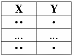
   <br><br>Вторая диаграмма:
   <br><br>заключение: X ? Z > Y
   <br><br>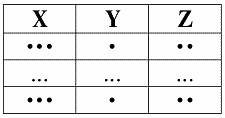
   <br><br>Пусть кортежи равны на X ? Z. Тогда они равны на X. Согласно посылке они будут равны и на Y.
   <br><br>Правило пополнения доказано.

3. Доказательство правила псевдотранзитивности также проиллюстрируем на диаграммах, которых в этом конкретном случае
   будет три.
   <br>Первая диаграмма – первая посылка:
   <br><br>посылка 1: X > Y
   <br><br>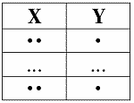
   <br><br>посылка 2: Y ? W > Z
   <br><br>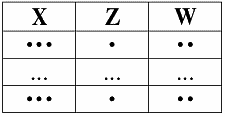
   <br><br>И, наконец, третья диаграмма – диаграмма заключения:
   <br><br>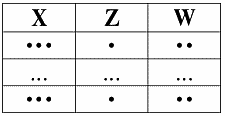
   <br><br>заключение: X ? W > Z
   <br><br>Пусть кортежи равны на X ? W. Тогда они равны и на X, и на W. Согласно Посылке 1, они будут равны и на Y.
   Отсюда, согласно Посылке 2, они будут равны и на Z.
   <br><br>Правило псевдотранзитивности доказано.

---

Замыкание множества функциональных зависимостей S — множество всех функциональных зависимостей, обозначаемое S<sup>
+</sup>, которые следуют из заданного множества функциональных зависимостей S.

> A -> B, B -> C => A -> C

S <b>слабее</b> P (P накрывает S) тогда и только тогда, когда S<sup>+</sup> является подмножеством P<sup>+</sup>:
> S ⊏ P ⇔ S<sup>+</sup> ⊂ P<sup>+</sup>

S эквивалентно P:
> S ≡ P ⇔ S ⊏ P and P ⊏ S ⇔ S<sup>+</sup> = P<sup>+</sup>

### Оценка мощности замыкания

Для начала оценим количество тривиальных ФЗ на n атрибутах. Количество способов выбрать k атрибутов из n для левой части
ФЗ — (<sup>n</sup><sub>k</sub>), количество способов выбрать непустое подмножество из левой части для правой — 2<sup>
k</sup> − 1.

Известно, что ∑<sup>n</sup><sub>k=0</sub>(<sup>n</sup><sub>k</sub>)x<sup>k</sup> = (1+x)<sup>n</sup>.

Значит количество тривиальных ФЗ: ∑<sup>n</sup><sub>k=0</sub>(<sup>n</sup><sub>k</sub>)(2<sup>k</sup> − 1)=O(3<sup>
n</sup>).

Заметим, что при построении замыкания нельзя не учитывать тривиальные зависимости, так как при применении правил вывода,
правила композиции, например, к нетривиальной и тривиальной зависимостям можно получить в итоге нетривиальную
зависимость.

Получается, что мощность порядка O(m3<sup>n</sup>), где m — количество базовых нетривиальных зависимостей.

На практике замыкания ФЗ не применимы, так как мощность в реальных приложениях слишком велика.

## Нормализация отношений. Первая, вторая и третья нормальные формы. Нормальная форма Бойса-Кодда.

Процесс проектирования БД с использование метода НФ является итерационным и заключается в последовательном переводе
отношения из 1НФ в НФ более высокого порядка по определенным правилам. Каждая следующая НФ ограничивается определенным
типом функциональных зависимостей и устранением соответствующих аномалий при выполнении операций над отношениями БД, а
также сохранении свойств предшествующих НФ.

---

Используемые термины

Атрибут — свойство некоторой сущности. Часто называется полем таблицы.

Домен атрибута — множество допустимых значений, которые может принимать атрибут.

Кортеж — конечное множество взаимосвязанных допустимых значений атрибутов, которые вместе описывают некоторую сущность (
строка таблицы).

Отношение — конечное множество кортежей (таблица).

Схема отношения — конечное множество атрибутов, определяющих некоторую сущность. Иными словами, это структура таблицы,
состоящей из конкретного набора полей.

Проекция — отношение, полученное из заданного путём удаления и (или) перестановки некоторых атрибутов.

Функциональная зависимость между атрибутами (множествами атрибутов) X и Y означает, что для любого допустимого набора
кортежей в данном отношении: если два кортежа совпадают по значению X, то они совпадают по значению Y. Например, если
значение атрибута «Название компании» — Canonical Ltd, то значением атрибута «Штаб-квартира» в таком кортеже всегда
будет Millbank Tower, London, United Kingdom. Обозначение: {X} -> {Y}.

Нормальная форма — требование, предъявляемое к структуре таблиц в теории реляционных баз данных для устранения из базы
избыточных функциональных зависимостей между атрибутами (полями таблиц).

Метод нормальных форм (НФ) состоит в сборе информации о объектах решения задачи в рамках одного отношения и последующей
декомпозиции этого отношения на несколько взаимосвязанных отношений на основе процедур нормализации отношений.

Цель нормализации: исключить избыточное дублирование данных, которое является причиной аномалий, возникших при
добавлении, редактировании и удалении кортежей(строк таблицы).

Аномалией называется такая ситуация в таблице БД, которая приводит к противоречию в БД либо существенно усложняет
обработку БД. Причиной является излишнее дублирование данных в таблице, которое вызывается наличием функциональных
зависимостей от не ключевых атрибутов.

Аномалии-модификации проявляются в том, что изменение одних данных может повлечь просмотр всей таблицы и соответствующее
изменение некоторых записей таблицы.

Аномалии-удаления — при удалении какого либо кортежа из таблицы может пропасть информация, которая не связана на прямую
с удаляемой записью.

Аномалии-добавления возникают, когда информацию в таблицу нельзя поместить, пока она не полная, либо вставка записи
требует дополнительного просмотра таблицы.

---

### Первая нормальная форма

Отношение находится в 1НФ, если все его атрибуты являются простыми, все используемые домены должны содержать только
скалярные значения. Не должно быть повторений строк в таблице.

Например, есть таблица «Автомобили»:

| Фирма | Модели | |:-:|:-:| | BMW | M5, X5M, M1 | | Nissan | GT-R |

Нарушение нормализации 1НФ происходит в моделях BMW, т.к. в одной ячейке содержится список из 3 элементов: M5, X5M, M1,
т.е. он не является атомарным.

Преобразуем таблицу к 1НФ:

| Фирма | Модели | |:-:|:-:| | BMW | M5 | | BMW | X5M | | BMW | M1 | | Nissan | GT-R |

### Вторая нормальная форма

Отношение находится во 2НФ, если оно находится в 1НФ и каждый не ключевой атрибут неприводимо зависит от Первичного
Ключа(ПК).

Неприводимость означает, что в составе потенциального ключа отсутствует меньшее подмножество атрибутов, от которого
можно также вывести данную функциональную зависимость.

Например, дана таблица:

| Модель | Фирма | Цена | Скидка | |:-:|:-:|:-:|:-:| | M5 | BMW | 5500000 | 5% | | X5M | BMW | 6000000 | 5% | | M1 | BMW
| 2500000 | 5% | | GT-R | Nissan | 5000000 | 10% |

Таблица находится в первой нормальной форме, но не во второй. Цена машины зависит от модели и фирмы. Скидка зависят от
фирмы, то есть зависимость от первичного ключа неполная. Исправляется это путем декомпозиции на два отношения, в которых
не ключевые атрибуты зависят от ПК.

| Модель | Фирма | Цена | |:-:|:-:|:-:| | M5 | BMW | 5500000 | | X5M | BMW | 6000000 | | M1 | BMW | 2500000 | | GT-R |
Nissan | 5000000 |

| Фирма | Скидка | |:-:|:-:| | BMW | 5% | | Nissan | 10% |

### Третья нормальная форма

Отношение находится в 3НФ, когда находится во 2НФ и каждый не ключевой атрибут нетранзитивно зависит от первичного
ключа. Проще говоря, второе правило требует выносить все не ключевые поля, содержимое которых может относиться к
нескольким записям таблицы в отдельные таблицы.

| Фирма | Магазин | Телефон | |:-:|:-:|:-:| | BMW | Риал-авто | 87-33-98 | | Audi | Риал-авто | 87-33-98 | | Nissan |
Некст-авто | 94-54-12 |

Таблица находится во 2НФ, но не в 3НФ.

В отношении атрибут «Модель» является первичным ключом. Личных телефонов у автомобилей нет, и телефон зависит
исключительно от магазина. Таким образом, в отношении существуют следующие функциональные зависимости:
> Модель → Магазин, Магазин → Телефон, Модель → Телефон.

Зависимость Модель → Телефон является транзитивной, следовательно, отношение не находится в 3НФ.

В результате разделения исходного отношения получаются два отношения, находящиеся в 3НФ:

| Фирма | Магазин | |:-:|:-:| | BMW | Риал-авто | | Audi | Риал-авто | | Nissan | Некст-авто |

| Магазин | Телефон | |:-:|:-:| | Риал-авто | 87-33-98 | | Некст-авто | 94-54-12 |

### Нормальная форма Бойса-Кодда (НФБК) (частная форма третьей нормальной формы)

Определение 3НФ не совсем подходит для следующих отношений:

1. отношение имеет два или более потенциальных ключа;
2. два и более потенциальных ключа являются составными;
3. они пересекаются, т.е. имеют хотя бы один общий атрибут.

Для отношений, имеющих один потенциальный ключ (первичный), НФБК является 3НФ.

Отношение находится в НФБК, когда каждая нетривиальная и неприводимая слева функциональная зависимость обладает
потенциальным ключом в качестве детерминанта.

Предположим, рассматривается отношение, представляющее данные о бронировании стоянки на день:

| Номер стоянки | Время начала | Время окончания | Тариф | |:-:|:-:|:-:|:-:| | 1 | 09:30 | 10:30 | Бережливый | | 1 |
11:00 | 12:00 | Бережливый | | 1 | 14:00 | 15:30 | Стандарт | | 2 | 10:00 | 12:00 | Премиум-B | | 2 | 12:00 | 14:00 |
Премиум-B | | 2 | 15:00 | 18:00 | Премиум-A |

Тариф имеет уникальное название и зависит от выбранной стоянки и наличии льгот, в частности:

- «Бережливый»: стоянка 1 для льготников
- «Стандарт»: стоянка 1 для не льготников
- «Премиум-А»: стоянка 2 для льготников
- «Премиум-B»: стоянка 2 для не льготников.

Таким образом, возможны следующие составные первичные ключи:

- {Номер стоянки, Время начала}
- {Номер стоянки, Время окончания}
- {Тариф, Время начала}
- {Тариф, Время окончания}

Отношение находится в 3НФ. Требования второй нормальной формы выполняются, так как все атрибуты входят в какой-то из
потенциальных ключей, а неключевых атрибутов в отношении нет. Также нет и транзитивных зависимостей, что соответствует
требованиям третьей нормальной формы. Тем не менее, существует функциональная зависимость Тариф → Номер стоянки, в
которой левая часть (детерминант) не является потенциальным ключом отношения, то есть отношение не находится в
нормальной форме Бойса — Кодда.

Недостатком данной структуры является то, что, например, по ошибке можно приписать тариф «Бережливый» к бронированию
второй стоянки, хотя он может относиться только к первой стоянке.

Можно улучшить структуру с помощью декомпозиции отношения на два и добавления атрибута <b>Имеет льготы</b>, получив
отношения, удовлетворяющие НФБК (подчёркнуты атрибуты, входящие в первичный ключ.):

<b>Тарифы</b>
| <ins>Тариф</ins>  | Номер стоянки | Имеет льготы | |:-:|:-:|:-:| | Бережливый | 1 | Да | | Стандарт | 1 | Нет | |
Премиум-А | 2 | Да | | Премиум-В | 2 | Нет |

<b>Бронирование</b>
|  <ins>Тариф</ins> |  <ins>Время начала</ins> | Время окончания | |---|---|---| | Бережливый | 09:30 | 10:30 | |
Бережливый | 11:00 | 12:00 | | Стандарт | 14:00 | 15:30 | | Премиум-В | 10:00 | 12:00 | | Премиум-В | 12:00 | 14:00 | |
Премиум-А | 15:00 | 18:00 |

## Нормализация отношений. Многозначные зависимости и четвертая нормальная форма. Зависимости соединения и пятая нормальная форма.

### Четвертая нормальная форма

Отношение находится в 4НФ, если оно находится в НФБК и все нетривиальные многозначные зависимости фактически являются
функциональными зависимостями от ее потенциальных ключей.

В отношении R (A, B, C) существует многозначная зависимость R.A -> R.B в том и только в том случае, если множество
значений B, соответствующее паре значений A и C, зависит только от A и не зависит от С.

Предположим, что рестораны производят разные виды пиццы, а службы доставки ресторанов работают только в определенных
районах города. Составной первичный ключ соответствующей переменной отношения включает три атрибута:
{Ресторан, Вид пиццы, Район доставки}.

Такая переменная отношения не соответствует 4НФ, так как существует следующая многозначная зависимость:

{Ресторан} → {Вид пиццы} {Ресторан} → {Район доставки}

То есть, например, при добавлении нового вида пиццы придется внести по одному новому кортежу для каждого района
доставки. Возможна логическая аномалия, при которой определенному виду пиццы будут соответствовать лишь некоторые районы
доставки из обслуживаемых рестораном районов.

Для предотвращения аномалии нужно декомпозировать отношение, разместив независимые факты в разных отношениях. В данном
примере следует выполнить декомпозицию на {Ресторан, Вид пиццы} и {Ресторан, Район доставки}.

Однако, если к исходной переменной отношения добавить атрибут, функционально зависящий от потенциального ключа, например
цену с учётом стоимости доставки
({Ресторан, Вид пиццы, Район доставки} → Цена), то полученное отношение будет находиться в 4НФ и его уже нельзя
подвергнуть декомпозиции без потерь.

### Пятая нормальная форма

Зависимость соединения является предельным обобщением понятий многозначной и функциональной зависимости, то есть это
наиболее общая форма зависимости между атрибутами отношения

Отношения находятся в 5НФ, если оно находится в 4НФ и отсутствуют сложные зависимые соединения между атрибутами.

Если «Атрибут_1» зависит от «Атрибута_2», а «Атрибут_2» в свою очередь зависит от «Атрибута_3», а «Атрибут_3» зависит от
«Атрибута_1», то все три атрибута обязательно входят в один кортеж.

Это очень жесткое требование, которое можно выполнить лишь при дополнительных условиях. На практике трудно найти пример
реализации этого требования в чистом виде.

Например, некоторая таблица содержит три атрибута «Поставщик», «Товар» и «Покупатель». Покупатель_1 приобретает
несколько Товаров у Поставщика_1. Покупатель_1 приобрел новый Товар у Поставщика_2. Тогда в силу изложенного выше
требования Поставщик_1 обязан поставлять Покупателю_1 тот же самый новый Товар, а Поставщик_2 должен поставлять
Покупателю_1, кроме нового Товара, всю номенклатуру Товаров Поставщика_1. Этого на практике не бывает. Покупатель
свободен в своем выборе товаров. Поэтому для устранения отмеченного затруднения все три атрибута разносят по разным
отношениям (таблицам). После выделения трех новых отношений (Поставщик, Товар и Покупатель) необходимо помнить, что при
извлечении информации (например, о покупателях и товарах) необходимо в запросе соединить все три отношения. Любая
комбинация соединения двух отношений из трех неминуемо приведет к извлечению неверной
(некорректной) информации. Некоторые СУБД снабжены специальными механизмами, устраняющими извлечение недостоверной
информации. Тем не менее, следует придерживаться общей рекомендации:
структуру базы данных строить таким образом, чтобы избежать применения 4НФ и 5НФ.

Пятая нормальная форма ориентирована на работу с зависимыми соединениями.

Указанные зависимые соединения между тремя атрибутами встречаются очень редко. Зависимые соединения между четырьмя,
пятью и более атрибутами указать практически невозможно.

### Доменно-ключевая нормальная форма

Переменная отношения находится в ДКНФ тогда и только тогда, когда каждое наложенное на неё ограничение является
логическим следствием ограничений доменов и ограничений ключей, наложенных на данную переменную отношения.

Ограничение домена – ограничение, предписывающее использовать для определённого атрибута значения только из некоторого
заданного домена. Ограничение по своей сути является заданием перечня (или логического эквивалента перечня) допустимых
значений типа и объявлением о том, что указанный атрибут имеет данный тип.

Ограничение ключа – ограничение, утверждающее, что некоторый атрибут или комбинация атрибутов является потенциальным
ключом.

Любая переменная отношения, находящаяся в ДКНФ, обязательно находится в 5НФ. Однако не любую переменную отношения можно
привести к ДКНФ.

Механизм представлений языка SQL позволяет различными способами разделить базу данных на части таким образом, чтобы
некоторая информация была скрыта от пользователей, которые не имеют прав для доступа к ней. Однако этот режим задается
не с помощью параметров операций, на основе которых санкционированные пользователи выполняют те или иные действия с
заданной частью данных. Эта функция (как было показано выше) выполняется с помощью директивы GRANT.

Обратите внимание, что создателю любого объекта автоматически предоставляются все привилегии в отношении этого объекта.

Стандарт SQL1 определяет следующие привилегии для таблиц:

1. SELECT – позволяет считывать данные из таблицы или представления;

2. INSERT – позволяет вставлять новые записи в таблицу или представление;

3. UPDATE – позволяет модифицировать записи из таблицы или представления;

4. DELETE – позволяет удалять записи из таблицы или представления.

Стандарт SQL2 расширил список привилегий для таблиц и представлений:

1. INSERT для отдельных столбцов, подобно привилегии UPDATE;

2. REFERENCES – для поддержки внешнего ключа.

Помимо перечисленных выше добавлена привилегия USAGE – для других объектов базы данных.

Кроме того, большинство коммерческих СУБД поддерживает дополнительные привилегии, например:

1. ALTER – позволяет модифицировать структуру таблиц (DB2, Oracle);

2. EXECUTE – позволяет выполнять хранимые процедуры.

Создатель объекта также получает право предоставить привилегии доступа какому-нибудь другому пользователю с помощью
оператора GRANT. Ниже приводится синтаксис утверждения GRANT:

GRANT {SELECT|INSERT|DELETE|(UPDATE столбец, …)}, …

ON таблица ТО {пользователь | PUBLIC} [WITH GRANT OPTION]

Привилегии вставки (INSERT) и обновления (UPDATE) (но не привилегии выбора SELECT, что весьма странно) могут задаваться
для специально заданных столбцов.

Если задана директива WITH GRANT OPTION, это значит, что указанные пользователи наделены особыми полномочиями для
заданного объекта – правом предоставления полномочий. Это, в свою очередь, означает, что для работы с данным объектом
они могут наделять полномочиями других пользователей

Например: предоставить пользователю Ivanov полномочия для осуществления выборки и модификации фамилий в таблице Students
с правом предоставления полномочий.

GRANT SELECT, UPDATE StName

ON Students ТО Ivanov WITH GRANT OPTION

Если пользователь А наделяет некоторыми полномочиями другого пользователя В, то впоследствии он может отменить эти
полномочия для пользователя В. Отмена полномочий выполняется с помощью директивы REVOKE с приведенным ниже синтаксисом.

REVOKE {{SELECT | INSERT | DELETE | UPDATE},…|ALL PRIVILEGES}

ON таблица,… FROM {пользователь | PUBLIC},… {CASCADE | RESTRICT}

Поскольку пользователь, с которого снимается привилегия, мог предоставить ее другому пользователю (если обладал правом
предоставления полномочий), возможно возникновение ситуации покинутых привилегий. Основное предназначение параметров
RESTRICT и CASCADE заключается в предотвращении ситуаций с возникновением покинутых привилегий. Благодаря заданию
параметра RESTRICT не разрешается выполнять операцию отмены привилегии, если она приводит к появлению покинутой
привилегии. Параметр CASCADE указывает на последовательную отмену всех привилегий, производных от данной.

Например: снять с пользователя Ivanov полномочия для осуществления модификации фамилий в таблице Students. Также снять
эту привилегию со всех пользователей, которым она была предоставлена Ивановым.

REVOKE UPDATE

ON Students FROM Ivanov CASCADE

При удалении домена, таблицы, столбца или представления автоматически будут удалены также и все привилегии в отношении
этих объектов со стороны всех пользователей.

Ограничение целостности - это некоторое утверждение, которое может быть истинным или ложным в зависимости от состояния
базы данных.

Примерами ограничений целостности могут служить следующие утверждения:

- Возраст сотрудника не может быть меньше 18 и больше 65 лет.
- Каждый сотрудник имеет уникальный табельный номер.
- Сотрудник обязан числиться в одном отделе.
- Сумма накладной обязана равняться сумме произведений цен товаров на количество товаров для всех товаров, входящих в
  накладную.

Как видно из этих примеров, некоторые из ограничений целостности являются ограничениями реляционной модели данных. Любое
ограничение целостности является семантическим понятием, т.е. появляется как следствие определенных свойств объектов
предметной области и/или их взаимосвязей.

База данных находится в согласованном (целостном) состоянии, если выполнены (удовлетворены) все ограничения целостности,
определенные для базы данных.

Согласованность базы данных есть формальное свойство базы данных. База данных не понимает "смысла" хранимых данных. "
Смыслом" данных для СУБД является весь набор ограничений целостности. Если все ограничения выполнены, то СУБД считает,
что данные корректны.

Вместе с понятием целостности базы данных возникает понятие реакции системы на попытку нарушения целостности. Система
должна не только проверять, не нарушаются ли ограничения в ходе выполнения различных операций, но и должным образом
реагировать, если операция приводит к нарушению целостности. Имеется два типа реакции на попытку нарушения целостности:

- Отказ выполнить "незаконную" операцию.
- Выполнение компенсирующих действий.

Например, если система знает, что в поле "Возраст_Сотрудника" должны быть целые числа в диапазоне от 18 до 65, то
система отвергает попытку ввести значение возраста 66. При этом может генерироваться какое-нибудь сообщение для
пользователя.

Работу системы по проверке ограничений можно изобразить на следующем рисунке:
http://citforum.ru/database/dblearn/image345.gif

Классификация ограничений целостности Ограничения целостности можно классифицировать несколькими способами:

- По способам реализации: декларативная и процедурная
- По времени проверки: немедленно проверяемые и отложенные
- По области действия: домен, атрибут, кортеж, отношение, база данных

Стандарт SQL не предусматривает процедурных ограничений целостности, реализуемых при помощи триггеров и хранимых
процедур. В стандарте SQL 92 отсутствует понятие "триггер", хотя триггеры имеются во всех промышленных СУБД SQL-типа.

Стандарт SQL позволяет задавать декларативные ограничения следующими способами:

Как ограничения домена. Как ограничения, входящие в определение таблицы. Как ограничения, хранящиеся в базе данных в
виде независимых утверждений (assertion). Допускаются как немедленно проверяемые, так и ограничения с отложенной
проверкой. Режим проверки отложенных ограничений можно в любой момент изменить так, чтобы ограничение проверялось:

- После исполнения каждого оператора, изменяющего содержимое таблицы, к которой относится данное ограничение.
- При завершении каждой транзакции, включающей операторы, изменяющие содержимое таблиц, к которым относятся данное
  ограничение.
- В любой промежуточный момент, если пользователь инициирует проверку.

При определении ограничения указывается тип проверки ограничения - является ли это ограничение неоткладываемым (NOT
DEFERRED) или может быть откладываемым (DEFERRED). Во втором случае можно задать процедуру по умолчанию: проверять
немедленно или проверять по завершении транзакции. Таким образом, можно определить потенциально откладываемое
ограничение, которое по умолчанию проверяется немедленно. В любой момент режим проверки такого ограничения можно
изменить на отложенный и наоборот. Режим проверки может быть изменен для одного ограничения или сразу для всех
потенциально откладываемых ограничений. Если ограничение определено как неоткладываемое, то тип такого ограничения
изменить нельзя и ограничение всегда проверяется немедленно.

Элементы процедурности все же присутствуют в стандарте SQL в виде так называемых действий, исполняемых по ссылке (
referential triggered actions). Эти действия определяют, что будет происходить при изменении значения родительского
ключа, на который ссылается некоторый внешний ключ. Эти действия можно задавать независимо для операций обновления (ON
UPDATE) или для операций удаления (ON DELETE) записей в родительском отношении. Стандартом SQL определяется 4 типа
действий, исполняемых по ссылке:

- CASCADE. Изменения значения родительского ключа автоматически приводят к таким же изменениям связанного с ним значения
  внешнего ключа. Удаление кортежа в родительском отношении приводит к удалению связанных с ним кортежей в дочернем
  отношении.
- SET NULL. Все внешние ключи, которые ссылаются на обновленный или удаленный родительский ключ получают значения NULL.
- SET DEFAULT. Все внешние ключи, которые ссылаются на обновленный или удаленный родительский ключ получают значения,
  принятые по умолчанию для этих ключей.
- NO ACTION. Значения внешнего ключа не изменяются. Если операция приводит к нарушению ссылочной целостности (
  появляются "висящие" ссылки), то такая операция не выполняется.

Как видно, действия, исполняемые по ссылке, фактически являются встроенными в СУБД триггерами. Действия типа CASCADE,
SET NULL и SET DEFAULT являются компенсирующими операциями, вызывающимися при попытке нарушить ссылочную целостность.

## Понятие списка, стека, дека, очереди. Основные алгоритмы включения, исключения элементов в этих структурах. Сравнительный анализ эффективности конкретных реализаций данных структур. Алгоритмы включения и исключения элемента из двусвязного списка.

Двусторонняя очередь (дек) – последовательный контейнер, поддерживающий доступ к
произвольным элементам и обеспечивает вставку и удаление из обоих концов очереди за
постоянное время. Операции с элементами внутри очереди занимают время, пропорциональное
количеству перемещаемых элементов. Доступ к элементам очереди осуществляется за постоянное
время (оно несколько больше, чем для вектора).

Список – последовательный контейнер, обеспечивающий вставку и удаление элементов за
постоянное время. Не предоставляет произвольный доступ к своим элементам. Операции с
элементами внутри списка (вставка элемента, удаление элемента) занимают постоянное время.
Список может быть односвязным и двусвязным (указатель на след. элемент или указатель на след. и пред. элементы)

Стек – последовательный контейнер, обеспечивающий вставку элемента в вершину стека
и удаление элемента из вершины стека.
Очередь – последовательный контейнер, обеспечивающий добавление элементов в конец
очереди и извлечение элементов с начала очереди.
Очередь с приоритетом – структура, реализованная при помощи очереди на основе
контейнера, допускающего произвольный доступ к элементам (например, вектора или
двусторонней очереди). Первым параметром при описании очереди с приоритетами является тип
ключа, вторым последовательный контейнер, третьим – функция определения приоритета.

|         	| Вставка 	| Удаление 	| Поиск 	|
|:-------:	|:-------:	|:--------:	|:-----:	|
|   Стек  	|   O(n)  	|   O(n)   	|  O(1) 	|
| Очередь 	|   O(1)  	|   O(1)   	|  O(n) 	|
|   Дек   	|   O(1)  	|   O(1)   	|  O(n) 	|

|         	| Вставка 	| Удаление 	| Поиск 	|
|:-------:	|:-------:	|:--------:	|:-----:	|
|   Стек  	|   push 	|   O(n)   	|  find? 	|
| Очередь 	|   push  	|   O(1)   	|  find? 	|
|   Дек   	|   push_front/back  	|   pop_front/back   	|  find? 	|

Стек на массиве, очереди на указателях

Работа со стеком - http://wwwcdl.bmstu.ru/iu7/book1/stage4.htm

Обработка очередей - http://wwwcdl.bmstu.ru/iu7/book1/stage5.htm


## Понятие рекурсии. Рекурсивные типы данных. Рекурсивные процедуры и функции. Критерии выбора для разработки рекурсивных или итеративных алгоритмов.

Рекурсия — это такой способ организации вспомогательного алгоритма (подпрограммы), при котором эта подпрограмма (процедура или функция)
в ходе выполнения ее операторов обращается сама к себе.

Рекурсивные типы данных – это типы, которые содержат сами себя.
Пример - связанный список, который называется Cons.
Самый простой список из возможных - пустой, который мы называем Nil.
Непустой список – это Cons, который состоит из:
- первое значение в списке, которое мы называем head
- ссылка на остальную часть списка, которую мы называем tail
  tail является рекурсивной частью: непустой список содержит меньший список, который может быть пустым или непустым.
  List = Cons(3, Cons(2, Cons(1, Nil)))


Рекурсивный алгоритм всегда можно преобразовать в итеративный, использующий циклические конструкции.
Рекурсивный подход обычно предпочитается итеративному в тех случаях, когда рекурсия более естественно отражает математическую сторону задачи и (или) приводит к
алгоритму, который проще для понимания.

Наличие рекурсии при компьютерной реализации алгоритмов требует наличия некоторой памяти — стека вызова.
В нем хранятся данные о дочерних рекурсивных вызовах, которые используются для возврата управления в родительскую процедуру или функцию.

Процесс разработки рекурсивных алгоритмов состоит из трех этапов: параметризации, выделении базы и декомпозиции.

Параметризация.
На этом этапе происходит выделение параметров, описывающих входные данные алгоритма.
Например, для вычисления F(m) — число m. Для алгоритма поиска минимального элемента во множестве чисел — количество чисел.

Выделение базы предполагает описание тривиальных случаев, для которых результат очевиден и не требует дополнительных операций.
Рекурсивный алгоритм в конечном итоге сводится именно к этим случаям.
Для рекурсивного вычисления факториала базовым случаем является 0! = 1, для вычисления чисел Фибоначчи — два базовых случая: F0 = 0 и F1 = 1.

Декомпозиция.
На этом этане рассматривается общий случай выполнения алгоритма, который сводится к выполнению более «простого» случая.
Под «простотой» может пониматься снижение значения параметров рекурсивного алгоритма, уменьшение размерности данных и т.п.

При оценке эффективности алгоритмов, содержащих рекурсию, вычисляют следующие характеристики:

- глубину рекурсии — максимальное количество вызовов рекурсивного алгоритма без возвратов;
- текущий уровень рекурсии — количество рекурсивных вызовов в некоторый момент времени;
- общее количество вызовов — число вызовов рекурсивного алгоритма при работе программы.

Хвостовая рекурсия — частный случай рекурсии, при котором любой рекурсивный вызов является последней операцией перед возвратом из функции.
Подобный вид рекурсии примечателен тем, что может быть легко заменён на итерацию путём формальной и гарантированно корректной перестройки кода функции.
Оптимизация хвостовой рекурсии путём преобразования её в плоскую итерацию реализована во многих оптимизирующих компиляторах.
В некоторых функциональных языках программирования спецификация гарантирует обязательную оптимизацию хвостовой рекурсии.

В традиционной рекурсии типичная модель состоит в том, что вы сначала выполняете свои рекурсивные вызовы,
а затем берете возвращаемое значение рекурсивного вызова и вычисляете результат.
Таким образом, вы не получите результат своих расчетов, пока не вернетесь после каждого рекурсивного вызова.
В хвостовой рекурсии вы сначала выполняете вычисления, а затем выполняете рекурсивный вызов,
передавая результаты текущего шага следующему рекурсивному шагу.
Это приводит к тому, что последнее утверждение имеет вид (return (recursive-function params)).
По сути, возвращаемое значение любого заданного рекурсивного шага совпадает с возвращаемым значением следующего рекурсивного вызова.

Следствием этого является то, что когда вы будете готовы выполнить следующий рекурсивный шаг,
вам больше не нужен текущий фрейм стека. Это приводит к некоторой оптимизации.
Фактически, с соответствующим образом написанным компилятором у вас никогда не должно быть перехватчика с хвостовым рекурсивным вызовом.
Просто используйте текущий кадр стека для следующего рекурсивного шага.


## Оценка эффективности алгоритмов. Принципы выбора различных по эффективности алгоритмов для решения конкретных задач.

Эффективность алгоритма — это свойство алгоритма, которое связано с вычислительными ресурсами, используемыми алгоритмом.
Алгоритм должен быть проанализирован с целью определения необходимых алгоритму ресурсов.
Эффективность алгоритма можно рассматривать как аналог производственной производительности повторяющихся или непрерывных процессов.

Для достижения максимальной эффективности мы желаем уменьшить использование ресурсов.
Однако различные ресурсы (такие как время и память) нельзя сравнить напрямую, так что какой из двух алгоритмов считать более эффективным часто зависит от того,
какой фактор более важен, например, требование высокой скорости, минимального использования памяти или другой меры эффективности.

|    Обозначение   	|                  Граница                  	|        Рост       	|
|:----------------:	|:-----------------------------------------:	|:-----------------:	|
|      (Тета) Θ     	|  Нижняя и верхняя границы, точная оценка  	|       Равно       	|
|   (О большое) О  	| Верхняя граница, точная оценка неизвестна 	| Меньше либо равно 	|
|    (о малое) о   	|      Верхняя граница, неточная оценка     	|       Меньше      	|
| (Омега большое) Ω  	|  Нижняя граница, точная оценка неизвестна 	| Больше либо равно 	|
|  (Омега малое)  ω 	|      Нижняя граница, неточная оценка      	|       Больше      	|

1.	(О — большое) — верхняя граница, в то время как (Омега — большое) — нижняя граница. Тета требует как (О — большое), так и (Омега — большое), поэтому она является точной оценкой (она должна быть ограничена как сверху, так и снизу). К примеру, алгоритм требующий Ω (n logn) требует не менее n logn времени, но верхняя граница не известна. Алгоритм требующий Θ (n*log(n)) предпочтительнее потому, что он требует не менее n log(n) (Ω (n*logn)) и не более чем n*log(n) (O(n*logn)).
2.	f(x) = Θ(g(n)) означает, что f растет так же как и g когда n стремится к бесконечности. Другими словами, скорость роста f(x) асимптотически пропорциональна скорости роста g(n).
3.	f(x) = O(g(n)). Здесь темпы роста не быстрее, чем g (n). O большое является наиболее полезной, поскольку представляет наихудший случай.

| Алгоритм 	| Эффективность 	|
|:--------:	|:-------------:	|
|   o(n)   	|      < n      	|
|   O(n)   	|       ≤ n        	|
|   Θ(n)       	|      n         	|
|   Ω(n)     	|         ≥ n      	|
|   ω(n)    	|         > n      	|

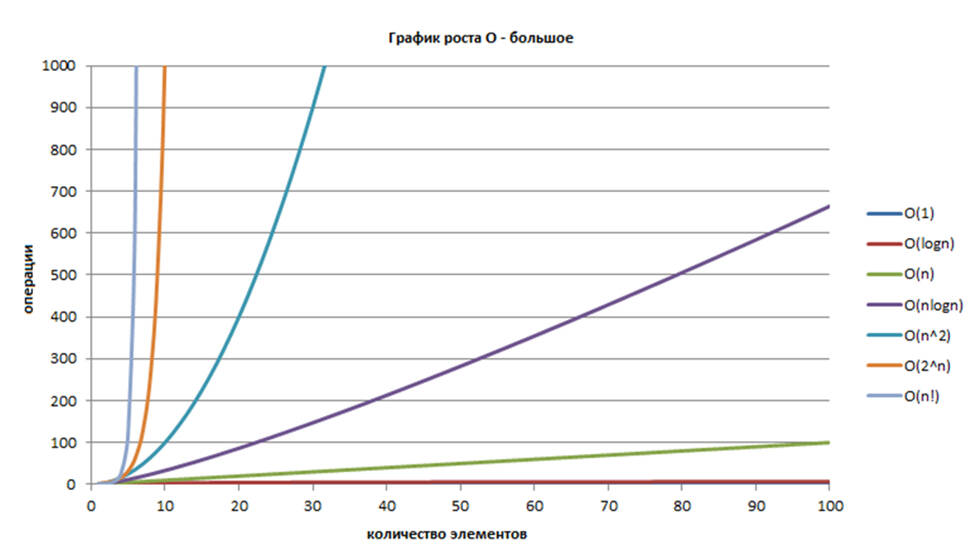


## Разреженные матрицы. Методы хранения и расчета разреженных матриц. Использование разреженных матриц.

Разрежённая матрица — матрица с преимущественно нулевыми элементами. В противном случае, если бо́льшая часть элементов матрицы ненулевые, матрица считается плотной.
Существует несколько способов хранения (представления) разреженных матриц, отличающиеся:
- удобством изменения структуры матрицы (активно используется косвенная адресация) - это структуры в виде списков и словарей.
- скоростью доступа к элементам и возможной оптимизацией матричных вычислений (чаще используются плотные блоки - массивы, увеличивая локальность доступа к памяти).

Способы:
- Словарь по ключам (DOK - Dictionary of Keys) строится как словарь, где ключ – это пара (строка, столбец), а значение это соответствующий строке и столбцу элемент матрицы.
- Список списков (LIL - List of Lists) строится как список строк, где строка – это список узлов вида (столбец, значение).
- Список координат (COO - Coordinate list) хранится список из элементов вида (строка, столбец, значение).
- Сжатое хранение строкой (CSR - Compressed Sparse Row, CRS - Compressed Row Storage, Йельский формат)
  <br>  Мы представляем исходную матрицу M<sup>n x m</sup>, cодержащую N<sub>NZ</sub> ненулевых значений в виде трёх массивов:
    -	массив значений - массив размера N<sub>NZ</sub>, в котором хранятся ненулевые значения, взятые подряд из первой непустой строки, затем идут значения из следующей непустой строки и т.д.
    - массив индексов столбцов - массив размера N<sub>NZ</sub>, и хранит номера столбцов, соответствующих элементов из массива значений.
    -	массив индексации строк - массив размера n + 1 (кол-во строк + 1), для индекса i хранит количество ненулевых элементов в строках с первой до i - 1 строки включительно, стоит отметить, что последний элемент массива индексации строк совпадает с N<sub>NZ</sub>, а первый всегда равен 0.
- Сжатое хранение столбцом (CSС - Compressed Sparse Column, CСS - Compressed Column Storage)
  То же самое что и CRS, только строки и столбцы меняются ролями - значения храним по столбцам, по второму массиву можем определить строку, после подсчётов с третьим массивом - узнаём столбцы.

Обработка разреженных матриц - http://wwwcdl.bmstu.ru/iu7/book1/stage6.htm


## Понятие абстрактных типов данных. Принципы создание алгоритмов с использованием абстрактных типов данных.

Любой тип данных в языке программирования определяет множество допустимых значений переменных и множество допустимых операций над ними,
поэтому можно определить стек как некий абстрактный тип данных (АТД).
Преимущество использования АТД заключается в том, что в этом случае описание данных и операций, выполняемых над ними,
отделено от их представления и реализации. Таким образом, АТД специфицирует данные и операции, которые могут быть применены к этим данным
<br>(Из Бомонки, http://wwwcdl.bmstu.ru/iu7/book1/stage4.htm)

(тупо из Вики, но написано адекватно, так что почему бы и нет)
<br>Абстрактный тип данных (АТД) — это математическая модель для типов данных, где тип данных определяется поведением (семантикой) с точки зрения пользователя данных, а именно в терминах возможных значений, возможных операций над данными этого типа и поведения этих операций.

Формально АТД может быть определён как множество объектов, определяемое списком компонентов (операций, применимых к этим объектам, и их свойств). Вся внутренняя структура такого типа спрятана от разработчика программного обеспечения — в этом и заключается суть абстракции. Абстрактный тип данных определяет набор функций, независимых от конкретной реализации типа, для оперирования его значениями. Конкретные реализации АТД называются структурами данных.

В программировании абстрактные типы данных обычно представляются в виде интерфейсов, которые скрывают соответствующие реализации типов. Программисты работают с абстрактными типами данных исключительно через их интерфейсы, поскольку реализация может в будущем измениться. Такой подход соответствует принципу инкапсуляции в объектно-ориентированном программировании. Сильной стороной этой методики является именно сокрытие реализации. Раз вовне опубликован только интерфейс, то пока структура данных поддерживает этот интерфейс, все программы, работающие с заданной структурой абстрактным типом данных, будут продолжать работать. Разработчики структур данных стараются, не меняя внешнего интерфейса и семантики функций, постепенно дорабатывать реализации, улучшая алгоритмы по скорости, надёжности и используемой памяти.

Различие между абстрактными типами данных и структурами данных, которые реализуют абстрактные типы, можно пояснить на следующем примере. Абстрактный тип данных «список» может быть реализован при помощи массива или линейного списка с использованием различных методов динамического выделения памяти. Однако каждая реализация определяет один и тот же набор функций, который должен работать одинаково (по результату, а не по скорости) для всех реализаций.

Абстрактные типы данных позволяют достичь модульности программных продуктов и иметь несколько альтернативных взаимозаменяемых реализаций отдельного модуля.

Примеры АТД
- Список
- Стек
- Очередь
- Ассоциативный массив
- Очередь с приоритетом


## Деревья. Виды деревьев. Остовное дерево. Использование различных видов деревьев для поиска и сортировки. Сравнение различных методов поиска в массивах, деревьях, хэш-таблицах

Дерево – это нелинейная структура данных, используемая для представления иерархических связей, имеющих отношение «один ко многим».

Дерево с базовым типом Т определяется рекурсивно либо как пустая структура (пустое дерево), либо как узел типа Т с конечным числом древовидных структур этого же типа, называемых поддеревьями.

Самый верхний узел дерева называется корнем.

Верхний узел для нижнего узла называется предком, а нижний узел для верхнего – потомком. Вершины (узлы), не имеющие потомков, называются терминальными вершинами или листьями. Нетерминальные вершины называются внутренними.

Две вершины дерева соединяются ветвью.

Дерево без ветвей с одной вершиной – это пустое или нулевое дерево.

Корень дерева лежит на нулевом уровне.

Максимальный уровень какой-либо вершины дерева называется ее глубиной (от корня до узла) или высотой (от узла до максимально удаленного листа). Отсюда максимальный уровень корня равен нулю. Максимальный уровень всех вершин называется глубиной дерева.

Число непосредственных потомков у вершины (узла) дерева называется степенью вершины (узла).

Максимальная степень всех вершин является степенью дерева. Число ветвей от корня к вершине есть длина пути к этой вершине.

Каждому узлу дерева можно сопоставить имя узла и значение узла, то есть собственно данные, хранящиеся в этом узле. Причем, если значением являются разнородные данные (записи или объединения), то значением узла можно считать значение одного из полей этих данных, называемого ключом.

<b>Типы деревьев</b>:
- N-арное дерево;
- сбалансированное дерево;
- бинарное дерево;
- бинарное дерево поиска;
- дерево AVL;
- красно-чёрное дерево;
- 2-3 дерево.
- РаНдОмИзИрОвАнНоЕ дЕрЕвО
- B/B+ дерево
- Префиксное дерево (ваще другая хуйня, https://ru.wikipedia.org/wiki/%D0%9F%D1%80%D0%B5%D1%84%D0%B8%D0%BA%D1%81%D0%BD%D0%BE%D0%B5_%D0%B4%D0%B5%D1%80%D0%B5%D0%B2%D0%BE)

---

Остовное дерево графа — это дерево, подграф данного графа, с тем же числом вершин, что и у исходного графа. Неформально говоря, остовное дерево получается из исходного графа удалением максимального числа рёбер, входящих в циклы, но без нарушения связности графа. Остовное дерево включает в себя все N вершин исходного графа и содержит N-1 ребро.

<b>Остовное дерево</b> — ациклический связный подграф данного связного неориентированного графа, в который входят все его вершины.

Понятие “остовный лес” неоднозначно, под ним могут понимать один из следующих подграфов:
- любой ациклический подграф, в который входят все вершины графа, но не обязательно связный;
- в несвязном графе — подграф, состоящий из объединения остовных деревьев для каждой его компоненты связности.

Остовное дерево также иногда называют покрывающим деревом, остовом или скелетом графа.

---

Худший случай поиска – O(n) (когда дерево нихуя не балансится и, по сути, получился связный список)

Лучший случай – O(log(n)), когда дерево идеально сбалансировано

Бинарное дерево называется сбалансированным, если для любой его вершины высота правого поддерева отличается от высоты левого поддерева не более чем на единицу.

Длина ветвей в n-вершинном сбалансированном дереве заключена между log(n) и 1,5*log(n).

Для сбалансированного дерева длина пути из корня в лист не превышает 1,44*log(n).

Для случайного дерева средняя длина пути из корня в лист составляет 1,39*log(n), но в худшем случае может оказаться равной n.

---

-	Поиск в массиве – O(n) (простой перебор)
-	Поиск в упорядоченном массиве – O(log(n)) (бинарный поиск)
-	Поиск в дереве – O(log(n))-O(n)
-	Поиск в хэш-таблице – O(1) (если заполненность не более 50%, вроде, дальше – хуже, вплоть до O(n)

В хэш-таблицах по значению ключа сразу определяется индекс элемента массива, в котором хранится информация. Хэш-функция ставит в соответствие каждому ключу ki индекс ячейки j, где расположен элемент с этим ключом, таким образом:
h(ki) = j, если j = (1, m),
где j принадлежит множеству от 1 до m, а m – размерность массива.

Массив, заполненный в порядке, определенным хеш-функцией, называется хеш-таблицей. Минимальная трудоемкость поиска в хеш-таблице равна О(1)

Принято считать, что хорошей является такая функция, которая удовлетворяет следующим условиям:
-	функция должна быть простой с вычислительной точки зрения;
-	функция должна распределять ключи в хеш-таблице наиболее равномерно.

Итак, первое свойство хорошей хеш-функции зависит от характеристик компьютера, а второе – от значений данных.
Если бы все данные были случайными, то хеш-функции были бы очень простые (несколько битов ключа, например).
Однако на практике случайные данные встречаются крайне редко, и приходится создавать функцию, которая зависела бы от всего ключа.

Может возникнуть ситуация, когда разным ключам соответствует одно значение хеш-функции, то есть, когда h(K1) = h(K2), в то время как K1 ≠ K2.
Такая ситуация называется <b>коллизией</b>.
В этом случае, очевидно, необходимо найти новое место для хранения ключей, претендующих на одну и ту же ячейку хеш-таблицы.
Причем количество коллизий необходимо минимизировать. Таким образом, хорошая хеш-функция должна удовлетворять еще одному требованию, а именно: она должна минимизировать число коллизий.

---

Существует два основных типа хеширования, один из которых основан на делении, а другой на умножении.
Впрочем, это не единственные методы, которые существуют, более того, они не всегда являются оптимальными.

Если ключей меньше, чем элементов массива, то в качестве хеш-функции можно принять вычисление остатка от деления целочисленного ключа на размерность массива (m),
то есть:
> h(ki) = (ki mod m), при n < m, где  n – количество ключей.

Данная функция очень проста, хотя и не самая лучшая. Вообще, можно использовать любую размерность (константу m), но она должна быть такой,
чтобы минимизировать число коллизий.

Для этого лучше использовать простое число. В большинстве случаев подобный выбор вполне удовлетворителен.

Для символьной строки ключом может являться остаток от деления, например, суммы кодов символов строки на m.

На практике, метод деления – самый распространенный

---

Существует несколько возможных вариантов разрешения коллизий, которые имеют свои достоинства и недостатки.

Первый метод – внешнее (открытое) хеширование (метод цепочек)

В случае, когда элемент таблицы с индексом, который вернула хеш-функция, уже занят, к нему присоединяется связный список. Таким образом, если для нескольких различных значений ключа возвращается одинаковое значение хеш-функции, то по этому адресу находится указатель на связанный список, который содержит все значения. Поиск в этом списке осуществляется простым перебором, так как при грамотном выборе хеш-функции любой из списков оказывается достаточно коротким.

Другой путь решения проблемы, связанной с коллизиями – внутреннее (закрытое) хеширование (открытая адресация).

Оно состоит в том, чтобы полностью отказаться от ссылок.
В этом случае, если ячейка с вычисленным индексом занята, то можно просто просматривать следующие записи таблицы по порядку (с шагом 1), до тех пор,
пока не будет найден ключ K или пустая позиция в таблице.

При этом, если индекс следующего просматриваемого элемента определяется добавлением какого-то постоянного шага (от 1 до n),
то данный способ разрешения коллизий называется линейной адресацией.

Для вычисления шага можно также применить формулу:
> h = h + a2, где a – это номер попытки поиска ключа.

Этот вид адресации называется квадратичной или произвольной адресацией.

При любом методе разрешения коллизий необходимо ограничить длину поиска элемента.

Если для поиска элемента необходимо более 3–4 сравнений, то эффективность использования такой хеш-таблицы пропадает и ее следует реструктуризировать
(т.е. найти другую хеш-функцию), чтобы минимизировать количество сравнений для поиска элемента

(взято с Бомонки, http://wwwcdl.bmstu.ru/iu7/book1/stage8.htm)


## Базовые понятия теории графов. Поиск в графах. Алгоритмы поиска в ширину и глубину, построение каркасов графа. Пути в графах. Алгоритмы поиска Эйлерова и Гамильтонова пути. Алгоритмы поиска минимальных путей. Раскраска графов. Планарность графов.

Граф – это конечное множество вершин и ребер, соединяющих их, т. е.:

> G = < V, E >

где
- V – конечное непустое множество вершин;
- Е – множество ребер (пар вершин).

Если пары Е (ребра) имеют направление, то граф называется ориентированным (орграф), если иначе - неориентированный (неорграф).

Если в пары Е входят только различные вершины, то в графе нет петель.

Если ребро графа имеет вес, то граф называется взвешенным.

Степень вершины графа равна числу ребер, входящих и выходящих из нее (инцидентных ей).

Неорграф называется связным, если существует путь из каждой вершины в любую другую.

---

Способы представления:
- Матрица смежности
-	Матрица инцидентности
-	Список смежности
-	Список дуг

---

Основные операции по работе с графовыми структурами:
-	поиск кратчайшего пути от одной вершины к другой (если он есть);
-	поиск кратчайшего пути от одной вершины ко всем другим;
-	поиск кратчайших путей между всеми вершинами;
-	поиск эйлерова пути (если он есть);
-	поиск гамильтонова пути (если он есть).

---

Поиск (или обход графа) в глубину (depth first search, DFS), при котором, начиная с произвольной вершины v0, ищется ближайшая смежная вершина v,
для которой в свою очередь осуществляется поиск в глубину (т.е. снова ищется ближайшая, смежная с ней вершина) до тех пор,
пока не встретится ранее просмотренная вершина, или не закончится список смежности вершины v (то есть вершина полностью обработана).

Если нет новых вершин, смежных с v, то вершина v считается использованной, идет возврат в вершину, из которой попали в вершину v, и процесс продолжается до тех пор,
пока не получим v = v0. Иными словами, поиск в глубину из вершины v основан на поиске в глубину из всех новых вершин, смежных с вершиной v.

Путь, полученный методом поиска в глубину, в общем случае не является кратчайшим путем из вершины v в вершину u. Это общий недостаток поиска в глубину.

Указанного недостатка лишен другой метод обхода графа – поиск в ширину (breadth first search, BFS).
Обработка вершины v осуществляется путем просмотра сразу всех новых соседей этой вершины.
При этом полученный путь является кратчайшим путем из одной вершины в другую.

При использовании алгоритмов DFS и BFS графы обходят разными способами, получая при этом некоторые подграфы,
которые имеют специфические названия: каркасы, остовы или стягивающие деревья.

Все вершины исходного графа входят в полученное стягивающее дерево, а все ветви дерева – это множество ребер из все множеств ребер графа

---

Произвольный путь в графе, проходящий через каждое ребро графа точно один раз, называется эйлеровым путем.

При этом, если по некоторым вершинам путь проходит неоднократно, то он является непростым.

Если путь замкнут, то имеем эйлеров цикл. Для существования эйлерова пути в связном графе необходимо и достаточно,
чтобы граф содержал не более двух вершин нечетной степени.

Путь в графе, проходящий в точности один раз через каждую вершину графа (а не каждое ребро) и соответствующий цикл называются гамильтоновыми и
существуют не для каждого графа, как и эйлеров путь.

В отличие от эйлеровых путей неизвестно ни одного простого необходимого и достаточного условия для существования гамильтоновых путей.

Неизвестен даже алгоритм полиномиальной сложности, проверяющий существование гамильтонова пути в произвольном графе.

Проблема существования гамильтонова пути принадлежит к классу так называемых NP-полных задач

---

Поиск кратчайших путей до всех вершин из одной указанной вершины для взвешенного орграфа (имеющего значение, т.е. вес или стоимость, ребра)
с неотрицательными ребрами осуществляется с использованием алгоритма Дейкстры.

Алгоритм Дейкстры основан на выборе для включения в путь всякий раз той вершины, которая имеет наименьшую оценку кратчайшего пути (по весам ребер),
то есть наименьший путь до этой вершины из всех возможных путей, которые были рассмотрены ранее.

Алгоритм Беллмана-Форда позволяет решить задачу о поиске кратчайших путях из одной выбранной вершины ко всем остальным вершинам при любых весах ребер,
в том числе и отрицательных.
Сначала ищется путь от выбранной вершины ко всем вершинам, связными с ней (аналогично поиску в ширину),
а затем – кратчайший путь ко всем остальным вершинам, с попыткой последовательно пройти к ним, т.е. сначала через первую вершину,
затем через вторую, через третью и так далее до последней вершины. Кроме того алгоритм возвращает TRUE, если в графе нет цикла отрицательного веса,
достижимого из данной вершины.

Для поиска кратчайших путей между всеми вершинами используется алгоритм Флойда-Уоршалла.
По алгоритму Флойда-Уоршалла сначала ищется кратчайший путь от одной вершины ко всем вершинам, доступным из нее,
затем проводятся те же действия, но пытаясь пройти от этой вершины ко всем доступным из нее,
проходя каждый раз через новую вершину (сначала через первую, затем – через вторую и т.д.).
Таким образом обрабатываются все вершины.

Остовым деревом графа является дерево, содержащие все вершины графа. Стоимостью этого дерева является сумма стоимостей всех ребер

---

Граф укладывается на некоторой поверхности, если его диаграмму можно нарисовать на этой поверхности без пересечения ребер.

Граф называется планарным, если его можно уложить на плоскости


Граф G называется k-раскрашиваемым, если каждой его вершине можно приписать один из k цветов таким образом,
чтобы никакие две смежные вершины не были одного цвета.

Если граф G является k-раскрашиваемым, но не является k − 1- раскрашиваемым, то граф называется k-хроматическим, а k – его хроматическим числом χ(G).


 
---

Теорема о шести красках. Любой планарный граф 6-раскрашиваем.

Теорема о пяти красках. Любой планарный граф 5-раскрашиваем.

Гипотеза четырех красок. Любой планарный граф 4-раскрашиваем.

Возникновение гипотезы четырех красок исторически связано с раскрашиванием географических карт.
Если имеется карта с изображением нескольких стран, то граничащие страны необходимо раскрасить в разные цвета.
Если каждой стране сопоставить вершину графа, и соединить вершины ребром в случае, если страны граничат, то мы получим планарный граф.

---

Алгоритмы раскраски графов
Точный алгоритм раскрашивания.
1. Найти все максимальные независимые подмножества вершин.
2. Построить булеву матрицу, строкам которой сопоставлены максимальные независимые подмножества вершин, а столбцам – вершины графа.
3. Найти кратчайшее покрытие этой таблицы.
4. Раскрасить граф по найденному кратчайшему покрытию: выбрать произвольную строку и окрасить все вершины соответствующего подмножества в один цвет. Затем выбрать следующую строку и окрасить все вершины соответствующего подмножества, кроме уже окрашенных, в следующий цвет и т.д., пока не будут исчерпаны все строки.

Алгоритм вычислительно сложный – поиск всех максимальных независимых подмножеств и поиск кратчайшего покрытия булевой матрицы являются вычислительно сложными задачами.
Поэтому актуальными являются приближенные алгоритмы последовательной раскраски.

Алгоритм 1. Последовательно раскрашиваются вершины – берется очередная вершина и раскрашивается в цвет, не совпадающий с цветами смежных окрашенных вершин.

Алгоритм 2. Цикл по цветам – сначала все, что можно, окрашивается в цвет 1, затем все, что можно, в цвет 2, и т.д. При этом лучше сначала упорядочить вершины по убыванию степеней, так как чем больше степень вершины, тем больше вероятность, что ее придется красить в новый цвет, если она будет окрашиваться последней.

(часть Бомонка, http://wwwcdl.bmstu.ru/iu7/book1/stage9.htm, часть другие лекции
<br>Планарность графов - https://portal.tpu.ru/SHARED/t/TRACEY/Courses/Graph_Theory/Tab1/graph_lec_09.pdf,
<br>Раскрашивание графов - https://portal.tpu.ru/SHARED/t/TRACEY/Courses/Graph_Theory/Tab1/graph_lec_10.pdf)


## 1. Назначение и функции ОС: ресурсы ВС, управление ресурсами. Поколения ОС, современные тенденции развития ОС. Типы ОС: однопрограммные и мультипрограммные, ОС пакетной обработки и системы с разделением времени, системы реального времени, сетевые и многопроцессорные ОС.

ОС - это программное обеспечение, которое управляет аппаратными средствами, приложениями и другими логическими ресурсами компьютера.

Основные задачи ОС:
- Обеспечение взаимодействия между приложениями и аппаратными средствами компьютера
- Обеспечение межпроцессного взаимодействия
- Распределение и управление программно-аппаратными средствами системы

### Ресурсы ВС

Ресурс ВС - любой компонент вычислительной системы с возможностями, которые он предоставляет

Виды ресурсов ВС:
- Процессорное время
- Объем памяти (адресное пространство)
- Разделяемая память
- Устройства ввода/вывода
- Каналы
- Данные(файлы)

Управление ресурсами, включает в себя набор общих(не зависимых от типа ресурса) задач:
- Планирование ресурса (какому процессу выдать и в каком кол-ве)
- Удовлетворение запросов на ресурсы
- Отслеживание состояния ресурса
- Разрешение конфликтов за ресурсы между процессами

### Поколения ОС

1. В это время не предполагась ОС для вычислительной машины. Вычислительный процесс управлялся с пульта управления.
2. Появление прообраза ОС, однопоточные системы пакетной обработки заданий, совершенно не интерактивные.
3. Появление ОС разделения врмени и многозадачностью, повзоляющая разделять интерактивных пользователей,
   адреное простраство процессов и ориентированность задач программ(на вычисление или ввод/вывод)
4. Этот период времени свзяан с популярностью персональных компьютеров и интернета. Появление графического
   пользовательского интерфейса, поддержки сетевых функций ОС и протоколов TCP/IP, HTTP, управление работой многопроцессорынх
   вычислительных комплексов.

### Типы ОС

- По числу процессов, одновременно выполняемых под управлением системы:
    - ОС однопрограммной обработки. В оперативной памяти может быть только 1 прикладная программа.
    - ОС мультипрограммной обработки. В оперативной памяти одновременно много программ. Планирование на принципе распараллеливания функций.
      Программа выполняется до тех пор, пока не запросит дополнительные ресурс системы или пока не придет более высокоприоритетный процесс,
      в случае поддержки вытеснения, может вытеснить.
- По типу доступа пользователя к вычислительной системе
    - ОС пакетной обработки: в них из программ, подлежащих выполнению, формируется пакет заданий, вводимых в ЭВМ и выполняемых в порядке очередности
      с возможным учетом приоритетности.
    - ОС разделения времени обеспечивают одновременный диалоговый режим доступа к ЭВМ нескольких пользователей, которым
      по очереди выделяются ресурсы машины, что координируется операционной системой в соответствии с заданной дисциплиной обслуживания. Каждой программе,
      находящейся в оперативной памяти и готовой к исполнению, выделяется для исполнения фиксированный, задаваемый в соответствии с приоритетом пользователя
      интервал времени. Если программа не выполнена до конца за этот интервал, ее исполнение принудительно прерывается, и
      программа переводится в конец очереди, и далее берется следующая.
    - ОС реального времени обеспечивают определенное гарантированное время ответа машины на запрос пользователя с управлением им какими-либо
      внешними по отношению к ЭВМ событиями.
- Многопроцессорные ОС поддерживают режим распределения ресурсов нескольких процессоров для решения той или иной задачи.
- Сетевая ОС - это операционная система отдельного компьютера, обеспечивающая ему возможность работать в сети.


## 2. Понятие процесса: процесс как единица декомпозиции системы. Параллельные процессы: уровни наблюдения - параллельные и псевдопараллельные процессы. Состояния процесса: диаграмма состояний процесса. Оценка эффективности работы ОС. Приостановка и возобновление; проблемы приостановки и возобновления. Процессы в OC UNIX.

### Процесс

Процесс - это логический объект, описывающий программу в стадии выполнения. Процесс владеет ресурсами и имеет собственное виртуальное адресное пространство.
Адресное пространство процесса включает в себя:
- Область команд. Содержит инструкции предназначенные для выполнения процессором
- Область данных. Содержит данные процесса, имеется возможность изменения
- Область стека. Содержит вызовы процедур и данные ими используемые

Все процессы ОС хранятся в таблице процессов в виде указателей на дескрипторы процессов. В качестве структур описания процессов ОС использует контекст и дескриптор процесса.

Дескриптор(блок управления процессом) процесса включает в себя все те данные о процессе, которые могут понадобиться ОС при различных состояниях процесса.
Основной состав дескриптора процесса:
- Идентификатор процесса
- Контекст выполнения(указатель на него) - ниже
- Состояние процесса - ниже
- Приоритет процесса
- Адресное пространство(указатель на него) - память выделенная процессу
- Указатель на родительский процесс
- Указатель на дочерние процессы

Контекст процесса включает данные, необходимые только для текущего его выполнения на процессоре. Прежде всего, значения всех регистров процессора, включая
указатель текущей команды; таблица файлов, открытых процессом; указатели на области памяти, которые занимает процесс при его выполнении; системные флаги и режимы.

### Поток

В ОС в рамках одного процесса может выполняться несколько потоков. Поток — логический объект, описывающий последовательность независимо выполняемых
программных инструкций внутри процесса. Включает в себя контекст процессора(программный счетчик, указатель на общую память потоков процесса), а
также свою собственную область стека(для организации вызова подпрограмм и хранения локальных данных).

Важно понимать, что все потоки в рамках одного процесса используют общие ресурсы системы, выделенные данному процессу. Можно даже сказать, что процессы конкурируют
за все ресурсы системы, кроме процессорного времени, в то время как потоки конкурируют только за процессорное время.

### Состояния процесса(потока)

- Порождение(новый) - присвоение процессу записи в таблице процессов
- Готовность(готов) - после получения необходимых ресурсов процесс попадает в очередь(с приоритетом) готовых к выполнению процессов
- Выполнение(активный) - процессу выделено процессорное время для выполнения. Может произойти вытеснение, после истечения кванта времени
  или когда пришел процесс приоритетнее, тогда процесс перейдет в состояние готов. При нехватке ресурсов процесс перейдет в состояние ожидания.
  При завершении перейдет в состояние выполнен.
- Блокировка(ожидание) - процесс не может выполняться из-за нехватки ресурсов. Список заблокированных процессов — структура данных ядра, содержащая
  указатели на все заблокированные процессы. Данный список не упорядочен по приоритету. После получения сигнала о доступности ресурсов, процесс переходит в состояние готовности.
- Завершение(выполнен) - процесс прекратил свое выполнение. После процесс вытесняется из памяти, иначе будет в состоянии "зомби"

Переход из одного состояния в другое выполняет планировщик процессов, кроме блокирования, оно осуществляется, когда процесс не смог получить необходимый ресурс.

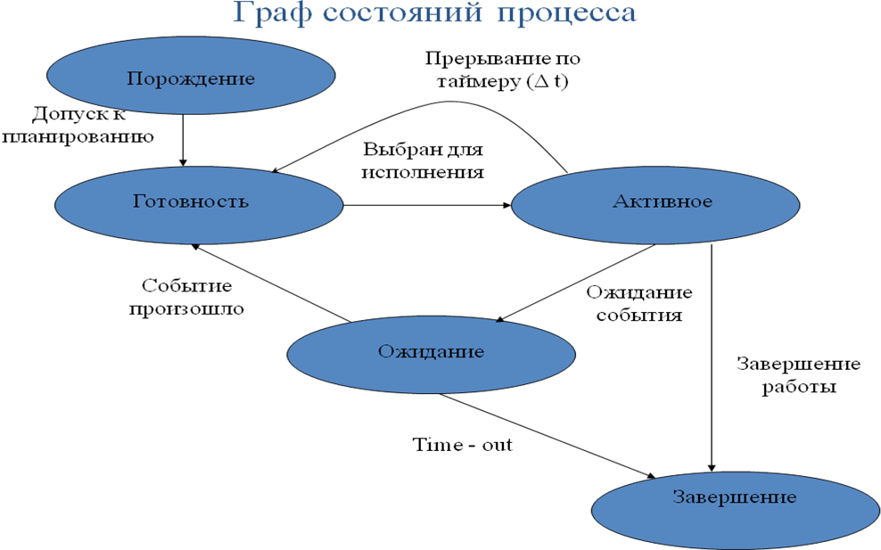

Для смены работающего на ядре процессора процесса(потока) ОС использует механизм переключения контекста. Состоит из следующих шагов:
- сохранить контекст(регистры процессора и программный счетчик) предыдущей задачи
- загрузить контекст новой задачи в регистры процессора и программный счетчик
- перейти к месту, указанному программным счетчиком
- приступить к выполнению задачи

### Оценка эффективности работы ОС
Ну тут что угодно можно приплести)

Закон Амдала показывает рост производительности процесса вычисления, при изменении числа процессоров, для определенного соотношения программного
выполняемого параллельно. Этот закон показывает предел числа процессоров при увеличении которого эффективность вычисления не измениться.

S = 1 / (a + ((1 - a) / P)), где a - процентаж последовательного кода, P - число процессоров

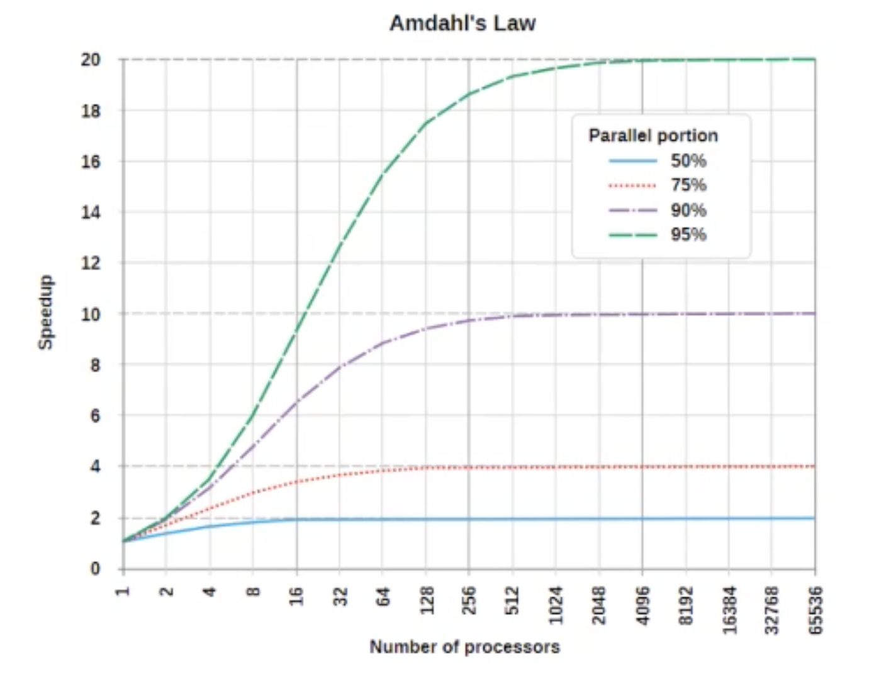

### Параллельные и псевдопараллельные процессы
В единственный момент времени на процессоре может выполняться лишь один процесс. Случай когда процессор переключается между несколькими
процессами за небольшой промежуток времени(десятки миллисекунд) называется псевдопараллелизмом, при котором происходит постоянное переключение контекста.
Просто параллелизм требует многопроцессорной системы, когда процессоры делят между собой общее адресное пространство.

### Прерывания
Прерывание (interrupt) — аппаратный сигнал, сообщающий о наступлении определенного события. Прерывания заставляют процессор выполнять
последовательность программных инструкций, называемых обработчиком прерываний. Обработчик прерываний (interrupt handler) — код ядра, выполняемый в ответ на прерывание.
Контроллер прерываний (interrupt controller) — микросхема на материнской плате либо аппаратный компонент процессора, сортирующий прерывания в соответствии
с их приоритетом, обеспечивая первоочередную обработку высокоприоритетных прерываний.

Прерывания делятся на аппаратные и программные:
Аппаратные прерывания используются для организации взаимодействия с внешними устройствами. Запросы аппаратных прерываний поступают на специальные входы микропроцессора.

Они бывают:
1. маскируемые, которые могут быть замаскированы программными средствами компьютера;
2. немаскируемые, запрос от которых таким образом замаскирован быть не может.

Программные прерывания вызываются следующими ситуациями:
1. особый случай, возникший при выполнении команды и препятствующий нормальному продолжению программы;
2. наличие в программе специальной команды прерывания INT n, используемой обычно программистом при обращениях к специальным функциям
   операционной системы для ввода-вывода информации.

### Приостановка и возобновление
Операции приостановки и возобновления играют важную роль в ОС и используются в следующих случаях:
- При пиковой нагрузке ВС, когда она не может обеспечить требуемое быстродействие, когда расходы времени на смену контекста не превышают полезную работу
- При ненадежной работе системы и возможном ее отказе
- Когда промежуточные результаты работы процесса вызывают сомнение в правильности работы программы

При приостановке процесса, его копия сбрасывается на диск, в специальный swaping файл. Но в этом состоянии он занимает также место и в оперативной памяти.

### Процессы в UNIX
Процесс в UNIX выполняется в отдельном защищенном виртуальном адресном пространстве. Часть времени процесс выполняется в режиме задачи, а часть времени процесс выполняется
в режиме ядра. В режиме задачи (пользовательском режиме) он выполняет собственный код. В режиме ядра он выполняет реентерабельный код операционной системы.
С помощью системного вызова fork() можно создать новый процесс, который является копией процесса-предка: процесс-потомок наследует адресное пространство
процесса-предка, дескрипторы всех открытых файлов и сигнальную маску и т.д.


## 3. Реализация мультипрограммирования - планирование и диспетчеризация. Дисциплины планирования. Супервизор: системные и пользовательские процессы; уровни привилегий.

### Планирование и диспетчеризация

Планирование - организация очереди процессов (постановка процесса в очередь). Планировщик - это программа в составе операционной системы, определяющая порядок
предоставления общих ресурсов ВС процессам, запрашивающим эти ресурсы.

Диспетчеризация - непосредственное выделение потоку(процессу) процессорного времени. Единица диспетчеризации в ОС - поток.

Классификация алгоритмов планирования:
- Без переключения / с переключением — переключение процессора на выполнение другого процесса, когда истек квант.
- С приоритетами / без приоритетов - переключение при появлении наиболее приоритетной задачи.
- С вытеснением / без вытеснения — возможно только в системах с приоритетным планированием. Вытеснение при появлении процесса с более высоким приоритетом.

Приоритеты:
- Статические - назначаются до выполнения и не меняются в ходе выполнения процесса.
- Динамические - меняются в процессе выполнения.

Приоритеты могут быть увеличены в зависимости от реализации ОС. К примеру поток с приоритетом = 2, постоянно захватывает процессор, не давая
выполняться потоку с приоритетом = 1. Также есть поток с приоритетом = 3, который ожидает ресурсов, захваченных в потоке с приоритетом = 1.
Но этот поток практически не выполняется из-за меньшего приоритета и не может их отдать.

Тогда в некоторых ОС(например старых окошках) пройдет скан подобных потоков и приоритет потока повышается с 1 до большего и дает некоторый квант времени.
Если поток еще не был выполнен за этот период его приоритет будет понижен обратно, и попытаться завершиться он сможет при следующем скане -> повышении приоритета.

### Дисциплины планирования

Дисциплины планирования(алгоритм определения приоритета):
- FIFO - first in first out – без вытеснения, без приоритетов. После блокировки будет поставлен в конец очереди.
- Циклическое планирование(round robin). Каждому процессу выделяется квант
  времени, процессы циклически выполняются друг за другом в предопределённой последовательности. С переключением, без приоритетов, без вытеснения.
- SJF - shortest job first – кратчайшее задание первыми - меньшее количество процессорного времени.
  Приводило к тому, что задания с большим процессорным временем все время откладывались в конец очереди — бесконечное откладывание - ситуация, когда
  процесс никогда не получает необходимых для выполнения ресурсов(точнее, кванта времени).
- SRT - shortest remaining time(наименьшее оставшееся время). В этом алгоритме, выполняющийся процесс может быть прерван(вытесняется с очереди на выполнение),
  если поступит процесс с меньшим оценочным временем выполнения, чем оставшееся время процесса текущего. Проблема - бесконечное откладывание долгих процессов.
- HRR - highest response rationext – наибольшее относительное время ответа. В этом алгоритме приоритет вычисляется по формуле: 𝑃 = (𝑡𝑤+𝑡𝑠)/𝑡𝑠, где 𝑡𝑠 – запрошенное
  время обслуживания. 𝑡𝑤 – время ожидания в очереди готовых процессов.

### Режимы задач

Большинство процессоров поддерживают два режима работы: привилегированный, или режим ядра, и пользовательский, или режим задачи.

Системные процессы являются частью ядра ОС и всегда расположены в оперативной (основной) памяти. Выполняемые инструкции
и данные этих процессов находятся в ядре системы, и поэтому они могут вызывать функции и обращаться к данным, недоступным для
остальных процессов, например диспетчер страничного замещения, диспетчер памяти ядра, диспетчер буферного кэша и другие.

Прикладные процессы, как правило, порождаются в рамках пользовательского сеанса. Они могут выполняться как в интерактивном, так и в фоновом режимах.

Определенные команды выполняются только в привилегированном режиме, например команды управления памятью и вводом-выводом. Режим работы устанавливается в регистре слова
состояния процессора битом режима выполнения, который может быть изменен при наступлении некоторых событий. Например,
если в результате прерывания управление пользовательским процессом переходит к процедуре ОС, данная процедура изменяет режим
выполнения на привилегированный. Перед возвращением управления пользовательскому процессу режим выполнения изменяется обратно
на пользовательский. Программы, выполняющиеся в режиме ядра, обладают полным контролем над процессором и имеют доступ ко
всем ячейкам памяти.


## 4. Структура ядра ОС: монолитное ядро - определение, системные вызовы, прерывания; микроядро - определение, передача сообщений, синхронизация; диаграмма состояний процесса - три состояния блокировки при передаче сообщения.

### Ядро и его структура
Ядро - это центральная часть операционной системы, которая обеспечивает архитектуру связи с приложениями, предоставляет наиболее низкий уровень абстракции
для доступа приложений к ресурсам системы, необходимым для их работы. Как правило, ядро предоставляет доступ исполняемым процессам соответствующих приложений
за счёт использования механизмов межпроцессного взаимодействия и обращения приложений к системным вызовам ОС. Ядро загружается в память один раз и находится в
памяти резидентно – постоянно, по одним и тем же адресам.

Основные функции ядра:
- управление процессами;
- организация взаимодействий между процессами;
- синхронизация процессов;
- планирование работы процессов;
- поддержка операций ввода-вывода;
- поддержка распределения и перераспределения памяти;

Структура ядра системы:
- нижний уровень - аппаратная часть
- уровень 1 - управление процессорами (диспетчеризация - выделение процессу процессорного времени)
- уровень 2 - контроль доступа к разделяемым ресурсам, планировщик процессов, управление памятью
- уровень 3 - управление процессорами (создание и удаление процессов)
- уровень 4 - управление устройствами (подсистема ввода/вывода)
- уровень 5 - управление информацией (файловая система)

### Архитектура ядер
Существует два основных класса ядер:
- Монолитное ядро - это один процесс, работающий в одном адресном пространстве в привилегированном режиме. В архитектуре с монолитным ядром все услуги
  для прикладного приложения выполняют отдельные части кода ядра (в адресном пространстве ядра) - системные вызовы. В системах с монолитным ядром любое
  расширение функциональности достигалось пересборкой ядра. Рано или поздно, любая монолитная операционная система начинает включать в себя ту или иную
  технологию динамической реконфигурации. Для Linux это — технология загружаемых модулей ядра. В Windows это многоуровневые драйверы и службы.
  К этому классу относятся: MS-DOS, Windows, Linux, BSD и т.д.
  3 события, переводящие систему в режим ядра:
    - Системные вызовы (можно вызвать из программы с помощью команды int).
    - Исключения - исключительные ситуации (деление на 0, арифметическое переполнение и т.д.).
    - Аппаратные прерывания (interrupts) - прерывания, поступившие от устройств (от таймера, от УВВ (устройства ввода вывода) и т.д.). (поступают от контроллера прерываний)

- Микроядро - это такая схема ядра ОС, при которой все её компоненты являются самостоятельными процессами, выполняющимися возможно в разных адресных
  пространствах и взаимодействуют друг с другом путем передачи сообщений. В микроядрах ядро разбивается на отдельные процессы. Некоторые из них работают
  в пространстве ядра, а некоторые - в пространстве пользователя. В микроядерной архитектуре все услуги для прикладных процессов система обеспечивает,
  передавая сообщения-запросы соответствующим сервисам, которые выполняются в пространстве пользователя. Основным принципом организации микроядерных ОС
  является включение в состав микроядра только тех функций, которым абсолютно необходимо выполнять в режиме супервизора и в защищенной памяти.
  К этому клссу относятся: QNX, MINIX, Darvin MacOS и т.д.

В режиме ядра (kernel mode) выполняются все разрешенные инструкции, в ходе выполнения доступна вся оперативная память и любые регистры. На время выполнения
кода ОС микропроцессор переключается в режим ядра. В пользовательском режиме (user mode) доступ к регистрам и памяти ограничен.

### Модель передачи сообщений
При обмене процессы синхронизируются: процесс, отправивший сообщение-запрос, блокируется в ожидании сообщения-ответа от другого процесса.

При передаче сообщений возможны три состояния блокировки процесса:
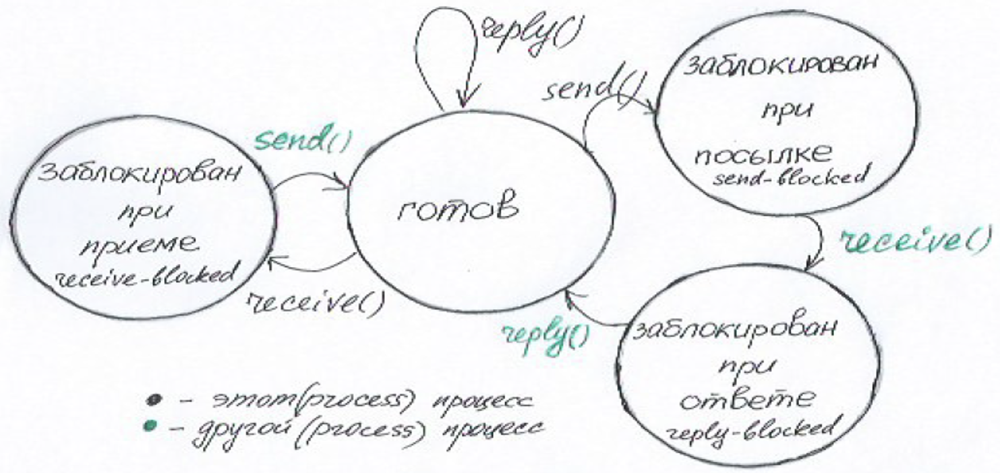
Процесс блокируется при посылке, если он вызвал send(), а процесс, которому сообщение адресовано, не готов к его приему.
Как только адресат вызовет receive(), процесс, пославший сообщение будет заблокирован при ответе и будет в этом состоянии до тех пор пока запрос
не будет обработан и на стороне другого процессе не будет вызван reply(). Если процесс вызвал receive(), а сообщение ему еще не послано, то процесс
окажется заблокированным при приеме. Аналогичная ситуация будет при вызове reply().


## 5. Взаимодействие процессов: проблемы взаимодействия асинхронных процессов синхронизация, взаимоисключение, взаимоблокировка. Монитор: читатели и писатели.

Выполнение процессов и потоков в мультипрограммной среде всегда имеет асинхронный характер – невозможно предсказать
относительную скорость выполнения потоков. Момент прерывания потоков, время нахождения их в очередях к разделяемым
ресурсам, порядок выбора потоков для выполнения – все эти события являются результатом стечения многих обстоятельств и
являются случайными, это справедливо как по отношению к потокам одного процесса, выполняющим общий программный код, так
и по отношению к потокам разных процессов, каждый из которых выполняет собственную программу.

Способы взаимодействия процессов можно классифицировать по степени осведомленности одного процесса о существовании
другого:

1. Процессы не осведомлены о наличии друг друга, например, процессы разных заданий. Это независимые процессы, не
   предназначенные для совместной работы. Хотя эти процессы и не работают совместно, ОС должна решать вопросы
   конкурентного использования ресурсов. Например, два независимых приложения могут затребовать доступ к одному и тому
   же ресурсу. ОС должна регулировать такие обращения.
2. Процессы косвенно осведомлены о наличии друг друга, например, процессы одного задания(общая память). Эти процессы
   необязательно должны быть осведомлены о наличии друг друга с точностью до идентификатора процесса, однако они
   разделяют доступ к некоторому объекту, например, буферу ввода-вывода, файлу или БД.
3. Процессы непосредственно осведомлены о наличии друг друга, например, процессы, работающие последовательно или
   поочередно в рамках одного задания(общая память). Такие процессы способны общаться один с другим с использованием
   идентификаторов процессов и изначально созданы для совместной работы.

Осведомленность | Взаимосвязь | Влияние | Проблемы
----------------|-------------|---------|---------
Процессы не осведомлены друг о друге | Конкуренция | Результат работы одного процесса не зависит от действий других | Взаимоисключения;</br> Взаимоблокировки;</br> Голодание
Процессы косвенно осведомлены друг о друге | Сотрудничество | Результат работы одного процесса может зависеть от информации, полученной от других | Взаимоисключения;</br> Взаимоблокировки;</br> Голодание;</br> Синхронизация
Процессы полностью осведомлены друг о друге | Сотрудничество | Результат работы одного процесса зависит от информации, полученной от других процессов | Взаимоблокировки;</br> Голодание

Критическая секция – часть программы, исполнение которой может привести к возникновению race condition(борьба за ресурс)
для определенного набора программ. Чтобы исключить этот эффект по отношению к некоторому ресурсу, необходимо
организовать работу так, чтобы в каждый момент времени только один процесс мог находиться в своей критической секции,
связанной с этим ресурсом.

Когда несколько процессов могут вместе асинхронно изменять области данных критических ресурсов, то им необходимо
согласовывать свои действия, синхронизировать, чтобы ресурсы находились всегда только у одного процесса. Взаимное
исключение - Отношение между процессами характеризуемое тем, что критическая секция одного процесса не должна
выполнятся, пока выполняется критическая секция другого процесса.

Тупиковая ситуация (взаимоблокировка) – когда два и более процесса удерживают и бесконечно ожидают необходимые для
выполнения ресурсов. Для возникновения такой ситуации необходимо выполнение одновременно 4 условий:

1. Условия взаимного исключения; (не должно выполняться)
2. Условия удержания и ожидания;
3. Условие отсутствия принудительной выгрузки ресурсов;
4. Условия циклического ожидания.

Мониторы(synchronized) - средство организации взаимодействия и взаимоисключения параллельных асинхронных процессов.
Монитор содержит как данные, так и подпрограммы, которые обрабатывают эти данные. Доступ к данным возможен только с
помощью функция монитора. Монитор защищает свои данные, так как изменить данные монитора можно только с помощью процедур
монитора. При попытке получить доступ к критической секции, в то время когда ресурс в ней захвачен потоком(он занял
монитор), монитор приостанавливает(блокирует) выполнение следующего в очереди потока.

Монитор «читатели-писатели»

Имеется произвольное число процессов-писателей и процессов-читателей, которые совместно используют какие-то данные (
обычно имеется в виду файл). В любой момент процесс-читатель может потребовать прочитать данные. В любой момент
процесс-писатель может потребовать прочитать или записать данные. Чтение и запись данных – операции длительные, но
конечные. В то время, когда процесс записывает данные, никакие другие читатели или писатели не должны иметь доступа к
данным. Любое число процессов может читать данные одновременно. Решение должно обеспечивать целостность данных и
отсутствие бесконечного откладывания процессов.

```java
      /* счетчик читателей */
      int rdCnt = 0;

        /* признак активности записи */
        char wrFlag = 0;

        /* списки - писателей и читателей */
        process *wrCrowd=NULL, *rdrowd=NULL;

        /* события: МОЖНО_ЧИТАТЬ, МОЖНО_ПИСАТЬ */
        event mayRead, mayWrite;

        /* процедура регистрации читателя */
        void guard startRead ( process *p ) {
           rdCnt++; /* подсчет читателей */
   
           /* если идет запись - ожидать МОЖНО_ЧИТАТЬ */
           if ( wrFlag )
           wait (mayRead);
   
           /* дублирование сигнала для другого читателя */
           signal (mayRead);
   
           /* включение в список читателей */
           inCrowd ( rdCrowd, p );
        }

        /* процедура открепления читателя */
        void guard endRead ( process *p ) {
           /* исключение из списка читателей */
           fromCrowd ( rdCrowd, p );
   
           /* уменьшение числа читателей, если читателей больше нет - сигнализация МОЖНО_ПИСАТЬ */
           if ( --rdCnt==0 )
           signal(mayWrite);
        }

        /* процедура регистрации писателя */
        void guard startWrite ( process *p ) {
           /* если есть другие читатели или писатели - ждать */
           if ( wrFlag||rdCnt )
           wait(mayWrite);
   
           /* установка признака записи */
           wrFlag = 1;
   
           /* писатель включается в оба списка*/
           inCrowd ( rdCrowd, p );
           inCrowd ( wrCrowd, p );
        }

        /* процедура открепления писателя */
        void guard endWrite ( process *p ) {
           wrFlag=0; /* сброс признака записи */
   
           /* исключение из списков */
           fromCrowd ( rdCrowd, p );
           fromCrowd ( wdCrowd, p );
   
           /* если есть претенденты-читатели - разрешение им */
           if ( rdCnt )
           signal (mayRead);
           /* иначе - разрешение на запись */
           else
           signal (mayWrite);
        }

        /* процедура чтения */
        void read ( process *p, ... ) {
           /* если процесс не зарегистрирован читателем - отказ */
   
           if (!checkCrowd(rdCrowd, p))
               <отказ>;
          else
                < чтение данных >;
        }

        /* процедура записи */
        void write ( process *p, ... ) {
            /* если процесс не зарегистрирован писателем - отказ */
            if (!checkCrowd(wrCrowd,p))
                <отказ>;
            else
                < запись данных >;
        }
```

Прежде чем процесс получит доступ к данным, он должен зарегистрироваться как читатель или как писатель. В нашем примере
переменные rdCrowd и wrCrowd являются указателями на списки читателей и писателей. Используемые нами функции inCrowd и
fromCrowd обеспечивают включение процесса в группу и исключение из группы, а функция checkCrowd возвращает 1, если
указанный процесс входит в группу (иначе – 0). Процедура read выполняется только для процессов, включенных в группу
читателей, а write – только для включенных в группу писателей. Переменная rdCnt – счетчик текущего числа читателей,
переменная wrFlag – счетчик писателей (или признак наличия писателя, так как писателей не может быть более одного).
События mayRead и mayWrite являются разрешениями читать и писать соответственно.

Входная точка startRead выполняет регистрацию читателя. Это охраняемая процедура. Она наращивает счетчик читателей, но
если в данный момент работает писатель, то потенциальный читатель блокируется до наступления события mayRead. После того
как процесс будет разблокирован (или если он не блокировался вообще), он выдает сигнал mayRead, который предназначается
для другого читателя, возможно, также ждущего разрешения на чтение (можно сказать, что процесс этим восстанавливает
потребленный им ресурс), и включается в список читателей. После завершения доступа читатель обращается к входной точке
endRead. Эта процедура исключает процесс из списка читателей, уменьшает счетчик читателей и, если читателей больше не
осталось, сигнализирует разрешение на запись.

Писатель регистрируется/разрегистрируется через входные точки startWrite/endWrite. При регистрации потенциальный
писатель может быть заблокирован, если в настоящий момент зарегистрирован другой писатель или хотя бы один читатель.
Сигнал mayWrite разблокирует писателя, и он включается в обе группы, так как имеет право и читать, и писать. При
откреплении писатель исключается из групп. Если за время его работы попытался зарегистрироваться хотя бы один читатель,
выдается разрешение на чтение, в противном случае – разрешение на запись для другого писателя, возможно, ждущего своей
очереди.


## 6. Разделяемые ресурсы и монопольный доступ. Обеспечение монопольного доступа к разделяемым ресурсам - взаимоисключение: алгоритм Деккерера, бесконечное откладывание и проблема активного ожидания. Взаимная блокировка процессов. Семафоры: определение, виды семафоров, примеры. Взаимоисключение при помощи семафоров.

Ресурсы могут быть разделяемые или неразделяемые. Разделяемые допускают одновременный доступ, неразделяемые допускают доступ только в порядке очереди.
Необходимость монопольного доступа к разделяемым ресурсам при взаимодействии параллельных процессов обусловлена тем, что при немонопольном доступе
возможно возникновение потерянного обновления (ситуация, когда при одновременном изменении одной переменной разными процессами теряются все изменения, кроме последнего).

Критическая секция – часть программы, исполнение которой может привести к возникновению race condition для определенного набора программ.
Чтобы исключить этот эффект по отношению к некоторому ресурсу, необходимо организовать работу так, чтобы в каждый момент времени только один
процесс мог находиться в своей критической секции, связанной с этим ресурсом.

Когда несколько процессов могут вместе асинхронно изменять области данных критических ресурсов, то им необходимо согласовывать свои действия, синхронизировать,
чтобы ресурсы находились всегда только у оодного процесса. Взаимное исключение - Отношение между процессами характеризуемое тем, что критическая секция
одного процесса не должна выполнятся, пока выполняется критическая секция другого процесса.

Тупиковая ситуация (взаимоблокировка) – когда два и более процесса удерживают и бесконечно ожидают необходимые для выполнения ресурсов. Для возникновения такой ситуации необходимо выполнение одновременно 4 условий:
1. Условия взаимного исключения;
2. Условия удержания и ожидания;
3. Условие отсутствия принудительной выгрузки ресурсов;
4. Условия циклического ожидания.

Бесконечное откладывание в планировании - ситуация, когда какой-либо процесс не получает процессорного времени.
Активное ожидание - это ситуация, в которой происходит захват и освобождение одного и того же ресурса, но полезной работы не выполняется.

Алгоритм Деккера позволяет двум потокам совместно использовать одноразовый ресурс без конфликтов, используя для связи лишь общую память.
Такое решение избавляет от dead lock, потому что процессы сбрасывают свои флаги. Так как процесс передает активность другому процессу (с помощью переменной que), исключается вечное откладывание.

Алгоритм Деккера имеет следующие ограничения:
- Алгоритм рассчитан строго на 2 процесса;
- При ожидании ресурса, процессы впустую тратят процессорное время, так как не снимаются с очереди на обслуживание;
- При попытке одновременного попадания двух процессов в критическую секцию, алгоритм позволяет войти лишь одному процессу;
- При нахождении одного из процессов в критической секции, другой процесс будет находиться в ожидании

Алгоритм Деккера основан на использовании 3-х переменных: ПР1 (процесс 1), ПР2 (процесс 2) и ОЧЕРЕДЬ.

1. Если первый процесс хочет войти в свой критический интервал, то переменная ПР2 принимает значение TRUE, т.е. значение переменной ОЧЕРЕДЬ показывает чьё именно сейчас право войти в критический интервал.
2. Если ПР1= TRUE, а ПР2=FALSE, то независимо от значения переменной ОЧЕРЕДЬ исполняется ПР1.
3. Если ПР1= TRUE и ПР2= TRUE, то дальше исполняется процесс, который определяется значением переменной ОЧЕРЕДЬ.

Завершив своё исполнение этот процесс сбрасывает флаг своего исполнения в FALSE и меняет значение переменной ОЧЕРЕДЬ на противоположное. Диапазон значений переменной ОЧЕРЕДЬ обычно колеблется в пределах [0;1] или [1;2]. Значение переменной ОЧЕРЕДЬ по сути тоже является флагом.

```java
flagp1 , flagp2: logical; 
que:int;

P1:
while (1)
begin
    flagp1 = 1;
    while(flagp2) 
    begin
        if (que == 2) then
        begin
            flagp1 = 0; 
            while(que == 2);
            flagp1 = 1;
        end 
    end
    CR1; 
    flagp1 = 0; 
    que = 2;
    PR1;
    end;        //Флаг сбрасывается. и указывается, что в критич.секцию  
                //заходит другой процесс
P2:
while (1) 
begin
    flagp2 = 1; 
    while(flagp1) 
    begin
        if (que == 1) then
        begin
           flagp2 = 0;
           while(que == 1);
           flagp2 = 1;
       end
    end
    CR2;
    flagp2 = 0;
    que = 1;
    PR2;
end;

//объявления 
flagp1, flagp2: logical;
que: int;

//начальные установки
flagp1 = 0;
flagp2 = 0;
que = 1;
parbegin;
    P1; P2;
parend;
```

Семафор — неотрицательная защищенная переменная, на которой определены 2 неделимые операции: P(S) (passeren, пропустить) и V(S) (vrygeven, освободить).
- Операция V(S) - инкремент, S = S + 1. Если S = 0, то операция V(S) может активизировать некоторый процесс блокированный на семафоре.
- Операция P(S) - декремент значения семафора, S = S - 1. Если S = 0, то декремент невозможен и процесс блокируется до тех пор, пока другой процесс не освободит ресурс.
  Семафоры исключают активное ожидание на процессоре, но платой за это является переход в режим ядра. Команды, определенные на семафоре являются системными вызовами.

Процесс может создать семафор и изменять его. Удалить семафор может либо процесс создавший его, либо привелегированный процесс. При захвате и освобождении семафора происходит переключение в режим ядра, следовательно происходит переключение контекста.

Виды семафоров:
- Бинарный - принимает только 0 и 1.
- Считающий - прнимает неотрицательные целые значения.
- Множественные семафоры - массив считающих семафоров. Одной неделимой операцией можноз изменить все или часть семафоров набора.

Способы взаимодействий:
- Взаимоисключения, организация монопольного доступа процесса к разделяемой переменной (задача "Читатели-писатели")
- Синхронизация, когда процесс заинтересован в действиях другого процесса (задача "Производство-потребление")


## 7. Тупики: обнаружение тупиков. Метод редукции графа: представление состояний системы в виде направленных графов. Представление графа: матричное представление; представление с помощью связного списка. Алгоритмы обнаружения тупиков: метод прямого обнаружения; алгоритм со счетчиком ожиданий; примеры реализации.

Тупик — это ситуация, которая возникает в результате монопольного использования разделяемых ресурсов, когда процесс, владея ресурсом, запрашивает другой ресурс,
занятый непосредственно или через цепочку запросов другим процессом, ожидающим освобождения ресурса, занятого первым процессом.

В теории тупиков принято различать два типа ресурсов:
- Повторно используемые ресурсы
- Потребляемые ресурсы

Повторное используемые ресурсы — используются многократно, использование ресурса не изменяет качества и характеристик ресурса.
К повторно используемым ресурсам относится: реентерабельный код системы, системные таблицы, разделяемая память, семафоры, программные каналы.

Потребляемые ресурсы — количество в ОС переменно и произвольно. К потребяемым ресурсам относится: память, каналы, внешние устройства, процессор, сообщения.

Условия возникновения тупика:
- Взаимоисключение. Возникает, когда процессы монопольно используют ресурсы.
- Ожидание. Когда процессы удерживают занятые ими ресурсы, ожидая предоставления им дополнительных ресурсов.
- Неперераспределяемость. Когда ресурсы нельзя отобрать у процесса до их завершения, или как говорят, добровольного особождения этих ресурсов (надпись: ресурсы у процесса нельзя принудительно отобрать).
- Круговое ожидание. Возникает замкнутая цепь запросов процессов на дополнительные ресурсы.

Обнаружение тупиков происходит с помощью графовой модели. Система может быть описана двудольным направленным графом. Два непересекающихся множества
вершин: процессы и ресурсы. Вершины соединяются дугами, никакая дуга не соединяет вершины одного подмножества. Дуга, направленная из вершины ресурсов,
к вершине процессов, называется выделением или приборетением ресурсов. Дуга направленная из вершины процессам к ресурсам называется запросом.

Графовая модель Холта

Приобретение - `(r, p)` (от ресурса к процессу)
Запрос - `(p, r)` (от процесса к ресурсу)

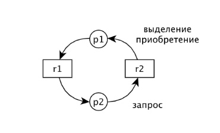

Обнаружение тупиков по графовой модели выполняется методом редукции графа. Этот метод основан на предположении, что незаблокированный в тупике процесс
может запрашивать приобретения любых нужных ему ресурсов, а затем освобождать их. Освободившиеся ресурсы могут быть выделены или распределены другим процессам, которые их ожидают.

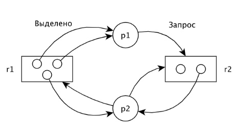
P1 выделено два ресурса R1 и он запрашивает один ресурс R2. P2 выделены по одному ресурсу R1 и R2 и он запрашивает ещё один R1 и R2. Видно, что процесс P1
может завершиться, значит он может стать изолированной вершиной (освободить занимаемые им ресурсы). Когда P1 завершиться, запросы P2 могут быть
удовлетворенны. В итоге, обе вершины P1 и P2 будут изолированны. Такой редукцией определяется, что система не находится в тупике (вершины процессов изолированны).

Двудольный граф может быть описан 2 матрицами(процессы и ресурсы) или 2 связными списками.

### Алгоритмы обнаружения тупиков

Метод прямого обнаружения.

Последовательно рассматриваются запросы каждого процесса и определяется, может ли этот запрос быть удовлетворен. Последовательный просмотр матрицы запросов.
В процессе просмотра определяется возможно ли сокращение соотвествующей дуги или невозможно (если возможно - сокращается). Те процессы, которые останутся в
этих матрицах после всех возможных сокращений будут находится в тупике. Для реализации нужно выполнить (m процессов, n ресурсов) (mn)^2 проверок.

Метод со счетчиком ожидания.

Для каждого ресурса необходимо хранить ресурсы, упорядоченные по размеру. Для каждого процесса Pi определяется счетчик ожидания, который содержит число
ресурсов каждого типа, которые вызвали блокировку процесса (или указывает на ресурсы, на которых процесс был блокирован в ожидании освобождения ресурсов).
В этом алгоритме также хранится вектор свободных ресурсов. То есть если к матрице запросов и матрице распределения добавить вектор свободных ресурсов,
то можно для каждого процесса анализировать его вектор запросов (если вектор запросов процессов меньше, чем вектор свободных ресурсов, то его запросы могут быть удовлетворены).


## 8. Тупики: недопущение тупиков. Обход тупиков - алгоритм банкира и его аппроксимации. Обнаружение и восстановление работоспособности системы.

Предотвращение тупиков возможно только за счёт нарушения условий возникновения тупиков.

- Нарушение условия взаимоисключения. Доступ к некоторым ресурсам должен быть исключительным, тем не менее некоторые устройства удаётся сделать разделяемыми.
  Для предоставления такой возможности в современных системах используют механизм спулинга — данные для устройства от каждого процесса помещаются в буферные файлы,
  а собственно обработку устройством этих файлов выполняет специальный системный процесс.
- Нарушение условия бесконечного ожидания. В этом случае система требует, чтобы каждый процесс запрашивал все требуемые ему ресурсы сразу, перед началом выполнения.
  Если какой-либо ресурс не может быть предоставлен, процесс просто не может начать выполняться, и должен ждать освобождения всех необходимых ему ресурсов,
  не удерживая при этом за собой никаких ресурсов.
- Нарушение принципа отсутствия принудительной выгрузки ресурсов. Отбирая ресурсы у удерживающих их процессов до завершения этих процессов, удалось бы добиться выполнения этого условия.
  Перечислим минусы данного подхода:
    - Во-первых, отбирать у процессов можно только те ресурсы, состояние которых легко сохранить, а позднее восстановить, например состояние процессора.
    - Во-вторых, если процесс в течение некоторого времени использует определённые ресурсы, а затем освобождает эти ресурсы, он может потерять результаты
      работы, проделанной до настоящего момента.
- Нарушения условия циклического ожидания. Можно предложить упорядочить все ресурсы в системе и потребовать, чтобы каждый процесс запрашивал ресурсы
  в строго определённом порядке. На практике эта схема трудно реализуема и ведёт к неэффективности использования ресурсов и существенному усложнению системы.

Обход тупика - это недопущение выполнения для процесса одного из 4-ех условий возникновения взаимоблокировки.

Среди такого рода алгоритмов наиболее известен алгоритм банкира, предложенный Дейкстрой, который базируется на безопасных или надёжных состояниях.
Безопасное состояние — это такое состояние, для которого имеется по крайней мере одна последовательность событий, которая не приведёт к тупику.
Модель алгоритма основана на действиях банкира, который, имея в наличии капитал, выдаёт кредиты.

Пусть в системе имеется n процессов и m типов ресурсов.

Вектор Available длины m содержит информацию о доступных ресурсах. Если Avaliable[j] = k, то в системе в данный момент доступно k единиц ресурса j.

Матрица Max (n x m) отображает максимальные потребности процессов в ресурсах. Если Max [i, j] = k, то процесс i может запросить максимально, k единиц ресурса j.

Матрица Allocation (n x m) отображает фактическое выделение системой ресурсов. Если Allocation [i, j] = k, то процессу i в данный момент выделено системой k единиц ресурса j.

Матрица Need (n x m) отображает оставшиеся потребности процессов в ресурсах. Если Need [i, j] = k, то процессу i могут потребоваться еще k единиц ресурса j для завершения работы.

Имеет место следующее соотношение между элементами матриц: `Need [i, j] = Max [i, j] – Allocation [i, j]`

Алгоритм запроса ресурсов для процесса P[i] (Request - вектор запросов ресурсов для процесса):

1. Если Request[i] <= Need[i], перейти к шагу 2. Иначе (процесс превысил свои максимальные потребности) – сгенерировать исключительную ситуацию.
2. Если Request[i] <= Available, перейти к шагу 3. Иначе процесс должен ждать, так как ресурс недоступен.
3. Спланировать выделение ресурса процессу P[i], модифицируя состояние системы следующим образом:
    - Available = Available - Request[i]
    - Allocation = Allocation + Request[i]
    - Need[i] = Need[i] - Request[i]
4. Вызвать алгоритм проверки безопасности полученного состояния. Если состояние безопасно, выделить ресурс процессу P[i]. Если состояние небезопасно, восстановить предыдущее состояние.

Восстановление системы.

1. Перезагрузка системы
    - Дорогое решение, так как будет потеряна вся проделанная не завершившимися процессами работа.
    - Для системы, работающей длительное время, такой подход невозможен.
2. Последовательно завершать процессы, попавшие в тупик
    - В результате процессы, работа которых завершается, вернут занимаемые ресурсы. Этих ресурсов может оказаться достаточно, чтобы другие процессы могли успешно продолжить работу.
    - Очевидный недостаток - проделанная работа завершаемого процесса будет потеряна.
3. Завершать процессы, не имеющие отношения к тупику
    - То есть отнимать ресурсы у процессов, вернуть их системе, и мб того процессы, попавшие в тупик, смогут завершиться.
    - Решается на основе приоритетов.


## 9. Виртуальная память. Страничная организация памяти: таблицы страниц. Стратегии управления виртуальной памятью. Схемы преобразования адресов. Алгоритмы "выталкивания" страниц: выталкивание случайной страницы, FIFO, LRU, LFU, NUR, метод связанных пар - размер страницы. Рабочее множество: определение, стратегия рабочего множества. Анализ страничного распределения.

Виртуальная память — это совокупность программно-аппаратных средств, позволяющих пользователям писать программы, размер которых превосходит
имеющуюся оперативную память. Для этого виртуальная память решает следующие задачи автоматически:
- размещает данные в запоминающих устройствах разного типа, например, часть программы в оперативной памяти, а часть на диске;
- перемещает по мере необходимости данные между запоминающими устройствами разного типа, например, подгружает нужную часть программы с диска в оперативную память;
- преобразует виртуальные адреса в физические.

Наиболее распространёнными реализациями виртуальной памяти является страничное, сегментное и странично-сегментное распределение памяти, а также свопинг.

Принцип организации:
- Все обращения к памяти в рамках процесса представляют собой виртуальные адреса, которые динамически транслируются в физические адреса во время исполнения.
  Это означает, что процесс может быть выгружен на диск и вновь загружен в основную память, так что во время работы он может находиться в разных местах основной памяти.
- Процесс может быть разбит на ряд частей (страниц), которые необязательно должны располагаться в основной памяти единым непрерывным блоком. Это обеспечивается
  за счёт динамической трансляции адресов и использования таблицы страниц.

### Страничная организация памяти
Виртуальное адресное пространство каждого процесса делится на части одинакового, фиксированного для данной системы размера(обычно 4кб), называемые виртуальными страницами.
В общем случае размер виртуального адресного пространства не является кратным размеру страницы, поэтому последняя страница каждого процесса дополняется фиктивной областью.
Вся оперативная память машины также делится на части такого же размера, называемые физическими страницами (или блоками).

При загрузке операционная система создаёт для каждого процесса информационную структуру — таблицу страниц, в которой устанавливается соответствие между номерами
виртуальных и физических страниц для страниц, загруженных в оперативную память, или делается отметка о том, что виртуальная страница выгружена на диск.
Кроме того, в таблице страниц содержится управляющая информация, такая как признак модификации страницы, признак невыгружаемости (выгрузка некоторых страниц
может быть запрещена), признак обращения к странице (используется для подсчёта числа обращений за определённый период времени) и другие данные используемые механизмом виртуальной памяти.

При выполнении программы, которая находится не целиком в памяти, процесс потребует страницу, которой нет в оперативной памяти - возникнет исключение,
которое будет обработано в режиме ядра. В результате менеджер памяти попытается загрузить страницу в свободную память, а процесс на это время будет заблокирован.
По завершении работы менеджера памяти страница будет загружена и процесс будет продолжать выполнятся с той команды, на которой возникло исключение.
Если свободная страница в физической памяти отсутствует, то менеджер памяти должен выбрать страницу для замещения.

Стратегии управления страничным обменом между ЖД и оперативной памятью:

ПРИСУТСТВИЕ
- Стратегия выборки («когда?») – предварительная выборка, которая подготавливает данные до того, как процесс запросил оперативную память.
- Стратегия размещения («где?») – находит первый подходящий раздел, либо первые страницы, которые схожи по запрашиваемой памяти.

МОДИФИКАЦИЯ
- Стратегия замещения («какие?») - определяет выбор страниц в основной памяти для замещения их загружаемыми из вторичной памяти;
- Управление резидентным множеством – работает по принципу фиксированного размера, переменного размера, локальной и глобальной зоной видимости.
  В случае с резидентным множеством, мы используем те страницы, которые требует процесс самостоятельно.

ОБРАЩЕНИЕ
- Стратегия очистки - выполняется по требованию или предварительно.
- Управление загрузкой – находит 50% и затем остальные 50% очищает.

Существует три схемы преобразования виртуального адреса в физический.

1. Прямой.(БАЗА)
   Таблица страниц находится в оперативной памяти. Таких страниц столько - сколько процессов. В процессоре должен находится регистр начального адреса таблицы страниц.
   Виртуальный адрес состоит из двух частей.
    - Смещение d.
    - Номер страницы p.
      Номер страницы используется как смещение дескриптора страницы в таблице страниц. Если страница загружена в память, то выполняя преобразование мы можем получить
      линейный физический адрес. Если страница не загружена в память, то возникнет страничное исключение


2. Ассоциативное отображение. В чистом виде не используется. Использование ассоциативной памяти – память, которая обеспечивает выборку по ключу за 1 такт.
3. Ассоциативное – прямое отображение. Комбинация первых двух методов.

Алгоритмы "выталкивания" страниц:

1. Выталкивание случайной страницы (первая попавшееся). Для замены выбирается любая случайная страница.
   Недостатки:
- Может быть вытолкнута часто используемая или только что загруженная страница.
  Преимущества:
- Малые накладные расходы

2. FIFO. Выталкивается та, которая дольше всего находится в памяти. Для реализации этого способа нужно организовать очередь либо хранить время.
   Недостатки:
- Может быть выгружена часто используемая страница.
- (особенность) Существуют такие траектории загрузки страниц, когда увеличение страничной памяти ведет к увеличению страничных прерываний.
  Преимущества:
- страничное прерывание. Если нужно загрузить страницу, которая в памяти, то очередь не редактируется.

3. LRU (Least Recently Used): замещаем наименее используемую страницу. Для реализации этого способа нужно хранить временные метки,
   которые редактируются при каждом обращении, либо список, каждый раз в конец которого кладем только что используемую. В начале списка будет менее использованная страница.
   Свойство включения: (особенность) Если какая-то страница выбрана при реализации с объемом памяти M, то этаже страница при такой же траектории будет выбрана,
   если память M+1 страниц (т.к. она полностью соответствует свойству локальности). Локальность - эмпирически выведенное свойство процессов, за время своей активность,
   работать с небольшим ограниченным набором адресов.
   Недостатки:
- Заметные накладные расходы

4. LFU (Least Frequency Used): Наименее часто используемая в последнее время. В этом способе контролируется частота обращения к странице (количество обращений).
   Недостатки:
- Может быть вытеснена только что загруженная страница, не набравшая число обращений.

5. NUR (Not Used Recently): Вытеснение ранее не используемых страниц Каждому кадру физической памяти приписывается бит обращения. Работа с
   битом: Вытесняется страница с битом обращения равным 0. Устанавливается в 1, когда страница загружается в какой-то кадр. Обновляется каждый раз
   при обращении. Периодически все биты обращений сбрасываются в 0. Также вводится бит модификации (dirty). Он устанавливается, если в страницу была осуществлена запись.
   Лучше вытеснять немодифицированную страницу, т.к. её точная копия находится на диске.

Для каждого процесса в каждый момент времени существует набор страниц которые он должен держать в памяти – рабочее множество.
Если этот набор не будет загружен возникнет трешинг страниц (постоянная загрузка и выгрузка страниц). Трешинг - процесс не может загрузить в
память все рабочее множество и все время подгружаются одни и те же страницы. Возьмем число страниц к котором обращается процесс за интервал
времени delta t(рабочее множество). Т.е. рабочее множество - это число страниц к котором обращается процесс за интервал времени delta t.

При увеличении delta t число страниц, к которым обращается процесс будет стремиться к некоторому пределу. Другими словами: процесс будет выполняться
без страничных преобразований, если ему удастся загрузить в память все нужные страницы. Если процессу не удается загрузить в память все, что ему нужно,
то возникает thrashing (подкачка одних и тех же страниц). За свое время жизни процесс меняет рабочее множество.

Глобальное замещение - может быть вытеснена любая страница любого процесса. Локальное замещение - вытесняются страницы только данного процесса.
Если у какого-то процесса слишком много страничных преобразований, то ему выделяется дополнительное количество страниц (квота). Позже можно снизить число страниц.
Т.е. можно регистрировать число выделяемых страниц.


## 10. Виртуальная память. Сегментная организация виртуальной памяти; преобразование адресов; организация таблиц сегментов. Сегментно-страничная организация: преобразование адресов, особенности реализации. Коллективное использование информации и защита информации для страничной, сегментной и сегментно-страничной организации памяти.

Сегментная организация виртуальной памяти предполагает разделение программы на логически законченные части - сегменты, которые становятся единицами
манипулирования при реализации механизма виртуальной памяти. Отдельный сегмент может представлять собой подпрограмму, массив данных и т. п.
Это позволяет разделять доступ к памяти для различных сегментов, например разрешить только чтение сегменту данных или запретить любые операции
с сегментом кода программы. Также можно загрузить в память участок кода, требуемый нескольким программам, в одном экземпляре.

При загрузке процесса часть сегментов помещается в оперативную память, при этом для каждого из этих сегментов операционная система подыскивает
подходящий участок свободной памяти, а часть сегментов размещается в дисковой памяти. Сегменты одной программы могут занимать в оперативной памяти
несмежные участки. Во время загрузки система создаёт таблицу сегментов процесса (аналогичную таблице страниц), в которой для каждого сегмента указывается
начальный физический адрес сегмента в оперативной памяти, размер сегмента, правила доступа, признак модификации, признак обращения к данному сегменту за
последний интервал времени и некоторая другая информация. Если виртуальные адресные пространства нескольких процессов включают один и тот же сегмент,
то в таблицах сегментов этих процессов делаются ссылки на один и тот же участок оперативной памяти, в который данный сегмент загружается в единственном экземпляре.

Виртуальный адрес при сегментной организации памяти может быть представлен парой (s,d), где s — номер сегмента, d — смещение в сегменте.
Физический адрес получается путём сложения начального физического адреса сегмента S, найденного в таблице сегментов по номеру s, и смещения d.

Способы организации таблиц сегментов

1. Единая таблица
   Одна единая таблица, которая содержит все дескрипторы сегментов и выполняемых программ, при этом у каждого такого сегмента в системе существует одно
   единственное имя, которое и является идентификатором дескриптора таблицы. В этом случае такой дескриптор должен содержать список прав доступа для всех процесов
   которые могут использовать данный сегмент. Такой список прав доступа может быть очень большим. Понятно, что такая система не является гибкой, все процессы
   обращаются к сегменту по одному единственному его имени.

2. Локальная таблица
   Локальные таблицы, то есть каждый процесс (его адресное пространство разбито на сегменты, соответственно, каждое такое локальное адресное пространство
   имеет свою локальную таблицу дескрипторов. Для того чтобы другие процессы могли обратиться к этому же сегменту этот сегмент должен иметь дескриптор в
   соответствующих локальный таблицах. То есть для того чтобы процесс смог обращаться к сегментам других программ, эти сегменты должны быть описаны в их
   локальных таблицах, но при этом получается, что один сегмент в системе может иметь несколько разных имён. Это безусловно усложняет работу с сегментами в системе.

3. Локальные таблицы + глобальные таблицы
   Локальные таблицы и глобальная таблица. При этом локальные таблицы описывают адресное пространство процессов, но дескрипторы этих локальных таблиц ссылаются на дескрипторы глобальной таблицы.

Странично-сегментная организация виртуальной памяти представляет собой комбинацию страничного и сегментного распределения памяти и, вследствие этого,
сочетает в себе достоинства обоих подходов. Виртуальное пространство процесса делится на сегменты, а каждый сегмент в свою очередь делится на виртуальные страницы,
которые нумеруются в пределах сегмента. Оперативная память делится на физические страницы равного размера, кратные степени двойки.

Загрузка процесса выполняется операционной системой постранично, при этом часть страниц размещается в оперативной памяти, а часть на диске. Для каждого сегмента
создаётся своя таблица страниц, структура которой полностью совпадает со структурой таблицы страниц, используемой при страничном распределении.
Для каждого процесса создаётся таблица сегментов, в которой указываются адреса таблиц страниц для всех сегментов данного процесса. Адрес таблицы сегментов
загружается в специальный регистр процессора, когда активизируется соответствующий процесс.

Виртуальный адрес в такой системе представляет собой тройку (s,p,d), где s — номер сегмента, р — номер страницы в сегменте, d — смещение в странице.

Преобразование виртуального адреса в физический выполняется следующим образом. По номеру s из таблицы сегментов выбирается запись, соответствующая
запрашиваемому сегменту. По имеющейся в записи информации выполняется проверка прав доступа. Далее из записи выбирается адрес таблицы страниц данного
сегмента и по номеру р из таблицы страниц выбирается запись, соответствующая заданной странице. Из выбранной записи извлекается физический адрес начала страницы P, к которому добавляется смещение d в странице.


# 1. Понятие информации. Атрибутивные, прагматические и динамические свойства информации.

Информация - любые сведения, являющиеся объектом хранения, передачи и преобразования, вне зависимости от формы их
представления.

Информация - мера уменьшения неопределенности знания о состоянии какого-либо объекта системы, которая
может находиться в N различных равно вероятностных состояниях.

У информации различают атрибутивные, прагматические и динамические свойства:

Атрибутивные - это те свойства, без которых информация не существует.
- Неотрывность информации от физического носителя и языковая природа информации
- Дискретность - в определенные моменты принимает определенное(не закономерное) значение
- Непрерывность - может быть объединена с полученной ранее информацией

Прагматические свойства характеризуют степень полезности информации для пользователя, потребителя и практики.
- Смысл и новизна
- Полезность - в плане уменьшения степени неопределенности объекта
- Ценность
- Кумулятивность - накопление и способность сохранения информации
- Полнота
- Достоверность
- Доступность

Динамические свойства информации характеризуют динамику развития информации во времени.
- Рост - рассеивание информации по различным источникам
- Старение


# 3. Меры и единицы количества информации синтаксического и семантического уровней.

Сообщение – форма представления информации в виде совокупности знаков (символов), используемая для передачи от источника
к приемнику.

Сообщение может изучаться на трех уровнях, на каждом из которых есть свои подходы к способу измерения информации и ее
меры:

- синтаксическом - где рассматриваются внутренние свойства сообщений
- семантическом - где анализируется смысловое содержание сообщения, его отношение к источнику информации
- прагматическом - где рассматриваются отношения между сообщением и получателем

### Меры информации синтаксического уровня

Количественная оценка информации этого уровня не связана с содержательной стороной информации, а оперирует с
обезличенной информацией, не выражающей смыслового отношения к объекту.

Для измерения информации на синтаксическом уровне вводятся два параметра:

- объем информации – V (объемный подход)
- количество информации – I (энтропийный подход)

### Объем информации

Каждый новый символ в сообщении увеличивает количество информации, представленной последовательностью символов данного
алфавита. Если теперь количество информации, содержащейся в сообщении из одного символа, принять за единицу, то объем
информации (данных) V в любом другом сообщении будет равен количеству символов (разрядов) в этом сообщении.

Так, в десятичной системе счисления один разряд имеет вес, равный 10, и соответственно единицей измерения информации
будет дит (десятичный разряд). В этом случае сообщение в виде n-разрядного числа имеет объем данных V = n дит. (1488 = 4
дит)

В двоичной системе счисления один разряд имеет вес, равный 2, и соответственно единицей измерения информации будет бит.
В этом случае сообщение в виде n-разрядного числа имеет объем данных V = n бит. (11001011 = 8 бит) В современной
вычислительной технике наряду с минимальной единицей измерения данных бит широко используется укрупненная единица
измерения байт, равная 8 бит.

1 Килобайт (Кбайт) = 1024 байт = 210 байт, 1 Мегабайт (Мбайт) = 1024 Кбайт = 220 байт = 1 048 576 байт; 1 Гигабайт (
Гбайт) = 1024 Мбайт = 230 байт = 1 073 741 824 байт; 1 Терабайт (Тбайт) = 1024 Гбайт = 240 байт = 1 099 511 627 776
байт; 1 Петабайт (Пбайт) = 1024 Тбайт = 250 байт = 1 125 899 906 842 624 байт.

### Количество информации

В теории информации и кодирования принят энтропийный подход к измерению информации. Этот подход основан на том, что факт
получения информации всегда связан с уменьшением разнообразия или неопределенности (энтропии) системы. Исходя из этого,
количество информации в сообщении определяется как мера уменьшения неопределенности состояния данной системы после
получения сообщения.

Таким образом, при энтропийном подходе под информацией понимается количественная величина исчезнувшей в ходе какого-либо
процесса неопределенности. При этом в качестве меры неопределенности вводится энтропия Н, а количество информации равно:

I = Hapr – Haps Hapr – априорная энтропия о состоянии исследуемой системы или процесса Haps – апостериорная энтропия (
происходящее из опыта)

Система имеющая N равновероятных состояний имеет неопределенность знаний вычисляемую по формуле Хартли:

I = log2 m, где m – число возможных равновероятных выборов

Формулу для определения количества информации для событий с различными вероятностями и получаемых от дискретного
источника информации предложил Шеннон. Согласно этой формуле количество информации определено следующим образом:

I = - sum 1..n (p[i] * log2 ( p[i] )), где n - число событий, а p[i] вероятность i-го события

### Меры информации семантического уровня

Для измерения смыслового содержания информации, т. е. ее количества на семантическом уровне, наибольшее распространение
получила тезаурусная мера, которая связывает семантические свойства информации со способностью пользователя принимать
поступившее сообщение.

Если назвать имеющиеся у получателя знания о данном предмете тезаурусом, то количество информации, содержащееся в
некотором сообщении, можно оценить степенью изменения индивидуального тезауруса под воздействием данного сообщения.

Тезаурус — совокупность сведений, которыми располагает пользователь или система.

Иными словами, количество семантической информации, извлекаемой получателем из поступающих сообщений, зависит от степени
подготовленности его тезауруса для восприятия такой информации.

В зависимости от соотношений между смысловым содержанием информации S и тезаурусом пользователя Sp изменяется количество
семантической информации Iс, воспринимаемой пользователем и включаемой им в дальнейшем в свой тезаурус.

Рассмотрим два предельных случая, когда количество семантической информации Iс равно 0:

- при Sp = 0 пользователь не воспринимает (не понимает) поступающую информацию
- при S —> ∞ пользователь «все знает», и поступающая информация ему не нужна

Максимальное количество семантической информации потребитель приобретает при согласовании ее смыслового содержания S со
своим тезаурусом Sp (S = Sp opt), когда поступающая информация понятна пользователю и несет ему ранее неизвестные (
отсутствующие в его тезаурусе) сведения.

Зависимость количества семантической информации, воспринимаемой потребителем, от его тезауруса Ic = f(Sp)

Относительной мерой количества семантической информации может служить коэффициент содержательности С, который
определяется как отношение количества семантической информации к ее объему:

С = Iс / V


# 5. Представление вещественных чисел в ЭВМ.

### Вещественные числа

Вещественные числа обычно представляются в виде чисел с плавающей запятой. Числа с плавающей запятой — один из возможных
способов представления действительных чисел, который является компромиссом между точностью и диапазоном принимаемых
значений.

Лишь некоторые из вещественных чисел могут быть представлены в памяти компьютера точным значением, в то время как
остальные числа представляются приближёнными значениями.

Число с плавающей запятой состоит из набора отдельных двоичных разрядов, условно разделенных на так называемые:

- знак
- порядок (экспонента, показатель степени)
- мантиссу

В наиболее распространённом формате число с плавающей запятой представляется в виде набора битов, часть из которых
кодирует собой мантиссу числа, другая часть — показатель степени, и ещё один бит используется для указания знака числа.

- Порядок записывается как целое число в коде со сдвигом
- Мантисса — в нормализованном виде, своей дробной частью в двоичной системе счисления


Границы допустимых значений вещественных чисел

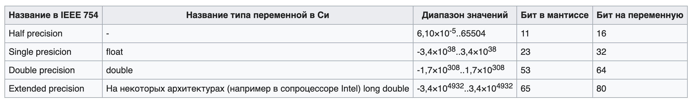


# 7. Построение СДНФ, СКНФ и СДНФ булевых функций.

Нормальная форма булевой функции не содержит импликации, эквивалентности или отрицания для неэлементарных членов.

Конъюнктивно нормальная форма - конъюнкция(И) нескольких дизъюнкций(ИЛИ).

Дизъюнктивно нормальная форма - дизъюнкций(ИЛИ) нескольких конъюнкция(И).

### СКНФ
СКНФ - КНФ у которой:
- нет одинаковых элементарных дизъюнкций;
- в каждом множителе нет повторяющихся переменных;
- каждый множитель содержит все переменные, от которых зависит булева функция.

### СДНФ
СДНФ - ДНФ у которой:
- нет одинаковых элементарных конъюнкций;
- в каждом слагаемом нет повторяющихся переменных;
- каждое слагаемое содержит все переменные, от которых зависит булева функция.

### Построение

В обоих случаях строим таблицу истинности

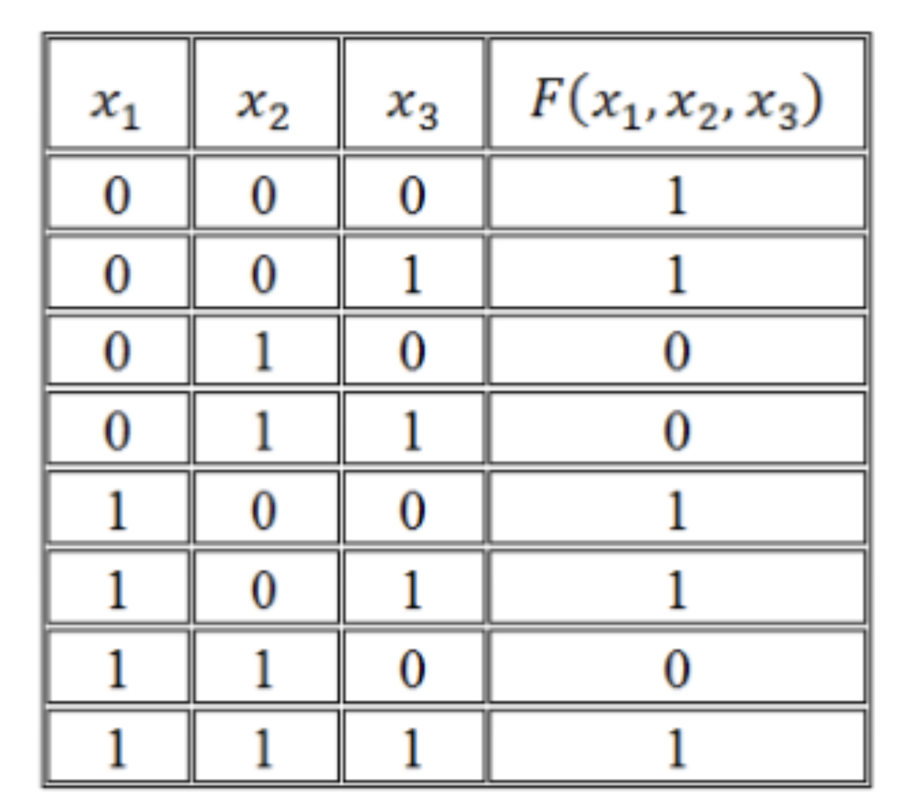

### СДНФ

Нужно найти строки, где значение булевой функции равно 1. Для значений переменных в этих строках нужно их записать, так
чтобы выполнялось равенство, т.е. если переменная x = 1 то x, а если x = 0, то !x, и для конкретной строки их перемножить.
После все найденные строки сложить.


### СКНФ

Нужно найти строки, где значение булевой функции равно 0. Для значений переменных в этих строках нужно их записать, так
чтобы выполнялось равенство, т.е. если переменная x = 1 то !x, а если x = 0, то x, и для конкретной строки их сложить.
После все найденные строки перемножить.


### 9. Алгоритмы. Рекурсивные функции. Машины Тьюринга.

### Алгоритмы

Алгоритм - это точно установленное предписание о выполнении в определённом порядке некоторой последовательности
операций, однозначно ведущих к решению той или иной конкретной задачи.

Предписание алгоритма представляет собой конечный набор правил, который задаёт потенциально осуществимый вычислительный
процесс, ведущий от варьирующих в определённых пределах исходных данных к получению результата, определяемого
допустимыми исходными данными.

### Рекурсивные функции

Рекурсивная функция — это числовая функция f(n) числового аргумента, которая в своей записи содержит себя же.

Хвостовая рекурсия — частный случай рекурсии, при котором любой рекурсивный вызов является последней операцией перед
возвратом из функции. Хвостовую рекурсию можно заменить на итерацию.

Хвостовая рекурсия C:

```
int fact (int n, int acc) {
    return (n == 0) ? acc : fact(n - 1, acc * n);
}

int factorial (int n) {
    return fact(n, 1);
}
```

Не хвостовая рекурсия C:

```
int factorial (int n) {
    return (n == 0) ? 1 : n * factorial(n - 1);
}
```

### Машины Тьюринга

Тьюринг предложил понятия абстрактных вычислительных машин. Любой алгоритм может быть реализован на данных машинах,
несмотря на кажущуюся примитивность их элементарных действий.

Устройство машины Тьюринга:

- память - бесконечная лента
- процессор - каретка и программа (конечное число команд)

В машине Тьюринга памятью является потенциально бесконечная лента, в каждой клетке которой записан символ из заранее
заданного конечного алфавита. Более того, достаточно рассматривать ленту, каждая клетка которой содержит один бит
информации, то есть либо пуста, либо содержит символ 1.

Процессор машины Тьюринга состоит из головки (каретки), которая в любой момент обозревает одну клетку, и программы,
состоящей из конечного числа команд, обычно нумеруемых натуральными числами. Каждая команда представляет собой условное
действие, зависящее от символа, записанного в клетке.

Это действие имеет вид совокупности элементарных инструкций формы ab (L, R, S) i, в которой присутствует лишь одна из
букв L, R, S.

- L означает приказ сдвинуться на следующем такте на одну клетку влево,
- R — вправо,
- S — остаться на месте.

Элементарная инструкция означает следующее: если машина видит a, записать в клетку b, передвинуться в соответствии с
командой и перейти к исполнению команды i. Такая элементарность действий машины стала результатом проведённого Тьюрингом
методологического анализа элементарных действий человека по исполнению алгоритмов.

Модификация машин Тьюринга При модификации машин Тьюринга разделением входной и выходной ленты (со входной можно лишь
читать, на выходную — лишь писать, причём после шага записи и чтения лента необратимо сдвигается на одну ячейку)
получается важное понятие конечного автомата, моделирующее вычислительные машины без внешней памяти.


# 11. Общая функциональная схема ЭВМ.

Общая функциональная схема ЭВМ была придумана фон Нейманом. Основными блоками, по Нейману, являются устройство
управления (УУ) и арифметико-логическое устройство (АЛУ) (обычно объединяемые в центральный процессор), память, внешняя
память, устройства ввода и вывода.

Устройство управления и арифметико-логическое устройство в современных компьютерах объединены в один блок – процессор,
являющийся преобразователем информации, поступающей из памяти и внешних устройств. Сюда относятся выборка команд из
памяти, кодирование и декодирование, выполнение различных, в том числе и арифметических, операций, согласование работы
узлов компьютера.

Память (ЗУ) хранит информацию (данные) и программы. Запоминающее устройство у современных компьютеров включает
оперативное запоминающее устройство (ОЗУ), хранящее ту информацию, с которой компьютер работает непосредственно в данное
время, и внешние запоминающие устройства (ВЗУ) гораздо большей емкости, чем ОЗУ, но с существенно более медленным
доступом. ПЗУ - энергозависимая память для хранения неизменяемой информации.

Для осуществления обмена информацией между человеком и компьютером в схему добавлены периферийные устройства -
ввода/вывода.


Для связи основных устройств компьютера между собой используется специальная информационная магистраль, обычно
называемая шиной. Шина состоит из трех частей:

- шина адреса, на которой устанавливается адрес требуемой ячейки памяти или устройства, с которым будет происходить
  обмен информацией;
- шина данных, по которой собственно и будет передана необходимая информация;
- шина управления, регулирующая этот процесс (например, один из сигналов на этой шине позволяет компьютеру различать
  между собой адреса памяти и устройств ввода/вывода).


### 1. Классификация видов моделирования: аналитическое, имитационное, комбинированное. Типовые математические схемы (D,F,P,Q,A).
<b>Аналитическое моделирование</b> – математическая формализация, изменение свойств объекта во времени.

Для аналитического моделирования характерно то, что процессы функционирования элементов системы записываются в виде некоторых функциональных соотношений (алгебраические, интегро-дифференцированные, конечно разностные) и логических условий.

Аналитическая модель может быть исследована 3-мя способами:

- аналитическим способом – стремятся получить в общем виде зависимость от исходных характеристик;

- численным способом – когда нельзя решить в общем виде, то получаем результаты для конкретных начальных данных;

- качественный способ – не имея решения управления в общем виде, мы можем найти некоторые свойства решения;

Имитационное моделирование хуже аналитического. Комбинированное – самое лучшее.

При <b>имитационном моделировании</b> реализующий модель алгоритм воспроизводит процесс функционирования системы во времени, причем имитируются элементарные явления, составляющие процесс с сохранением их логической структуры и последовательности протекании во времени, что позволяет по исходным данным получить сведения о состоянии процесса в определенные моменты времени, дающие возможность оценить характеристики системы.

Основным преимуществом имитационного моделирования по сравнению с аналитическим, является возможность решения более сложных задач. Имитационные модели позволяют достаточно просто учитывать такие факторы, как наличие дискретных и непрерывных элементов, нелинейные характеристики системы и её элементов, многочисленные случайные воздействия.

Когда результаты, получаются при воспроизведении на имитационной модели процесса функционирования системы, являются реализациями случайных величин и функций, тогда для нахождения характеристик процесса, требуется его многократное воспроизведение с последующей статической обработкой.

<b>Комбинированное моделирование</b> при анализе системы позволяет определить достоинства его компонентов. Обычно проводят декомпозицию процесса функционирования объекта на составляющие подпроцессы.

#### Типовые математические схемы (D,F,P,Q,A) + N

<b>D-схемы (Непрерывно-детерминированные модели)</b>

D-схемы (англ. dynamic) – отражают динамику изучаемой системы, и в качестве независимой переменной, от которой зависят неизвестные искомые функции, обычно служит время t.

Частным случаем динамических систем, описываемых D-схемами, являются системы автоматического управления. Использование D-схем позволяет формализовать процесс функционирования непрерывно детерминированных систем S и оценить их основные характеристики, применяя аналитический или имитационный подход, реализованный в виде соответствующего языка для моделирования непрерывных систем или использующий аналоговые и гибридные средства вычислительной техники.

<b>F-схемы (Дискретно-детерминированные модели)</b>

F-схема (англ. finite automata) – это абстрактно-конечный автомат, характеризующейся шестью элементами.

Конечным автоматом называется автомат, у которого множества внутренних состояний, входных и выходных сигналов являются конечными множествами. Существуют несколько способов задания работы F-автоматов, но наиболее часто используются табличный, графический и матричный.

<b>Р-схемы (Дискретно-стохастические модели)</b>
<i>По идее, они же - Марковские цепи.</i>

Р-схема (англ. probabilistic automata) – это вероятностный автомат схем при дискретно-стохастическом подходе на вероятностных (стохастических) автоматах. В общем, виде Р-схемы можно определить как дискретный потактный преобразователь информации с памятью, функционирование которого в каждом такте зависит только от состояния памяти в нем, и может быть описано статистически.

<b>Q-схемы (Непрерывно-стохастические модели)</b>

Q-схема (англ. queueing system) – система массового обслуживания.

В качестве процесса обслуживания могут быть представлены различные по своей физической природе процессы функционирования экономических, производственных, технических и других систем, например: потоки поставок продукции некоторому предприятию, потоки деталей и комплектующих изделий на сборочном конвейере цеха, заявки на обработку информации ЭВМ от удаленных терминалов и т.д. При этом характерным для работы таких объектов является случайное появление заявок (требований) на обслуживание и завершение обслуживания в случайные моменты времени, т.е. стохастический характер процесса их функционирования.

На работу с Q-схемами при машинной реализации моделей ориентированы многие языки имитационного моделирования, например SIMULA, SIMSCRIPT, GPSS и др.

<b>N-схемы (Сетевые модели)</b>

N-схема – сети Петри (англ. Petri Nets), используемые для формального описания структуры и взаимодействия параллельных систем и процессов, а также анализа причинно-следственных связей в сложных системах.

<b>А-схемы (Комбинированные модели)</b>

А-схема – агрегативная система (англ. aggregate system), используемая для описания поведения непрерывных и дискретных, детерминированных и стохастических систем.

При агрегативном описании сложный объект (система) расчленяется на конечное число частей (подсистем), сохраняя при этом связи, обеспечивающие взаимодействие частей. Если некоторые из полученных подсистем оказываются в свою очередь еще достаточно сложными, то процесс их разбиения продолжается до тех пор, пока не образуются подсистемы, которые в условиях рассматриваемой задачи моделирования могут считаться удобными для математического описания. В результате такой декомпозиции сложная система представляется в виде многоуровневой конструкции из взаимосвязанных элементов, объединенных в подсистемы различных уровней.

### 2. Формализация и алгоритмизация процесса функционирования сложных систем.

Сущность компьютерного моделирования сложной системы состоит в проведении на компьютере эксперимента с моделью, которая в нашем случае представляет собой некоторый программный комплекс, описывающий формально или алгоритмически поведения элементов системы в процессе её функционирования, т.е. в их взаимодействии друг с другом и внешней средой.

Основные требования, предъявляемые к модели:

- Полнота модели – должна предоставлять пользователю возможность получения необходимого набора характеристик, оценок системы, с требуемой точностью и достоверностью.
- Гибкость модели – должна давать возможность воспроизведения различных ситуаций при варьировании структуры, алгоритмов и параметров системы. Причем структура должна быть блочной, т.е. допускать возможность замены, добавления, исключение некоторой части без переделки всей модели.
- Компьютерная реализация моделидолжна соответствовать имеющимся техническим ресурсам.

Основные этапы моделирования больших систем:
- Построение концептуальной (описательной) модели системы и её формализация;
- Алгоритмизация модели и её машинная реализация;
- Получение и интерпретация результатов моделирования;

На <b>этапе формализации</b> формулируется модель и строится её формальная схема, т.е. основным назначением данного этапа является переход от содержательного описания объекта к его математической модели.

Последовательность действий:

- Проведение границы между системой и внешней средой.
- Исследование моделируемого объекта с точки зрения выделения основных составляющих функционирования системы (по отношению к поставленной цели)
- Переход от содержательного описания модели к формализованному описанию свойств функционирования модели, т.е. к её концептуальной модели. Это сводится к исключению из рассмотрения некоторых второстепенных элементов. Полагают, что они не указывают существенного явления на ход процесса исследуемой модели.

Оставшиеся элементы модели группируются в блоки:

- Блоки I-ой группы представляют собой имитатор событий внешних воздействий.

- Блоки II-ой группы являются собственно моделью процесса функционирования.

- Блоки III-ой группы являются вспомогательными и служат для реализации блоков I и II группы. Так же эти блоки обеспечивают корректность ввода данных, приемлимость результатов и т.д.

Процесс функционирования системы, так разбивается на подпроцессы, чтобы построение модели подпроцесса было элементарно и не вызывало особых трудностей

На <b>этапе алгоритимизации</b> и компьютерной реализации математическая модель, сформированная на первом этапе, воплощается в конекретную программную модель.

Исходный материал – блочная логическая схема.

Последовательность действий:
- Разработка схемы моделирующего алгоритма.
- Разработка схемы программы.
- Выбор технических средств для реализации программной модели.
- Процесс программирования и отладки.
- Проверка достоверности программы на тестовых примерах.
- Составление технической документации.

На этапе получения и интерпретации результатов компьютер изспользуются для проведения рабочих расчетов по готовой программе. Результаты этих расчетов позволяют проанализировать и сделать выводы о характеристиках процессов функционрирования исследуемой схемы.

### 3. Моделирование на системном уровне.

<i>(Т.е. моделирование вычислительных систем - судя по лекциям из бауманки)</i>

При моделировании новых и модернизации существующих вычислительных систем и сетей необходимо предварительно оценивать эффективность их функционирования с учетом различных вариантов структурной организации. Эти варианты могут отличаться составом и характеристиками устройств. Структурой межмодульных связей, режимами работы и алгоритмами управления. Для оценок таких структур используют модели вычислительных систем. Под вычислительной системой будем понимать комплект аппаратных (процессор, память, ву) и программных средств ( ОС ), которые в совокупности выполняют определенные рабочие функции.

Коллектив пользователей – это сообщество таких людей, которые используют вычислительную систему для удовлетворения своих нужд по обработке информации.

Входные сигналы (программы, команды, данные), которые создаются коллективом пользователей, называются рабочей нагрузкой.

Схема вычислительной установки:


<b>Концептуальная модель</b> включает в себя сведения о выходных и конструктивных параметрах системы, её структуре, особенности работы каждого ресурса (элемента системы), характере взаимодействия между ресурсами. Как правило, включается постановка прикладной задачи, определяющей цели моделирования исходной системы, а так же исходные данные для исследования системы.

<b>Формализованная схема</b> представляет собой, как правило, некоторую сложную систему массового обслуживания.

Основные задачи, которые необходимо решить:
- Определение принципов организации вычислительной системы;
- Выбор архитектуры, уточнение функции и их разделение на подфункции, реализуемое аппаратным или программным способом;
- Разработка структурной схемы, т.е. определение состава устройств и способов их взаимодействия;
- Определение требований к выходным параметров устройств и формирование технического задания для разработки отдельных устройств.

### 4. Исследование сложных дискретных структур с очередями. Уравнение Колмогорова.
Исследование сложных дискретных структур с очередями - это тема научной работы какого-то бауманского мудака-Корягина
https://math.semestr.ru/cmo/kolmogorov.php

### 5. Моделирование систем и языки моделирования, классификация языков имитационного моделирования

Алгоритмические языки при моделировании систем служат вспомогательным аппаратом в разработке машинной реализации и анализа характеристик моделей. Основная задача– это выбор языка.

Каждый язык имеет свою систему абстракций, лежащую в основе формализации функционирования сложных систем.

Для программирования модели могут использоваться следующие языки:
1. Универсальные алгоритмические языки высокого уровня.
2. Специализированные языки моделирования: языки, реализующие событийный подход, подход сканирования активностей, языки, реализующие процессно-ориентированный подход.
3. Проблемно-ориентированные языки и системы моделирования.

Качество языков моделирования характеризуется:
- Удобство описания процесса функционирования;
- Удобство ввода исходных данных, варьирования структуры, алгоритмов работы и параметров модели;
- Эффективностью анализа и вывода результатов моделирования;
- Простотой отладки и контроля работы моделирующей программы;
- Доступностью восприятия и использования языка.

В большинстве своем языки моделирования определяют поведение систем во времени с помощью модифицированного событийного алгоритма. Как правило, он включает в себя список текущих и будущих событий.

#### Классификация языков имитационного моделирования.


Непрерывное представление систем сводится к представлению дифференциальных уравнений, с помощью которых устанавливают связь между входной и выходной функциям. Если выходные переменные модели принимают дискретные значения, то уравнения являются разностными.

GASP– комбинированный, в основе лежит язык FORTRAN. Предполагается, что в системе могут наступать события двух типов:

1. события, зависящие от состояния
2. события, зависящие от времени.

Состояние системы описывается набором переменных, причем некоторые из них меняются непрерывно. При таком подходе пользователь должен составлять процедуры, описывающие условия наступления событий. Законы изменения непрерывных переменных, правила перехода от одного состояния к другому, т.е. реализуется классический принцип ДУ.

Группы языков моделирования, ориентированные на дискретное время, используется при построении именно имитационных моделей, но при этом используются разные способы описания динамического поведения исследуемого объекта.

### 7. Методология вычислительного эксперимента в науке и технике. Понятие корректности постановки задач моделирования. Методы построения математических моделей
#### Методология вычислительного эксперимента в науке и технике

Вычислительным экспериментом называется методология и технология исследований, основанные на применении прикладной математики и ЭВМ как технической базы при использовании ММ (математического моделирования). Вычислительный эксперимент основывается на создании ММ изучаемых объектов, которые формируются с помощью некоторой особой математической структуры, способной отражать свойства объекта, проявляемые им в различных экспериментальных условиях.

Процесс построения любой математической модели можно представить последовательностью этапов:

1. Обследование объекта моделирования и формулировка технического задания на разработку модели (содержательная постановка задачи);
2. Концептуальная и математическая постановка задачи;
3. Качественный анализ и проверка корректности модели;
4. Выбор и обоснование выбора методов решения задачи;
5. Поиск решения;
6. Разработка алгоритма решения и исследование его свойств, реализация алгоритма в виде программ;
7. Проверка адекватности модели;
8. Практическое использование построенной модели.

<i>Подробнее про все пункты: http://systems-analysis.ru/mathmodeling_process.html</i>

#### Понятие корректности постановки задач моделирования

Понятие корректности задачи имеет большое значение в при­кладной математике. Например, численные методы решения оправ­дано применять лишь к корректно поставленным задачам. При этом далеко не все задачи, возникающие на практике, можно считать корректными (например, так называемые обратные задачи). Дока­зательство корректности конкретной математической задачи - до­статочно сложная проблема, она решена только для некоторого класса математически поставленных задач. Проверка математичес­кой замкнутости является менее сложной по сравнению с провер­кой корректности математической постановки. В настоящее время активно исследуются свойства некорректных задач, разрабатывают­ся методы их решения. Аналогично понятию «корректно поставлен­ная задача» можно ввести понятие «корректная математическая модель».

Математическая модель является корректной,если для нее осу­ществлен и получен положительный результат всех контрольных проверок: размерности, порядков, характера зависимостей, экстре­мальных ситуаций, граничных условий, физического смысла и ма­тематической замкнутости.

#### Методы построения математических моделей
1. Экспериментальный
2. Аналитический
3. Экспериментально-аналитический

#### Экспериментальный
При построении методов управления требуются знания статики, динамики объекта в узком диапазоне вокруг рабочей точки.

Допускаются предположения:
- линейность объекта;
- сосредоточенность параметров;
- стационарность.

Эти допущения позволяют использовать линейные статические модели: и линейные дифференциальные уравнения и определять их экспериментальными методами на каждом объекте управления.

Достоинства и недостатки

- Достоинства: простота управления, малая трудоемкость.
- Недостатки метода: нельзя использовать модели при переходе на другую рабочую точку, нельзя использовать модель на другом объекте.

#### Аналитический
При составлении моделей аналитическим путем используются уравнения материального, энергетического баланса и другие.

Используется для построения моделей при оптимизации процессов. При этом учитываются физико-химические процессы, характеристики сырья, режимы параметров, параметры оборудования.

Достоинства и недостатки

- Достоинства: строится более общая модель, не требуется экспериментов на объекте, можно применять на других объектах управления.
- Недостатки: невысокая точность, сложность процесса построения моделей, необходимость лабораторных исследований. При определении коэффициентов кинетики химических процессов, гидродинамики, тепло процессов и т. д.

По многим параметрам и режимам делаются допущения о механизме процесса. (например, при идеальном перемешивании продукта в химическом реакторе имеются ошибки в описании и точность не высока).

#### Экспериментально-аналитический
Для повышения точности моделей, полученных аналитическим методом, на объекте управления проводят серию экспериментов и уточняют модель. Такой метод – экспериментально-аналитический. Метод позволяет использовать и экспериментальный, и аналитический методы. Точность моделей, по полученному вектору коэффициентов В можно использовать только на объекте, где производятся эксперименты.

### 8. Современные системы научно-технических расчетов и моделирования (MatLab, Mathcad). Общая характеристика и особенности применения в вычислительных экспериментах.

Matlab, Mathcad, а также - бонус - Maple и Mathematica - это системы, относящиеся к разделу CAE (Computer Aided Engeneering) инженерного проектирования.
Системы MathСad и MATLAB - системы автоматизации математических расчетов, построенные на расширенном представлении и применении матричных операций. Применение матриц, как основных объектов системы, способствует уменьшению числа циклов, которые очень распространены при выполнении матричных вычислений на обычных языках программирования высокого уровня, и облегчению реализации параллельных вычислений.

Спектр задач, решаемых этими системами, очень широк:

- проведение математических исследований, требующих вычислений и аналитических выкладок;
- разработка и анализ алгоритмов;
- математическое моделирование и компьютерный эксперимент;
- анализ и обработка данных;
- визуализация, научная и инженерная графика;
- разработка графических и расчетных приложений.

Поскольку CAE-системы содержат операторы для базовых вычислений, то почти все алгоритмы, отсутствующие в стандартных функциях, можно реализовать посредством написания собственной программы.

В данных математических пакетах применяется принцип конструирования модели, а не традиционное «искусство программирования». То есть пользователь лишь ставит задачу, а методы и алгоритмы решения система находит сама. Более того, такие рутинные операции, как раскрывание скобок, преобразование выражений, нахождение корней уравнений, производных и неопределенных интегралов компьютер самостоятельно осуществляет в символьном виде, причем практически без вмешательства пользователя.

<i>Не знаю, как подробно нужно давать ответы на вопросы по этой теме, подробнее об отличиях Matlab и Mathcad здесь (наверное, стоит один раз прочитать, всего 4 страницы):</i> https://cyberleninka.ru/article/n/programmnaya-realizatsiya-statisticheskoy-obrabotki-dannyh-sistemy-mathcad-i-matlab/viewer

### 9. Основные задачи линейной алгебры, решаемые при математическом моделировании. Плохо обусловленные системы. Нелинейные уравнения и системы нелинейных уравнений.

#### Плохо обусловленные системы

<b>Плохо обусловленная система</b> — это система, у которой определитель А не равен нулю, но число обусловленности |А-1| |А| очень велико. Несмотря на то, что плохо обусловленные системы имеют единственное решение, на практике искать это решение чаще всего не имеет смысла. Рассмотрим свойства плохо обусловленных СЛАУ на двух конкретных примерах:


Пример содержит решение двух очень близких плохо обусловленных СЛАУ (с одинаковой правой частью ь и мало отличающимися матрицами А). Несмотря на близость, точные решения этих систем оказываются очень далекими друг от друга. Надо заметить, что для системы двух уравнений точное решение получить легко, однако при решении СЛАУ большой размерности незначительные ошибки округления, неминуемо накапливаемые при расчетах (в том числе и "точным" алгоритмом Гаусса), приводят к огромным погрешностям результата. Возникает вопрос: имеет ли смысл искать численное решение, если заранее известно, что, в силу неустойчивости самой задачи, оно может оказаться совершенно неправильным?

Чтобы лучше понять причину некорректности, полезно сравнить графическую интерпретацию хорошо и плохо обусловленной системы двух уравнений. Решение системы визуализируется точкой пересечения двух прямых линий, изображающих каждое из уравнений.

Хорошо обусловленная:


Плохо обусловленная


Плохая обусловленность матрицы типична и при реконструкции экспериментальных данных, задаваемых переопределенными (несовместными) СЛАУ (например, в задачах томографии).

Для решения некорректных задач, в частности, вырожденных и плохо обусловленных СЛАУ, используется регуляризация. В ее основе лежит учет дополнительной априорной информации о структуре решения (векторе априорной оценки хо), которая очень часто присутствует в практических случаях. Задачу решения СЛАУ Аx=b можно заменить задачей отыскания минимума функционала Тихонова:

Ω(х,λ) = |Ах-b|^2+λ|х-х0|^2

Здесь λ, — малый положительный параметр регуляризации, который необходимо подобрать некоторым оптимальным способом. Можно показать, что задачу минимизации функционала Тихонова можно, в свою очередь, свести к решению другой СЛАУ:

(АTА+λI)-х=АTВ+λх0, <i>(AT = A транспонированная)</i>

которая при λ->0 переходит в исходную плохо обусловленную систему, а при больших x, будучи хорошо обусловленной, имеет решение х0. Очевидно, оптимальным будет некоторое промежуточное значение А, устанавливающее определенный компромисс между приемлемой обусловленностью и близостью к исходной задаче.

#### Нелинейные уравнения и системы нелинейных уравнений.

[РЕШЕНИЕ НЕЛИНЕЙНЫХ УРАВНЕНИЙ И СИСТЕМ НЕЛИНЕЙНЫХ УРАВНЕНИЙ](https://mainfodotru.files.wordpress.com/2017/09/numeric-methods-part2.pdf)

[Методы решения систем нелинейных уравнений](http://mathhelpplanet.com/static.php?p=metody-resheniya-sistem-nelineynykh-uravneniy)

### 10. Аппроксимация функций в задачах моделирования. Многомерная интерполяция. Наилучшее линейное и нелинейное среднеквадратичное приближения.

#### Аппроксимация функций в задачах моделирования.

<b>Аппроксимация</b> – это замена одних математических объектов другими, которые в определённом смысле близки к исходным и более просты и удобны. Исходными данными для аппроксимации в задачах моделирования могут являться эмпирические данные или результаты предварительного моделирования отдельных наиболее сложных элементов модели. Кроме того, часто практикуется замена точных сложных моделей на приближенные, но значительно более простые соотношения с целью сокращения времени моделирования.

Наиболее часто исходными данными для аппроксимации является множество табличных данных, которые называют узловыми точками

<b>Аппроксимацией (приближением) функции</b> f(x) называется нахождение такой функции (аппроксимирующей функции) g(x), которая была бы близка заданной. Критерии близости функций могут быть различные.

В случае если аппроксимация проводится на непрерывном множестве точек (отрезке), аппроксимация называется непрерывной или интегральной. Примером такой аппроксимации может служить разложение функции в ряд Тейлора, то есть замена некоторой функции степенным многочленом.

Наиболее часто встречающим видом точечной аппроксимации является интерполяция – нахождение промежуточных значений величины по имеющемуся дискретному набору известных значений.

Пусть задан дискретный набор точек, называемых узлами интерполяции, а также значения функции в этих точках. Требуется построить функцию g(x), проходящую наиболее близко ко всем заданным узлам. Таким образом, критерием близости функции является g(xi)=yi.

В качестве функции g(x) обычно выбирается полином, который называют интерполяционным полиномом.

В случае если полином един для всей области интерполяции, говорят, что интерполяция глобальная.

В случае если между различными узлами полиномы различны, говорят о кусочной или локальной интерполяции.

Найдя интерполяционный полином, мы можем вычислить значения функции между узлами, а также определить значение функции даже за пределами заданного интервала (провести экстраполяцию).

<b>Аппроксимация линейной функцией</b>

Любая линейная функция может быть записана уравнением . Аппроксимация заключается в отыскании коэффициентов a и b уравнения таких, чтобы все экспериментальные точки лежали наиболее близко к аппроксимирующей прямой.

С этой целью чаще всего используется метод наименьших квадратов (МНК), суть которого заключается в следующем: сумма квадратов отклонений значения точки от аппроксимирующей точки принимает минимальное значение:


<b>Теорема Цыбенко, Универсальная теорема аппроксимации</b> — теорема, доказанная Джорджем Цыбенко в 1989 году, которая утверждает, что искусственная нейронная сеть прямой связи (англ. feed-forward; в которых связи не образуют циклов) с одним скрытым слоем может аппроксимировать любую непрерывную функцию многих переменных с любой точностью. Условиями являются: достаточное количество нейронов скрытого слоя, удачный подбор ${\displaystyle \mathbf {w} _{1},\mathbf {w} _{2},\dots ,\mathbf {w} _{N},\mathbf {\alpha } ,}$ и ${\displaystyle \mathbf {\theta } }$, где

${\displaystyle \mathbf {w} _{i}}$ — веса между входными нейронами и нейронами скрытого слоя,

${\displaystyle \mathbf {\alpha } }$ — веса между связями от нейронов скрытого слоя и выходным нейроном,

${\displaystyle \mathbf {\theta } }$ — смещения для нейронов входного слоя.

#### Многомерная интерполяция

### 11. Алгоритмы численного интегрирования функций одной переменной. Формулы Рунге. Сходимость квадратурных формул. Нелинейные формулы. Вычисление многомерных интегралов.

Сначала стоит прочитать [это](http://solidstate.petrsu.ru/p/tutorial/meth_calc/files/04.shtml), потом [это](http://solidstate.petrsu.ru/p/tutorial/meth_calc/files/05.shtml)

#### Алгоритмы численного интегрирования функций одной переменной
Квадратурные формулы - формулы для численных методов интегрирования

<b>Методы прямоугольников</b>

Метод численного интегрирования функции одной переменной, заключающийся в замене подынтегральной функции на многочлен нулевой степени, то есть константу, на каждом элементарном отрезке. Если рассмотреть график подынтегральной функции, то метод будет заключаться в приближённом вычислении площади под графиком суммированием площадей конечного числа прямоугольников, ширина которых будет определяться расстоянием между соответствующими соседними узлами интегрирования, а высота — значением подынтегральной функции в этих узлах. Алгебраический порядок точности равен 0. (Для формулы средних прямоугольников равен 1).

<i>Алгебраический порядок точности численного метода (порядок точности численного метода, степень точности численного метода, порядок точности, степень точности) — наибольшая степень полинома, для которой численный метод даёт точное решение задачи.

Другое определение: говорят, что численный метод имеет порядок точности ${\displaystyle d}$, если его остаток ${\displaystyle R_{n}}$ равен нулю для любого полинома степени ${\displaystyle d}$, но не равен нулю для полинома степени ${\displaystyle d+1}$</i>


- Метод левых прямоугольников

  

- Правых

  
- Средних

  


<b>Метод трапеций</b>


Метод трапеций имеет второй порядок алгебраической точности

<b>Метод Симпсона</b>

В этом методе подынтегральная функция на частичном отрезке  аппроксимируется параболой, проходящей через три точки , , , то есть интерполяционным многочленом Лагранжа второй степени.

На отрезке  формула Симпсона примет вид:


Если разбить отрезок интегрирования  на четное количество 2N равных частей с шагом , то можно построить параболу на каждом сдвоенном частичном отрезке  и переписать выражение выше без дробных индексов. Тогда формула Симпсона примет вид:


Метод Симпсона имеет порядок погрешности 4 и алгебраический порядок точности 3.

<b>Оценка погрешности</b>

Для оценки погрешности численных методов используется <b>правило Рунге</b>. Основная идея состоит в вычислении приближения выбранным методом с шагом h, а затем с шагом h/2, и дальнейшем рассмотрении разностей погрешностей для этих двух вычислений.

<b>Метод Гаусса</b>


Квадратура Гаусса относится к квадратурам открытого типа. Это означает, что ни один и узлов не совпадает ни с одним из концов отрезка интегрирования a или b.

Веса квадратур Гаусса всегда положительны, и при увеличении числа узлов точность приближения почти всегда возрастает.

Недостаток метода Гаусса состоит в том, что он не имеет лёгкого (с вычислительной точки зрения) пути оценки погрешности полученного значения интеграла. Использование правила Рунге при дроблении отрезка интегрирования требует вычисления подынтегральной функции примерно в таком же числе точек, не давая при этом практически никакого выигрыша в точности, в отличие от простых методов, где точность увеличивается в несколько раз при каждом новом разбиении. Кронродом был предложен следующий метод оценки значения интеграла

${\displaystyle I\approx \sum _{i=1}^{n}a_{i}\,f(x_{i})+\sum _{i=1}^{n+1}b_{i}\,f(y_{i})}$,

где ${\displaystyle x_{i}}$ — узлы метода Гаусса по ${\displaystyle n}$ точкам, а ${\displaystyle 3n+2}$ параметров ${\displaystyle a_{i}}$, ${\displaystyle b_{i}}$, ${\displaystyle y_{i}}$ подобраны таким образом, чтобы порядок точности метода был равен ${\displaystyle 3n+1}$. Тогда для оценки погрешности можно использовать эмпирическую формулу:

${\displaystyle \Delta =\left(200|I-I_{G}|\right)^{1.5}}$,

где ${\displaystyle I_{G}}$ — приближённое значение интеграла, полученное методом Гаусса по ${\displaystyle n}$ точкам.

#### Сходимость квадратурных формул и нелинейные формулы

Простых ответов не будет


#### Вычисление многомерных интегралов.

С помощью метода Монте-Карло. Все. (Как у Серова искали площадь какого-то многоугольника)

### 12. Математические модели на основе обыкновенных дифференциальных уравнений. Постановки задач. Неявные схемы. Интегрирование жестких систем уравнений.

<i>Начиная с этого раздела, темы касаются разностных схем. Вообще это все трэш</i>

#### Математические модели на основе обыкновенных дифференциальных уравнений

Значительная часть проблем, с которыми имеет дело вычислительная математика, представляет собой различные задачи для обыкновенных дифференциальных уравнений и уравнений с частными производными. Так, например, <b>обыкновенными дифференциальными уравнениями можно описать задачи химической кинетики, электрических цепей, движение систем взаимодействующих материальных точек и другие задачи физики, химии, техники. </b> К дифференциальным уравнениям в частных производных приводятся задачи математической физики, гидродинамики, акустики и других областей знаний. Все методы решения дифференциальных уравнений можно условно разбить на две группы: аналитические и численные. В свою очередь аналитические методы подразделяются на точные и приближенные. Точные методы позволяют выразить решение дифференциальных уравнений через элементарные функции (в аналитическом виде).

<i>Следующий абзац важен для понимания сути разностных схем</i>

Приближенными называются методы, в которых решение получается как предел некоторой последовательности, члены которой выражаются через элементарные функции. <b>Численные методы не позволяют найти точное решение дифференциальных уравнений в аналитической форме. С их помощью получается таблица приближенных (иногда точных) значений искомого решения в некоторых точках рассматриваемой области решения, именуемых сеткой. В силу этого численные методы называют иначе разностными методами или методами сеток. </b> Численные методы применимы к широким классам дифференциальных уравнений и всем типам краевых задач для них.

Понятия сетки и сеточной функции возникают в теории разностных схем в связи с изучением численных методов решения краевых задач математической физики. Для построения численного метода необходимо написать разностную схему, приближенно описывающую дифференциальное уравнение (или систему). Этот этап связан с заменой области непрерывного изменения аргумента областью дискретного его изменения и с заменой дифференциального оператора некоторым его разностным аналогом, кроме того, записывается разностная аппроксимация для начальных и граничных условий. Результатом этой процедуры является алгебраическая система уравнений или система разностных уравнений. Численное решение краевой задачи для исходного линейного дифференциального уравнения сводится к решению полученной алгебраической системы.

#### Неявные схемы

<b>Явные схемы</b>

Явные схемы вычисляют значение сеточной функции через данные соседних точек. Пример явной схемы для дифференцирования: ${\displaystyle f'(x)={\frac {f(x+h)-f(x-h)}{2h}}}$ (2-й порядок аппроксимации). Явные схемы часто оказываются неустойчивыми.

<b>Неявные схемы</b>

Неявные схемы используют уравнения, которые выражают данные через несколько соседних точек результата. Для нахождения результата решается система линейных уравнений. Пример неявной схемы для уравнения струны: ${\displaystyle f(x,t+h)-2f(x,t)+f(x,t-h)=f(x+h,t+h)-2f(x,t+h)+f(x-h,t+h)}$. Неявные схемы обычно являются устойчивыми.

#### Интегрирование жестких систем уравнений

Жёсткой системой обыкновенных дифференциальных уравнений (ОДУ) называется (нестрого говоря) такая система ОДУ, численное решение которой явными методами (например, методами Рунге — Кутты или Адамса) является неудовлетворительным из-за резкого увеличения числа вычислений (при малом шаге интегрирования) или из-за резкого возрастания погрешности (так называемого, взрыва погрешности) при недостаточно малом шаге. <b>Для жёстких систем характерно то, что для них неявные методы дают лучший результат, обычно несравненно более хороший, чем явные методы.</b>

Численные методы решения ОДУ делятся на одношаговые и многошаговые, которые в свою очередь можно разделить на явные и неявные.

<b>Явные одношаговые методы можно записать в виде:</b>

$y_{k+1} = y_{k} + hФ(x_{k}, y_{k})$,

где для простоты полагаем $h_{k}=h$, через ук будем обозначать приближенное решение в точке $x_{k}$, а у(х) – точное решение, в частности, у($x_{k}$) – точное решение в точке $x_{k}$. Для продвижения на один шаг одношаговые методы используют значения решения лишь в одной предыдущей точке.

<b>Явные многошаговые методы используют решение в нескольких предыдущих точках:</b>

$y_{k+1} = y_{k} + hФ(x_{k}, y_{k}, y_{k-1}, ... , y_{k-m})$

<b>Неявные одношаговые методы записываются в виде:</b>

$y_{k+1} = y_{k} + hФ(x_{k+1}, y_{k+1})$,

<b>Неявные многошаговые:</b>

$y_{k+1} = y_{k} + hФ(x_{k+1}, y_{k+1}, y_{k}, ... , y_{k-(m-1)})$

В неявных методах для нахождения $y_{k+1}$ требуется решить, вообще говоря, нелинейное уравнение или в общем случае систему уравнений.

### 13. Математические модели на основе обыкновенных дифференциальных уравнений. Краевые задачи. Уравнения с разрывными коэффициентами.

#### Краевые задачи
Краевая задача (граничная задача) — задача о нахождении решения заданного дифференциального уравнения (системы дифференциальных уравнений), удовлетворяющего краевым (граничным) условиям в концах интервала или на границе области. Краевые задачи для гиперболических и параболических уравнений часто называют начально-краевыми или смешанными, потому что в них задаются не только граничные, но и начальные условия.

x′′ + A(t)x + B(t)x′ = c(t),   t ∈ [0, T],	(LE)
x(0) = a,   x(T) = b,

<b>Решение краевых задач</b>

Большинство используемых численных методов решения краевых задач может быть отнесено к одному из трех больших классов. Разумеется, границы между этими методами размыты, некоторые методы нельзя отнести ни к одному из этих классов, другие же могут быть отнесены одновременно к двум классам и т. д.

а) Методы стрельбы.

б) Конечно-разностные методы, основывающиеся на построении разностных схем, аппроксимирующих решение исходной задачи.

в) Проекционные, или вариационные, методы, суть которых состоит в проектировании исходной задачи на конечномерное пространство функций.

