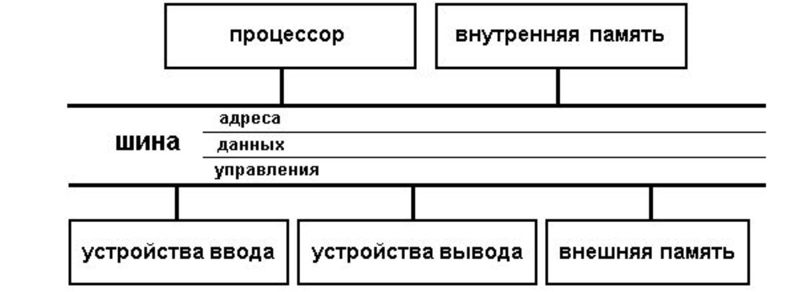

# 11. Общая функциональная схема ЭВМ.

Общая функциональная схема ЭВМ была придумана фон Нейманом. Основными блоками, по Нейману, являются устройство
управления (УУ) и арифметико-логическое устройство (АЛУ) (обычно объединяемые в центральный процессор), память, внешняя
память, устройства ввода и вывода.

Устройство управления и арифметико-логическое устройство в современных компьютерах объединены в один блок – процессор,
являющийся преобразователем информации, поступающей из памяти и внешних устройств. Сюда относятся выборка команд из
памяти, кодирование и декодирование, выполнение различных, в том числе и арифметических, операций, согласование работы
узлов компьютера.

Память (ЗУ) хранит информацию (данные) и программы. Запоминающее устройство у современных компьютеров включает
оперативное запоминающее устройство (ОЗУ), хранящее ту информацию, с которой компьютер работает непосредственно в данное
время, и внешние запоминающие устройства (ВЗУ) гораздо большей емкости, чем ОЗУ, но с существенно более медленным
доступом. ПЗУ - энергозависимая память для хранения неизменяемой информации.

Для осуществления обмена информацией между человеком и компьютером в схему добавлены периферийные устройства -
ввода/вывода.

Для связи основных устройств компьютера между собой используется специальная информационная магистраль, обычно
называемая шиной. Шина состоит из трех частей:

- шина адреса, на которой устанавливается адрес требуемой ячейки памяти или устройства, с которым будет происходить
  обмен информацией;
- шина данных, по которой собственно и будет передана необходимая информация;
- шина управления, регулирующая этот процесс (например, один из сигналов на этой шине позволяет компьютеру различать
  между собой адреса памяти и устройств ввода/вывода).

