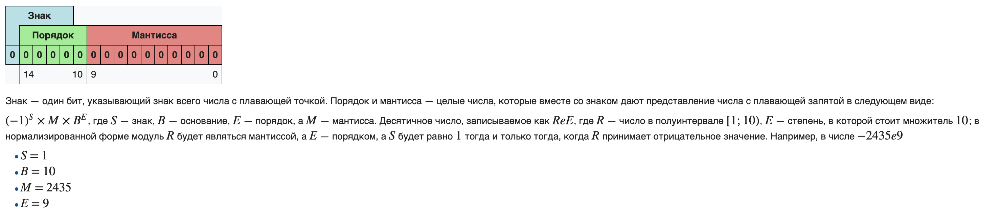
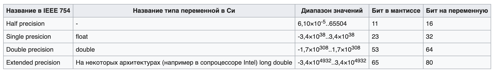

# 5. Представление вещественных чисел в ЭВМ.

### Вещественные числа

Вещественные числа обычно представляются в виде чисел с плавающей запятой. Числа с плавающей запятой — один из возможных
способов представления действительных чисел, который является компромиссом между точностью и диапазоном принимаемых
значений.

Лишь некоторые из вещественных чисел могут быть представлены в памяти компьютера точным значением, в то время как
остальные числа представляются приближёнными значениями.

Число с плавающей запятой состоит из набора отдельных двоичных разрядов, условно разделенных на так называемые:

- знак
- порядок (экспонента, показатель степени)
- мантиссу

В наиболее распространённом формате число с плавающей запятой представляется в виде набора битов, часть из которых
кодирует собой мантиссу числа, другая часть — показатель степени, и ещё один бит используется для указания знака числа.

- Порядок записывается как целое число в коде со сдвигом
- Мантисса — в нормализованном виде, своей дробной частью в двоичной системе счисления

Границы допустимых значений вещественных чисел

