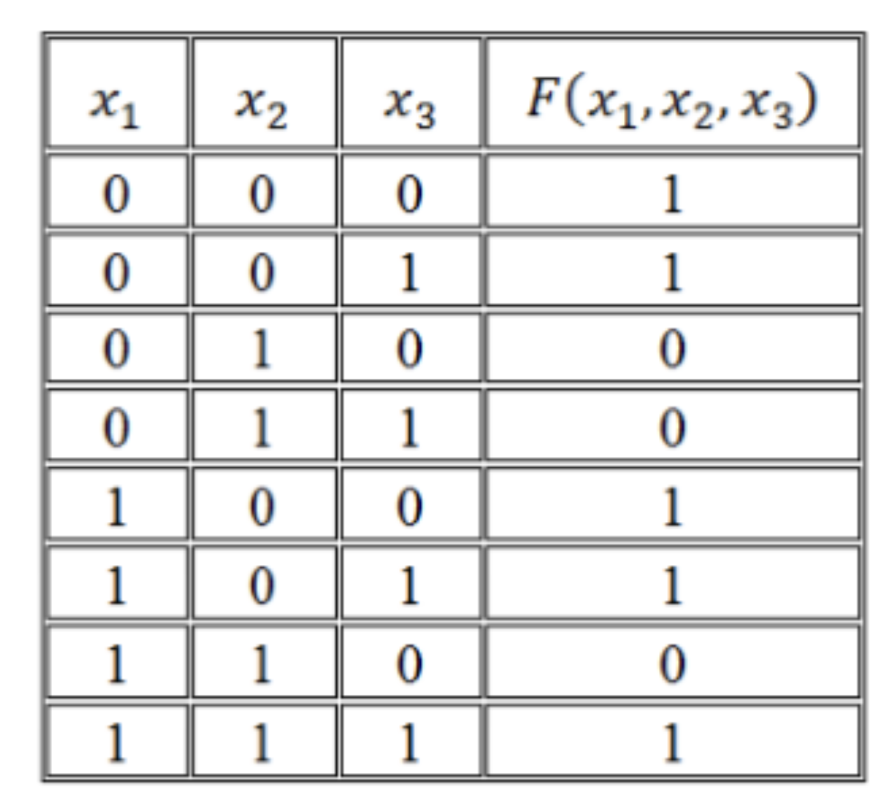
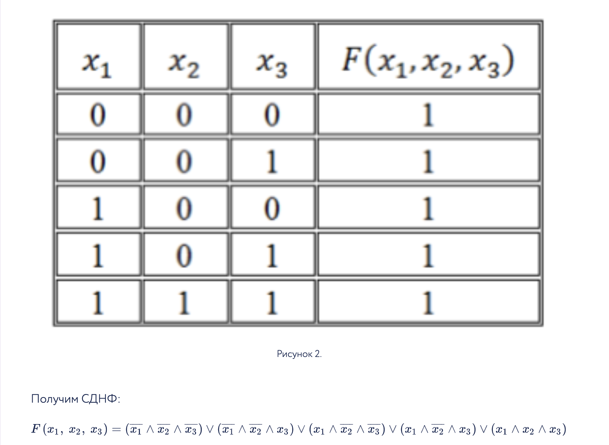
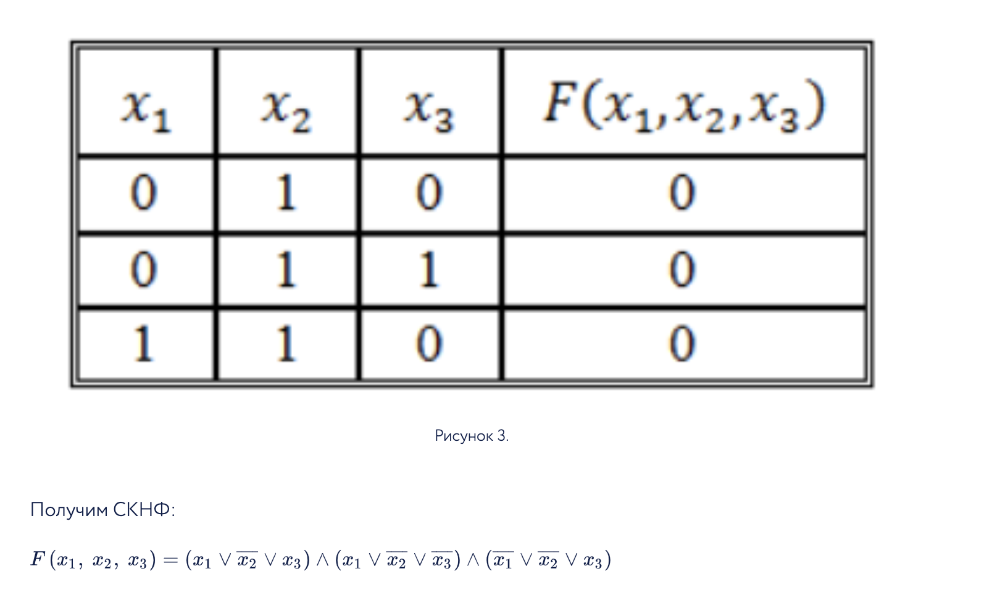

# 7. Построение СДНФ, СКНФ и СДНФ булевых функций.

Нормальная форма булевой функции не содержит импликации, эквивалентности или отрицания для неэлементарных членов.

Конъюнктивно нормальная форма - конъюнкция(И) нескольких дизъюнкций(ИЛИ).

Дизъюнктивно нормальная форма - дизъюнкций(ИЛИ) нескольких конъюнкция(И).

### СКНФ
СКНФ - КНФ у которой:
- нет одинаковых элементарных дизъюнкций;
- в каждом множителе нет повторяющихся переменных;
- каждый множитель содержит все переменные, от которых зависит булева функция.

### СДНФ
СДНФ - ДНФ у которой:
- нет одинаковых элементарных конъюнкций;
- в каждом слагаемом нет повторяющихся переменных;
- каждое слагаемое содержит все переменные, от которых зависит булева функция.

### Построение

В обоих случаях строим таблицу истинности

### СДНФ

Нужно найти строки, где значение булевой функции равно 1. Для значений переменных в этих строках нужно их записать, так
чтобы выполнялось равенство, т.е. если переменная x = 1 то x, а если x = 0, то !x, и для конкретной строки их перемножить.
После все найденные строки сложить.

### СКНФ

Нужно найти строки, где значение булевой функции равно 0. Для значений переменных в этих строках нужно их записать, так
чтобы выполнялось равенство, т.е. если переменная x = 1 то !x, а если x = 0, то x, и для конкретной строки их сложить.
После все найденные строки перемножить.

