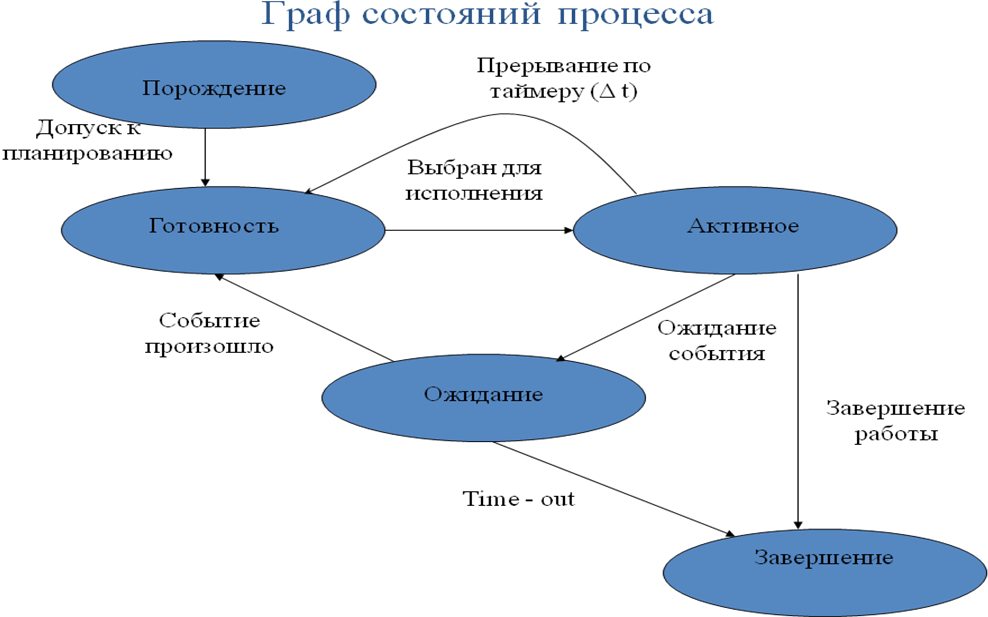
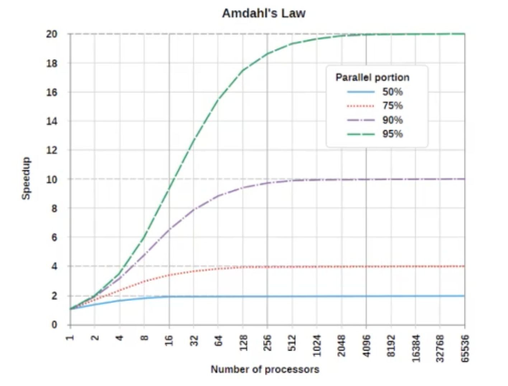

## 2. Понятие процесса: процесс как единица декомпозиции системы. Параллельные процессы: уровни наблюдения - параллельные и псевдопараллельные процессы. Состояния процесса: диаграмма состояний процесса. Оценка эффективности работы ОС. Приостановка и возобновление; проблемы приостановки и возобновления. Процессы в OC UNIX.

### Процесс

Процесс - это логический объект, описывающий программу в стадии выполнения. Процесс владеет ресурсами и имеет собственное виртуальное адресное пространство.
Адресное пространство процесса включает в себя:
- Область команд. Содержит инструкции предназначенные для выполнения процессором
- Область данных. Содержит данные процесса, имеется возможность изменения
- Область стека. Содержит вызовы процедур и данные ими используемые

Все процессы ОС хранятся в таблице процессов в виде указателей на дескрипторы процессов. В качестве структур описания процессов ОС использует контекст и дескриптор процесса.

Дескриптор(блок управления процессом) процесса включает в себя все те данные о процессе, которые могут понадобиться ОС при различных состояниях процесса.
Основной состав дескриптора процесса:
- Идентификатор процесса
- Контекст выполнения(указатель на него) - ниже
- Состояние процесса - ниже
- Приоритет процесса
- Адресное пространство(указатель на него) - память выделенная процессу
- Указатель на родительский процесс
- Указатель на дочерние процессы

Контекст процесса включает данные, необходимые только для текущего его выполнения на процессоре. Прежде всего, значения всех регистров процессора, включая
указатель текущей команды; таблица файлов, открытых процессом; указатели на области памяти, которые занимает процесс при его выполнении; системные флаги и режимы.

### Поток

В ОС в рамках одного процесса может выполняться несколько потоков. Поток — логический объект, описывающий последовательность независимо выполняемых
программных инструкций внутри процесса. Включает в себя контекст процессора(программный счетчик, указатель на общую память потоков процесса), а
также свою собственную область стека(для организации вызова подпрограмм и хранения локальных данных).

Важно понимать, что все потоки в рамках одного процесса используют общие ресурсы системы, выделенные данному процессу. Можно даже сказать, что процессы конкурируют
за все ресурсы системы, кроме процессорного времени, в то время как потоки конкурируют только за процессорное время.

### Состояния процесса(потока)

- Порождение(новый) - присвоение процессу записи в таблице процессов
- Готовность(готов) - после получения необходимых ресурсов процесс попадает в очередь(с приоритетом) готовых к выполнению процессов
- Выполнение(активный) - процессу выделено процессорное время для выполнения. Может произойти вытеснение, после истечения кванта времени
  или когда пришел процесс приоритетнее, тогда процесс перейдет в состояние готов. При нехватке ресурсов процесс перейдет в состояние ожидания.
  При завершении перейдет в состояние выполнен.
- Блокировка(ожидание) - процесс не может выполняться из-за нехватки ресурсов. Список заблокированных процессов — структура данных ядра, содержащая
  указатели на все заблокированные процессы. Данный список не упорядочен по приоритету. После получения сигнала о доступности ресурсов, процесс переходит в состояние готовности.
- Завершение(выполнен) - процесс прекратил свое выполнение. После процесс вытесняется из памяти, иначе будет в состоянии "зомби"

Переход из одного состояния в другое выполняет планировщик процессов, кроме блокирования, оно осуществляется, когда процесс не смог получить необходимый ресурс.

Для смены работающего на ядре процессора процесса(потока) ОС использует механизм переключения контекста. Состоит из следующих шагов:
- сохранить контекст(регистры процессора и программный счетчик) предыдущей задачи
- загрузить контекст новой задачи в регистры процессора и программный счетчик
- перейти к месту, указанному программным счетчиком
- приступить к выполнению задачи

### Оценка эффективности работы ОС
Ну тут что угодно можно приплести)

Закон Амдала показывает рост производительности процесса вычисления, при изменении числа процессоров, для определенного соотношения программного
выполняемого параллельно. Этот закон показывает предел числа процессоров при увеличении которого эффективность вычисления не измениться.

S = 1 / (a + ((1 - a) / P)), где a - процентаж последовательного кода, P - число процессоров

### Параллельные и псевдопараллельные процессы
В единственный момент времени на процессоре может выполняться лишь один процесс. Случай когда процессор переключается между несколькими
процессами за небольшой промежуток времени(десятки миллисекунд) называется псевдопараллелизмом, при котором происходит постоянное переключение контекста.
Просто параллелизм требует многопроцессорной системы, когда процессоры делят между собой общее адресное пространство.

### Прерывания
Прерывание (interrupt) — аппаратный сигнал, сообщающий о наступлении определенного события. Прерывания заставляют процессор выполнять
последовательность программных инструкций, называемых обработчиком прерываний. Обработчик прерываний (interrupt handler) — код ядра, выполняемый в ответ на прерывание.
Контроллер прерываний (interrupt controller) — микросхема на материнской плате либо аппаратный компонент процессора, сортирующий прерывания в соответствии
с их приоритетом, обеспечивая первоочередную обработку высокоприоритетных прерываний.

Прерывания делятся на аппаратные и программные:
Аппаратные прерывания используются для организации взаимодействия с внешними устройствами. Запросы аппаратных прерываний поступают на специальные входы микропроцессора.

Они бывают:
1. маскируемые, которые могут быть замаскированы программными средствами компьютера;
2. немаскируемые, запрос от которых таким образом замаскирован быть не может.

Программные прерывания вызываются следующими ситуациями:
1. особый случай, возникший при выполнении команды и препятствующий нормальному продолжению программы;
2. наличие в программе специальной команды прерывания INT n, используемой обычно программистом при обращениях к специальным функциям
   операционной системы для ввода-вывода информации.

### Приостановка и возобновление
Операции приостановки и возобновления играют важную роль в ОС и используются в следующих случаях:
- При пиковой нагрузке ВС, когда она не может обеспечить требуемое быстродействие, когда расходы времени на смену контекста не превышают полезную работу
- При ненадежной работе системы и возможном ее отказе
- Когда промежуточные результаты работы процесса вызывают сомнение в правильности работы программы

При приостановке процесса, его копия сбрасывается на диск, в специальный swaping файл. Но в этом состоянии он занимает также место и в оперативной памяти.

### Процессы в UNIX
Процесс в UNIX выполняется в отдельном защищенном виртуальном адресном пространстве. Часть времени процесс выполняется в режиме задачи, а часть времени процесс выполняется
в режиме ядра. В режиме задачи (пользовательском режиме) он выполняет собственный код. В режиме ядра он выполняет реентерабельный код операционной системы.
С помощью системного вызова fork() можно создать новый процесс, который является копией процесса-предка: процесс-потомок наследует адресное пространство
процесса-предка, дескрипторы всех открытых файлов и сигнальную маску и т.д.
