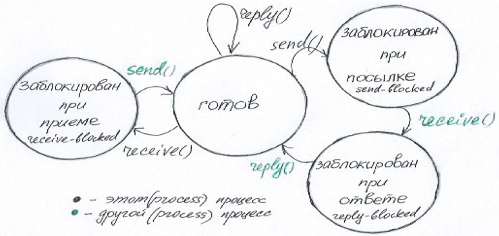

## 4. Структура ядра ОС: монолитное ядро - определение, системные вызовы, прерывания; микроядро - определение, передача сообщений, синхронизация; диаграмма состояний процесса - три состояния блокировки при передаче сообщения.

### Ядро и его структура
Ядро - это центральная часть операционной системы, которая обеспечивает архитектуру связи с приложениями, предоставляет наиболее низкий уровень абстракции
для доступа приложений к ресурсам системы, необходимым для их работы. Как правило, ядро предоставляет доступ исполняемым процессам соответствующих приложений
за счёт использования механизмов межпроцессного взаимодействия и обращения приложений к системным вызовам ОС. Ядро загружается в память один раз и находится в
памяти резидентно – постоянно, по одним и тем же адресам.

Основные функции ядра:
- управление процессами;
- организация взаимодействий между процессами;
- синхронизация процессов;
- планирование работы процессов;
- поддержка операций ввода-вывода;
- поддержка распределения и перераспределения памяти;

Структура ядра системы:
- нижний уровень - аппаратная часть
- уровень 1 - управление процессорами (диспетчеризация - выделение процессу процессорного времени)
- уровень 2 - контроль доступа к разделяемым ресурсам, планировщик процессов, управление памятью
- уровень 3 - управление процессорами (создание и удаление процессов)
- уровень 4 - управление устройствами (подсистема ввода/вывода)
- уровень 5 - управление информацией (файловая система)

### Архитектура ядер
Существует два основных класса ядер:
- Монолитное ядро - это один процесс, работающий в одном адресном пространстве в привилегированном режиме. В архитектуре с монолитным ядром все услуги
для прикладного приложения выполняют отдельные части кода ядра (в адресном пространстве ядра) - системные вызовы. В системах с монолитным ядром любое
расширение функциональности достигалось пересборкой ядра. Рано или поздно, любая монолитная операционная система начинает включать в себя ту или иную
технологию динамической реконфигурации. Для Linux это — технология загружаемых модулей ядра. В Windows это многоуровневые драйверы и службы.
К этому классу относятся: MS-DOS, Windows, Linux, BSD и т.д.
    3 события, переводящие систему в режим ядра:
  - Системные вызовы (можно вызвать из программы с помощью команды int).
  - Исключения - исключительные ситуации (деление на 0, арифметическое переполнение и т.д.).
  - Аппаратные прерывания (interrupts) - прерывания, поступившие от устройств (от таймера, от УВВ (устройства ввода вывода) и т.д.). (поступают от контроллера прерываний)

- Микроядро - это такая схема ядра ОС, при которой все её компоненты являются самостоятельными процессами, выполняющимися возможно в разных адресных
пространствах и взаимодействуют друг с другом путем передачи сообщений. В микроядрах ядро разбивается на отдельные процессы. Некоторые из них работают
в пространстве ядра, а некоторые - в пространстве пользователя. В микроядерной архитектуре все услуги для прикладных процессов система обеспечивает,
передавая сообщения-запросы соответствующим сервисам, которые выполняются в пространстве пользователя. Основным принципом организации микроядерных ОС
является включение в состав микроядра только тех функций, которым абсолютно необходимо выполнять в режиме супервизора и в защищенной памяти.
К этому клссу относятся: QNX, MINIX, Darvin MacOS и т.д.

В режиме ядра (kernel mode) выполняются все разрешенные инструкции, в ходе выполнения доступна вся оперативная память и любые регистры. На время выполнения
кода ОС микропроцессор переключается в режим ядра. В пользовательском режиме (user mode) доступ к регистрам и памяти ограничен.

### Модель передачи сообщений
При обмене процессы синхронизируются: процесс, отправивший сообщение-запрос, блокируется в ожидании сообщения-ответа от другого процесса. 

При передаче сообщений возможны три состояния блокировки процесса:

Процесс блокируется при посылке, если он вызвал send(), а процесс, которому сообщение адресовано, не готов к его приему.
Как только адресат вызовет receive(), процесс, пославший сообщение будет заблокирован при ответе и будет в этом состоянии до тех пор пока запрос
не будет обработан и на стороне другого процессе не будет вызван reply(). Если процесс вызвал receive(), а сообщение ему еще не послано, то процесс
окажется заблокированным при приеме. Аналогичная ситуация будет при вызове reply().
