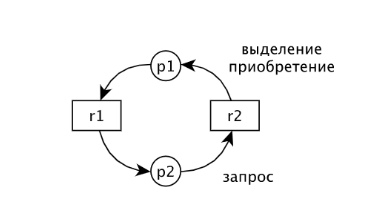
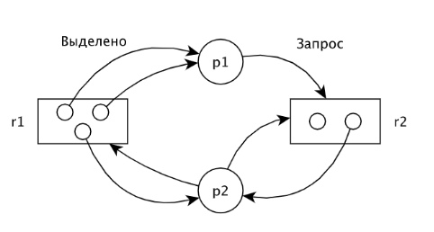

## 7. Тупики: обнаружение тупиков. Метод редукции графа: представление состояний системы в виде направленных графов. Представление графа: матричное представление; представление с помощью связного списка. Алгоритмы обнаружения тупиков: метод прямого обнаружения; алгоритм со счетчиком ожиданий; примеры реализации.

Тупик — это ситуация, которая возникает в результате монопольного использования разделяемых ресурсов, когда процесс, владея ресурсом, запрашивает другой ресурс,
занятый непосредственно или через цепочку запросов другим процессом, ожидающим освобождения ресурса, занятого первым процессом.

В теории тупиков принято различать два типа ресурсов:
- Повторно используемые ресурсы
- Потребляемые ресурсы

Повторное используемые ресурсы — используются многократно, использование ресурса не изменяет качества и характеристик ресурса.
К повторно используемым ресурсам относится: реентерабельный код системы, системные таблицы, разделяемая память, семафоры, программные каналы.

Потребляемые ресурсы — количество в ОС переменно и произвольно. К потребяемым ресурсам относится: память, каналы, внешние устройства, процессор, сообщения.

Условия возникновения тупика:
- Взаимоисключение. Возникает, когда процессы монопольно используют ресурсы.
- Ожидание. Когда процессы удерживают занятые ими ресурсы, ожидая предоставления им дополнительных ресурсов.
- Неперераспределяемость. Когда ресурсы нельзя отобрать у процесса до их завершения, или как говорят, добровольного особождения этих ресурсов (надпись: ресурсы у процесса нельзя принудительно отобрать).
- Круговое ожидание. Возникает замкнутая цепь запросов процессов на дополнительные ресурсы.

Обнаружение тупиков происходит с помощью графовой модели. Система может быть описана двудольным направленным графом. Два непересекающихся множества 
вершин: процессы и ресурсы. Вершины соединяются дугами, никакая дуга не соединяет вершины одного подмножества. Дуга, направленная из вершины ресурсов,
к вершине процессов, называется выделением или приборетением ресурсов. Дуга направленная из вершины процессам к ресурсам называется запросом.

Графовая модель Холта

Приобретение - `(r, p)` (от ресурса к процессу)
Запрос - `(p, r)` (от процесса к ресурсу)

Обнаружение тупиков по графовой модели выполняется методом редукции графа. Этот метод основан на предположении, что незаблокированный в тупике процесс
может запрашивать приобретения любых нужных ему ресурсов, а затем освобождать их. Освободившиеся ресурсы могут быть выделены или распределены другим процессам, которые их ожидают.

P1 выделено два ресурса R1 и он запрашивает один ресурс R2. P2 выделены по одному ресурсу R1 и R2 и он запрашивает ещё один R1 и R2. Видно, что процесс P1
может завершиться, значит он может стать изолированной вершиной (освободить занимаемые им ресурсы). Когда P1 завершиться, запросы P2 могут быть
удовлетворенны. В итоге, обе вершины P1 и P2 будут изолированны. Такой редукцией определяется, что система не находится в тупике (вершины процессов изолированны).

Двудольный граф может быть описан 2 матрицами(процессы и ресурсы) или 2 связными списками.

### Алгоритмы обнаружения тупиков

Метод прямого обнаружения.

Последовательно рассматриваются запросы каждого процесса и определяется, может ли этот запрос быть удовлетворен. Последовательный просмотр матрицы запросов.
В процессе просмотра определяется возможно ли сокращение соотвествующей дуги или невозможно (если возможно - сокращается). Те процессы, которые останутся в
этих матрицах после всех возможных сокращений будут находится в тупике. Для реализации нужно выполнить (m процессов, n ресурсов) (mn)^2 проверок.

Метод со счетчиком ожидания.

Для каждого ресурса необходимо хранить ресурсы, упорядоченные по размеру. Для каждого процесса Pi определяется счетчик ожидания, который содержит число 
ресурсов каждого типа, которые вызвали блокировку процесса (или указывает на ресурсы, на которых процесс был блокирован в ожидании освобождения ресурсов).
В этом алгоритме также хранится вектор свободных ресурсов. То есть если к матрице запросов и матрице распределения добавить вектор свободных ресурсов,
то можно для каждого процесса анализировать его вектор запросов (если вектор запросов процессов меньше, чем вектор свободных ресурсов, то его запросы могут быть удовлетворены).

